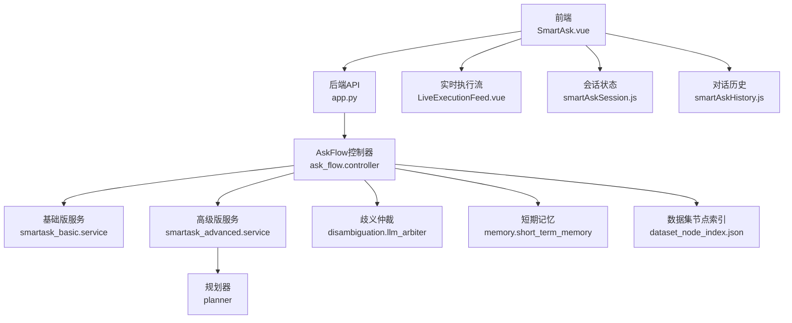
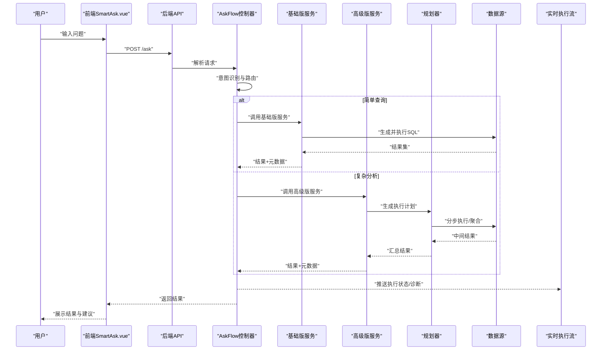
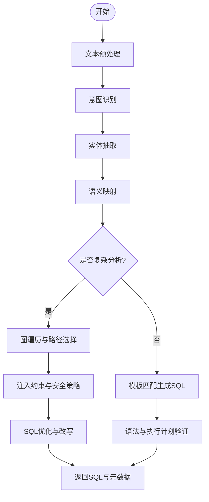
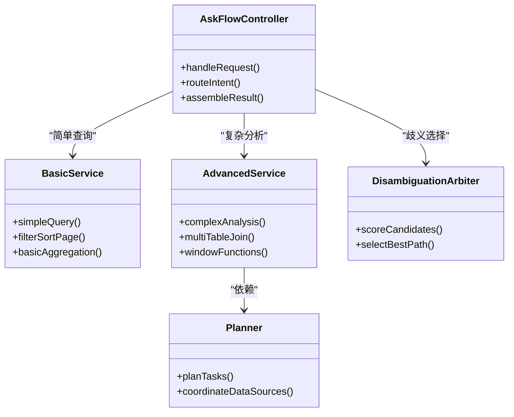
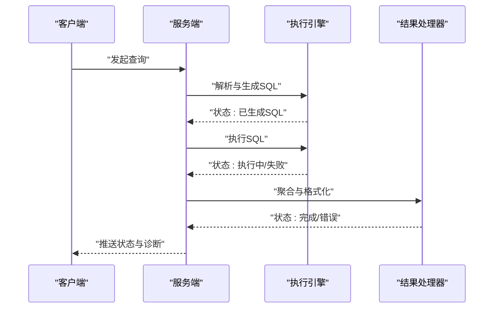
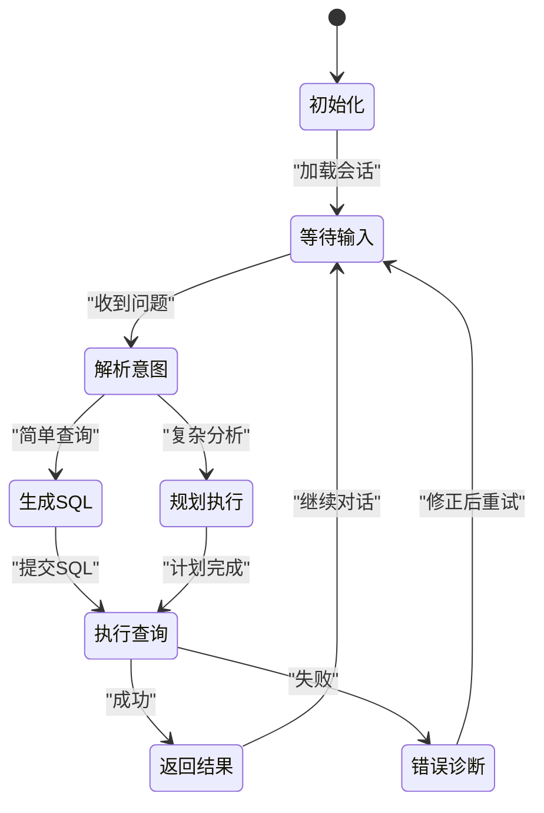
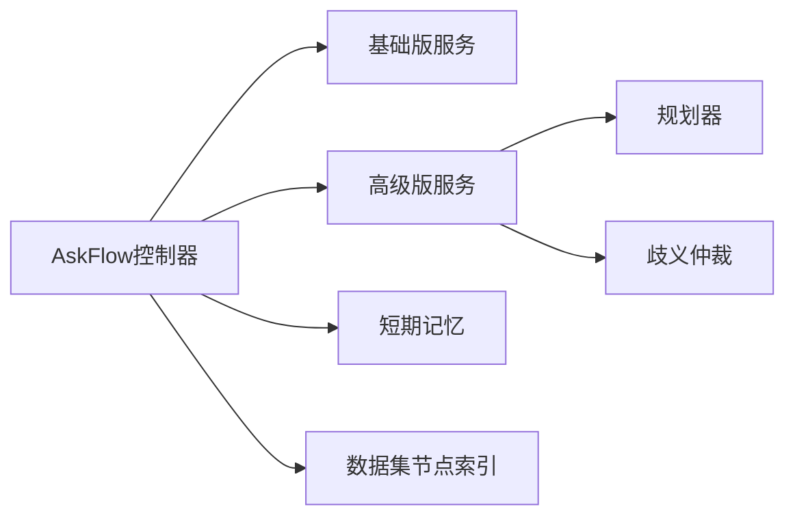

# 智能问数引擎

<cite>
**本文引用的文件**   
- [backend/app.py](file://backend/app.py)
- [backend/controllers/ask_flow.py](file://backend/controllers/ask_flow.py)
- [backend/ask_flow/controller.py](file://backend/ask_flow/controller.py)
- [backend/smartask_basic/service.py](file://backend/smartask_basic/service.py)
- [backend/smartask_advanced/service.py](file://backend/smartask_advanced/service.py)
- [backend/smartask_advanced/planner.py](file://backend/smartask_advanced/planner.py)
- [backend/disambiguation/llm_arbiter.py](file://backend/disambiguation/llm_arbiter.py)
- [backend/memory/short_term_memory.py](file://backend/memory/short_term_memory.py)
- [frontend/src/views/SmartAsk.vue](file://frontend/src/views/SmartAsk.vue)
- [frontend/src/components/smartask/LiveExecutionFeed.vue](file://frontend/src/components/smartask/LiveExecutionFeed.vue)
- [frontend/src/state/smartAskSession.js](file://frontend/src/state/smartAskSession.js)
- [frontend/src/state/smartAskHistory.js](file://frontend/src/state/smartAskHistory.js)
- [config/dataset_node_index.json](file://config/dataset_node_index.json)
</cite>

## 目录
1. [简介](#简介)
2. [项目结构](#项目结构)
3. [核心组件](#核心组件)
4. [架构总览](#架构总览)
5. [详细组件分析](#详细组件分析)
6. [依赖关系分析](#依赖关系分析)
7. [性能考量](#性能考量)
8. [故障排查指南](#故障排查指南)
9. [结论](#结论)
10. [附录](#附录)

## 简介
本文件为 SmartAsk 智能问数引擎的功能文档，面向产品、研发与运维人员。内容覆盖自然语言到 SQL 的智能转换机制（NLP 处理流程、意图识别、实体抽取、SQL 生成）、基础版与高级版的差异、实时执行反馈系统、多轮对话支持机制，以及使用示例、配置参数、性能优化技巧与常见问题解决方案。

## 项目结构
SmartAsk 采用前后端分离架构：
- 前端：Vue 应用，提供对话界面、实时执行流展示、会话状态与历史管理。
- 后端：Python 服务，暴露 REST API，编排 NLP、路由、SQL 生成与执行、结果聚合与报告。
- 配置与索引：数据集节点索引等静态配置用于快速路由与上下文构建。

**图表来源** 
- [backend/app.py](file://backend/app.py)
- [backend/ask_flow/controller.py](file://backend/ask_flow/controller.py)
- [backend/smartask_basic/service.py](file://backend/smartask_basic/service.py)
- [backend/smartask_advanced/service.py](file://backend/smartask_advanced/service.py)
- [backend/smartask_advanced/planner.py](file://backend/smartask_advanced/planner.py)
- [backend/disambiguation/llm_arbiter.py](file://backend/disambiguation/llm_arbiter.py)
- [backend/memory/short_term_memory.py](file://backend/memory/short_term_memory.py)
- [config/dataset_node_index.json](file://config/dataset_node_index.json)
- [frontend/src/views/SmartAsk.vue](file://frontend/src/views/SmartAsk.vue)
- [frontend/src/components/smartask/LiveExecutionFeed.vue](file://frontend/src/components/smartask/LiveExecutionFeed.vue)
- [frontend/src/state/smartAskSession.js](file://frontend/src/state/smartAskSession.js)
- [frontend/src/state/smartAskHistory.js](file://frontend/src/state/smartAskHistory.js)

**章节来源**
- [backend/app.py](file://backend/app.py)
- [frontend/src/views/SmartAsk.vue](file://frontend/src/views/SmartAsk.vue)
- [config/dataset_node_index.json](file://config/dataset_node_index.json)

## 核心组件
- AskFlow 控制器：统一入口，负责请求解析、权限校验、路由分支、结果组装。
- 基础版服务：简单查询场景，单表过滤、排序、分页、基础聚合。
- 高级版服务：复杂分析场景，多表关联、分组聚合、窗口函数、指标计算、计划编排。
- 规划器：将用户问题拆解为可执行的子任务序列，协调数据源与算子。
- 歧义仲裁：在多个候选答案或路径之间进行评分与选择。
- 短期记忆：维护会话上下文，支撑多轮对话。
- 实时执行流：前端组件，展示执行阶段、状态与错误诊断信息。

**章节来源**
- [backend/ask_flow/controller.py](file://backend/ask_flow/controller.py)
- [backend/smartask_basic/service.py](file://backend/smartask_basic/service.py)
- [backend/smartask_advanced/service.py](file://backend/smartask_advanced/service.py)
- [backend/smartask_advanced/planner.py](file://backend/smartask_advanced/planner.py)
- [backend/disambiguation/llm_arbiter.py](file://backend/disambiguation/llm_arbiter.py)
- [backend/memory/short_term_memory.py](file://backend/memory/short_term_memory.py)
- [frontend/src/components/smartask/LiveExecutionFeed.vue](file://frontend/src/components/smartask/LiveExecutionFeed.vue)

## 架构总览
SmartAsk 的端到端流程如下：
- 用户在前端输入自然语言问题。
- 后端 AskFlow 控制器接收请求，进行意图识别与路由。
- 基础版走简单查询路径；高级版进入规划器，生成执行计划并调用相应数据源。
- 执行过程中通过实时流推送状态与诊断信息。
- 最终返回结构化结果与可视化建议。

**图表来源** 
- [backend/ask_flow/controller.py](file://backend/ask_flow/controller.py)
- [backend/smartask_basic/service.py](file://backend/smartask_basic/service.py)
- [backend/smartask_advanced/service.py](file://backend/smartask_advanced/service.py)
- [backend/smartask_advanced/planner.py](file://backend/smartask_advanced/planner.py)
- [frontend/src/views/SmartAsk.vue](file://frontend/src/views/SmartAsk.vue)
- [frontend/src/components/smartask/LiveExecutionFeed.vue](file://frontend/src/components/smartask/LiveExecutionFeed.vue)

## 详细组件分析

### 自然语言到 SQL 的智能转换机制
- NLP 处理流程：
  - 文本预处理：清洗、分词、去停用词。
  - 意图识别：判断查询类型（如筛选、聚合、对比、趋势）。
  - 实体抽取：提取维度、指标、时间范围、条件值等。
  - 语义映射：将实体映射到数据集节点与字段。
- SQL 生成算法：
  - 模板匹配：基于规则生成简单 SQL。
  - 图遍历：根据数据集节点索引构建查询图，选择最优路径。
  - 约束注入：权限、安全、性能约束。
  - 验证与优化：语法检查、执行计划预估、改写建议。

**图表来源** 
- [backend/ask_flow/controller.py](file://backend/ask_flow/controller.py)
- [config/dataset_node_index.json](file://config/dataset_node_index.json)

**章节来源**
- [backend/ask_flow/controller.py](file://backend/ask_flow/controller.py)
- [config/dataset_node_index.json](file://config/dataset_node_index.json)

### 基础版与高级版差异
- 基础版：
  - 适用场景：单表过滤、排序、分页、基础聚合。
  - 能力边界：不支持多表关联、窗口函数、复杂指标。
  - 性能特点：低延迟、高吞吐。
- 高级版：
  - 适用场景：多表关联、分组聚合、趋势分析、对比分析。
  - 能力增强：规划器、歧义仲裁、自我检查、质量评估。
  - 资源消耗：较高，需合理限流与缓存。

**图表来源** 
- [backend/ask_flow/controller.py](file://backend/ask_flow/controller.py)
- [backend/smartask_basic/service.py](file://backend/smartask_basic/service.py)
- [backend/smartask_advanced/service.py](file://backend/smartask_advanced/service.py)
- [backend/smartask_advanced/planner.py](file://backend/smartask_advanced/planner.py)
- [backend/disambiguation/llm_arbiter.py](file://backend/disambiguation/llm_arbiter.py)

**章节来源**
- [backend/smartask_basic/service.py](file://backend/smartask_basic/service.py)
- [backend/smartask_advanced/service.py](file://backend/smartask_advanced/service.py)
- [backend/smartask_advanced/planner.py](file://backend/smartask_advanced/planner.py)
- [backend/disambiguation/llm_arbiter.py](file://backend/disambiguation/llm_arbiter.py)

### 实时执行反馈系统
- 功能要点：
  - 执行状态监控：解析、路由、生成、执行、聚合各阶段状态。
  - 错误诊断：捕获异常、定位原因、给出修复建议。
  - 优化建议：提示索引、改写、分页限制。
- 实现方式：
  - 后端事件流：按阶段推送状态与诊断信息。
  - 前端渲染：实时流组件更新 UI，支持折叠与展开详情。

**图表来源** 
- [frontend/src/components/smartask/LiveExecutionFeed.vue](file://frontend/src/components/smartask/LiveExecutionFeed.vue)

**章节来源**
- [frontend/src/components/smartask/LiveExecutionFeed.vue](file://frontend/src/components/smartask/LiveExecutionFeed.vue)

### 多轮对话支持机制
- 上下文管理：
  - 短期记忆存储会话上下文，包括上一轮问题、答案、实体与意图。
  - 会话状态维护：当前路由、权限、数据集绑定。
- 对话历史存储：
  - 前端持久化历史，支持回溯与重放。
  - 后端可选持久化，便于审计与分析。

**图表来源** 
- [backend/memory/short_term_memory.py](file://backend/memory/short_term_memory.py)
- [frontend/src/state/smartAskSession.js](file://frontend/src/state/smartAskSession.js)
- [frontend/src/state/smartAskHistory.js](file://frontend/src/state/smartAskHistory.js)

**章节来源**
- [backend/memory/short_term_memory.py](file://backend/memory/short_term_memory.py)
- [frontend/src/state/smartAskSession.js](file://frontend/src/state/smartAskSession.js)
- [frontend/src/state/smartAskHistory.js](file://frontend/src/state/smartAskHistory.js)

## 依赖关系分析
- 模块耦合：
  - AskFlow 控制器依赖基础版与高级版服务，通过路由解耦。
  - 高级版服务依赖规划器与歧义仲裁，提升复杂场景处理能力。
  - 短期记忆与会话状态独立，便于扩展与替换。
- 外部依赖：
  - 数据源适配器：数据库连接、查询执行、结果集处理。
  - 配置中心：数据集节点索引、权限策略、特征开关。

**图表来源** 
- [backend/ask_flow/controller.py](file://backend/ask_flow/controller.py)
- [backend/smartask_basic/service.py](file://backend/smartask_basic/service.py)
- [backend/smartask_advanced/service.py](file://backend/smartask_advanced/service.py)
- [backend/smartask_advanced/planner.py](file://backend/smartask_advanced/planner.py)
- [backend/disambiguation/llm_arbiter.py](file://backend/disambiguation/llm_arbiter.py)
- [backend/memory/short_term_memory.py](file://backend/memory/short_term_memory.py)
- [config/dataset_node_index.json](file://config/dataset_node_index.json)

**章节来源**
- [backend/ask_flow/controller.py](file://backend/ask_flow/controller.py)
- [config/dataset_node_index.json](file://config/dataset_node_index.json)

## 性能考量
- 查询优化：
  - 合理使用索引与分区，避免全表扫描。
  - 分页与限制行数，减少内存占用。
  - 预计算与缓存热点结果。
- 并发控制：
  - 限流与队列，防止雪崩。
  - 超时与重试策略，提升稳定性。
- 资源隔离：
  - 基础版与高级版资源池分离。
  - 动态扩缩容，按需分配。

[本节为通用指导，不直接分析具体文件]

## 故障排查指南
- 常见问题：
  - SQL 生成失败：检查意图识别与实体抽取是否正确。
  - 执行超时：优化查询语句，增加索引或限制范围。
  - 权限拒绝：确认用户权限与数据集绑定。
- 调试方法：
  - 查看实时执行流，定位失败阶段。
  - 启用详细日志，记录中间结果与错误堆栈。
  - 使用测试用例复现问题，逐步缩小范围。

**章节来源**
- [frontend/src/components/smartask/LiveExecutionFeed.vue](file://frontend/src/components/smartask/LiveExecutionFeed.vue)

## 结论
SmartAsk 智能问数引擎通过模块化设计与清晰的数据流，实现了从自然语言到 SQL 的智能转换，支持基础版与高级版差异化能力，并提供实时反馈与多轮对话支持。通过合理的性能优化与故障排查策略，可在生产环境中稳定运行。

[本节为总结性内容，不直接分析具体文件]

## 附录
- 使用示例：
  - 简单查询：“上个月销售额是多少？”
  - 复杂分析：“对比各区域季度利润趋势，排除异常值。”
- 配置参数：
  - 数据集节点索引：定义维度、指标、关联关系。
  - 权限策略：控制访问范围与字段级权限。
- 最佳实践：
  - 明确意图与实体，提高准确率。
  - 合理拆分复杂问题，提升可解释性。
  - 定期优化索引与查询计划。

[本节为补充信息，不直接分析具体文件]