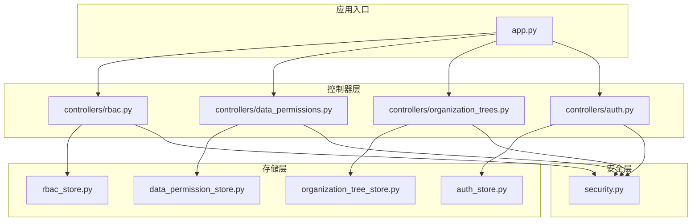
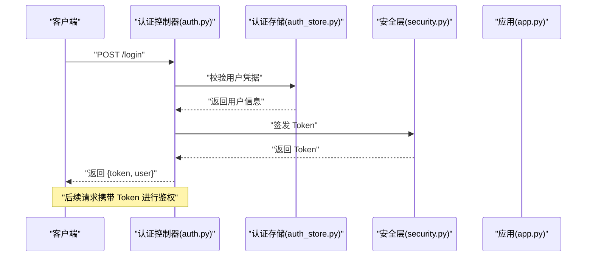
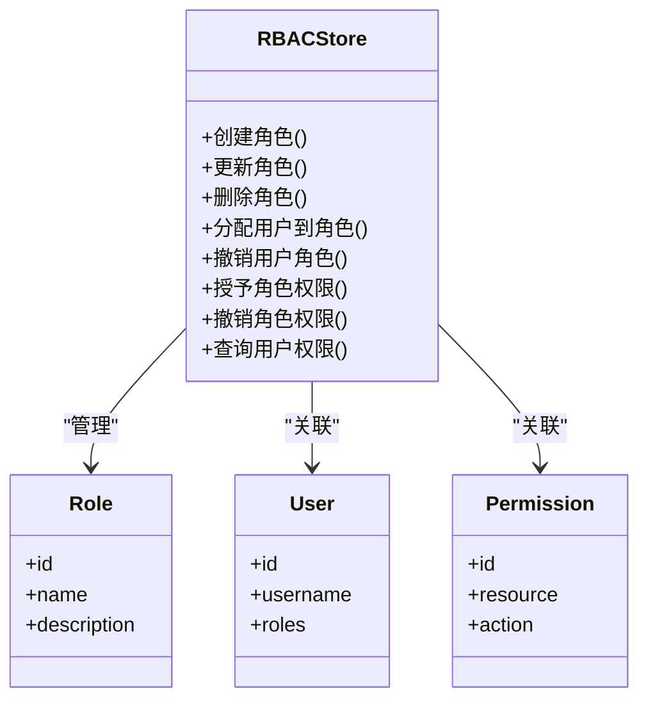
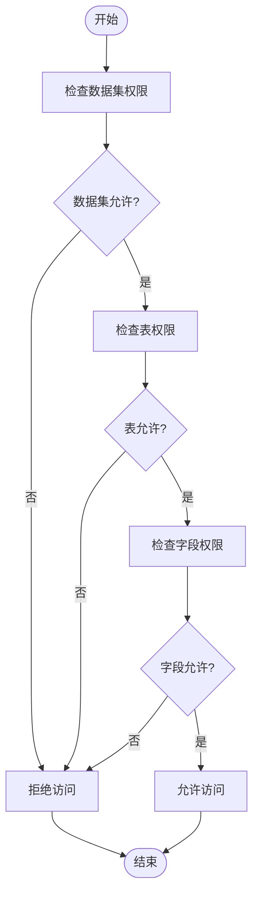
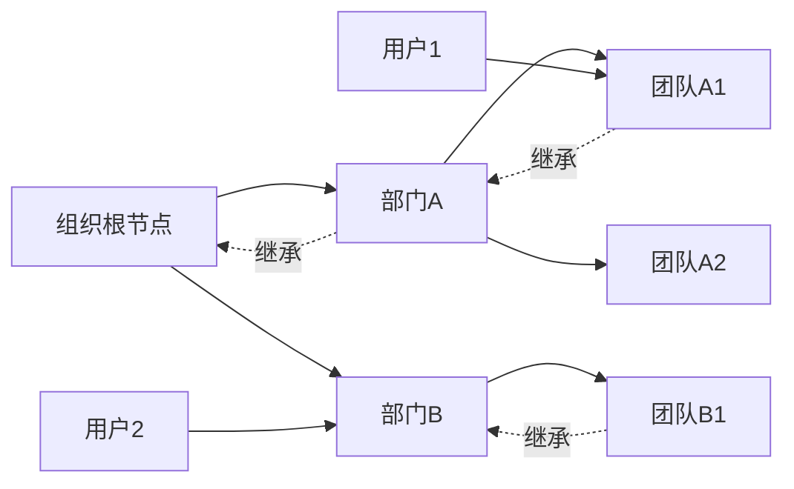
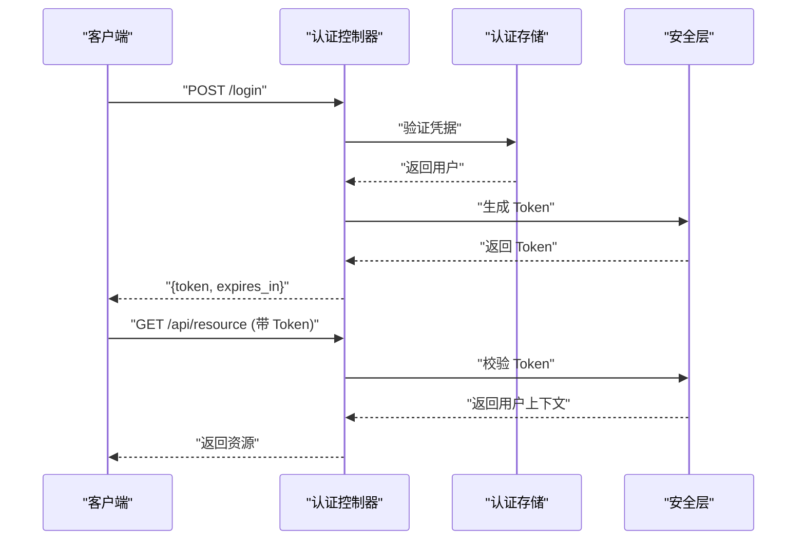
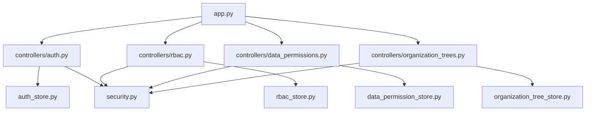

# 权限管理系统

<cite>
**本文引用的文件**   
- [rbac_store.py](file://backend/rbac_store.py)
- [data_permission_store.py](file://backend/data_permission_store.py)
- [organization_tree_store.py](file://backend/organization_tree_store.py)
- [auth_store.py](file://backend/auth_store.py)
- [security.py](file://backend/security.py)
- [controllers/rbac.py](file://backend/controllers/rbac.py)
- [controllers/data_permissions.py](file://backend/controllers/data_permissions.py)
- [controllers/organization_trees.py](file://backend/controllers/organization_trees.py)
- [controllers/auth.py](file://backend/controllers/auth.py)
- [app.py](file://backend/app.py)
</cite>

## 目录
1. [简介](#简介)
2. [项目结构](#项目结构)
3. [核心组件](#核心组件)
4. [架构总览](#架构总览)
5. [详细组件分析](#详细组件分析)
6. [依赖关系分析](#依赖关系分析)
7. [性能考量](#性能考量)
8. [故障排查指南](#故障排查指南)
9. [结论](#结论)
10. [附录](#附录)

## 简介
本文件为 SmartAsk 权限管理系统的权威文档，聚焦 RBAC（基于角色的访问控制）模型与数据权限、组织树继承、认证与会话等安全机制。内容覆盖：
- RBAC 角色与权限设计原理与实现
- 用户角色管理（管理员、普通用户、只读用户）的权限范围
- 数据权限控制（数据集级、表级、字段级）
- 组织树权限继承机制
- 认证流程（登录、Token 验证、会话管理）
- 权限配置最佳实践、常见问题排查与安全加固建议
- 权限矩阵与配置示例

## 项目结构
权限相关能力主要分布在后端模块中，采用“控制器 + 存储层”的分层设计：
- 控制器层：对外暴露 API，处理请求校验、鉴权与响应组装
- 存储层：封装 RBAC、数据权限、组织树、认证与会话等持久化逻辑
- 安全层：提供 Token 签发与校验、加密工具等通用安全能力
- 应用入口：注册路由、初始化依赖

**图表来源** 
- [app.py](file://backend/app.py)
- [controllers/rbac.py](file://backend/controllers/rbac.py)
- [controllers/data_permissions.py](file://backend/controllers/data_permissions.py)
- [controllers/organization_trees.py](file://backend/controllers/organization_trees.py)
- [controllers/auth.py](file://backend/controllers/auth.py)
- [rbac_store.py](file://backend/rbac_store.py)
- [data_permission_store.py](file://backend/data_permission_store.py)
- [organization_tree_store.py](file://backend/organization_tree_store.py)
- [auth_store.py](file://backend/auth_store.py)
- [security.py](file://backend/security.py)

**章节来源**
- [app.py](file://backend/app.py)
- [controllers/rbac.py](file://backend/controllers/rbac.py)
- [controllers/data_permissions.py](file://backend/controllers/data_permissions.py)
- [controllers/organization_trees.py](file://backend/controllers/organization_trees.py)
- [controllers/auth.py](file://backend/controllers/auth.py)
- [rbac_store.py](file://backend/rbac_store.py)
- [data_permission_store.py](file://backend/data_permission_store.py)
- [organization_tree_store.py](file://backend/organization_tree_store.py)
- [auth_store.py](file://backend/auth_store.py)
- [security.py](file://backend/security.py)

## 核心组件
- RBAC 存储层：负责角色、用户-角色、角色-权限的增删改查与批量操作
- 数据权限存储层：维护数据集、表、字段的授权关系及生效策略
- 组织树存储层：维护组织架构节点、父子关系与成员映射
- 认证存储层：管理用户凭据、会话、Token 生命周期
- 安全层：提供 Token 生成/校验、签名与加密工具

**章节来源**
- [rbac_store.py](file://backend/rbac_store.py)
- [data_permission_store.py](file://backend/data_permission_store.py)
- [organization_tree_store.py](file://backend/organization_tree_store.py)
- [auth_store.py](file://backend/auth_store.py)
- [security.py](file://backend/security.py)

## 架构总览
系统采用分层架构，控制器通过存储层访问数据，安全层贯穿认证与鉴权流程。RBAC 与数据权限相互协作，组织树作为权限继承的基础设施。

**图表来源** 
- [controllers/auth.py](file://backend/controllers/auth.py)
- [auth_store.py](file://backend/auth_store.py)
- [security.py](file://backend/security.py)
- [app.py](file://backend/app.py)

## 详细组件分析

### RBAC 角色与权限
- 角色类型：管理员、普通用户、只读用户
- 权限粒度：功能点（如查看、编辑、删除）、资源（数据集、表、字段）
- 用户-角色：多对多关系，支持批量分配
- 角色-权限：一对多关系，支持批量授予

**图表来源** 
- [rbac_store.py](file://backend/rbac_store.py)
- [controllers/rbac.py](file://backend/controllers/rbac.py)

**章节来源**
- [rbac_store.py](file://backend/rbac_store.py)
- [controllers/rbac.py](file://backend/controllers/rbac.py)

### 数据权限控制（数据集、表、字段）
- 数据集级权限：控制对数据集的访问（查看、导出、编辑）
- 表级权限：控制对数据集中特定表的访问
- 字段级权限：控制对表中特定字段的可见性与可写性
- 权限合并：用户自身权限 + 角色权限 + 组织继承权限

**图表来源** 
- [data_permission_store.py](file://backend/data_permission_store.py)
- [controllers/data_permissions.py](file://backend/controllers/data_permissions.py)

**章节来源**
- [data_permission_store.py](file://backend/data_permission_store.py)
- [controllers/data_permissions.py](file://backend/controllers/data_permissions.py)

### 组织树权限继承
- 组织树：节点表示部门/团队，支持父子层级
- 成员映射：用户属于一个或多个组织节点
- 权限继承：子节点继承父节点的权限，支持覆盖
- 动态计算：实时计算用户在当前组织上下文中的有效权限

**图表来源** 
- [organization_tree_store.py](file://backend/organization_tree_store.py)
- [controllers/organization_trees.py](file://backend/controllers/organization_trees.py)

**章节来源**
- [organization_tree_store.py](file://backend/organization_tree_store.py)
- [controllers/organization_trees.py](file://backend/controllers/organization_trees.py)

### 认证与会话管理
- 登录：用户名密码或第三方集成（如飞书）回调
- Token：JWT 格式，包含用户标识、角色、过期时间
- 会话：服务端存储活跃会话，支持主动注销
- 刷新：支持 Token 刷新机制，提升用户体验

**图表来源** 
- [controllers/auth.py](file://backend/controllers/auth.py)
- [auth_store.py](file://backend/auth_store.py)
- [security.py](file://backend/security.py)

**章节来源**
- [controllers/auth.py](file://backend/controllers/auth.py)
- [auth_store.py](file://backend/auth_store.py)
- [security.py](file://backend/security.py)

## 依赖关系分析
- 控制器依赖存储层进行数据操作
- 存储层依赖数据库（通过 ORM 或 SQL 驱动）
- 安全层被认证与鉴权流程共同使用
- 应用入口统一注册路由与中间件

**图表来源** 
- [app.py](file://backend/app.py)
- [controllers/auth.py](file://backend/controllers/auth.py)
- [controllers/rbac.py](file://backend/controllers/rbac.py)
- [controllers/data_permissions.py](file://backend/controllers/data_permissions.py)
- [controllers/organization_trees.py](file://backend/controllers/organization_trees.py)
- [auth_store.py](file://backend/auth_store.py)
- [rbac_store.py](file://backend/rbac_store.py)
- [data_permission_store.py](file://backend/data_permission_store.py)
- [organization_tree_store.py](file://backend/organization_tree_store.py)
- [security.py](file://backend/security.py)

**章节来源**
- [app.py](file://backend/app.py)
- [controllers/auth.py](file://backend/controllers/auth.py)
- [controllers/rbac.py](file://backend/controllers/rbac.py)
- [controllers/data_permissions.py](file://backend/controllers/data_permissions.py)
- [controllers/organization_trees.py](file://backend/controllers/organization_trees.py)
- [auth_store.py](file://backend/auth_store.py)
- [rbac_store.py](file://backend/rbac_store.py)
- [data_permission_store.py](file://backend/data_permission_store.py)
- [organization_tree_store.py](file://backend/organization_tree_store.py)
- [security.py](file://backend/security.py)

## 性能考量
- 权限缓存：将用户权限结果缓存至内存或 Redis，减少重复计算
- 组织树遍历优化：预计算祖先链，避免深度递归
- 数据权限合并：增量更新权限索引，避免全量扫描
- Token 校验：使用无状态 JWT，减少服务端会话存储压力
- 批量操作：支持批量分配角色与权限，降低数据库往返次数

[本节为通用指导，不直接分析具体文件]

## 故障排查指南
- 登录失败：检查用户凭据、第三方集成配置、Token 签发逻辑
- 权限不足：确认用户角色、数据权限、组织继承是否正确设置
- Token 过期：检查过期时间、刷新机制、客户端重试逻辑
- 组织树异常：验证父子关系、成员映射、权限继承规则
- 性能问题：监控权限计算耗时、缓存命中率、数据库查询计划

**章节来源**
- [controllers/auth.py](file://backend/controllers/auth.py)
- [rbac_store.py](file://backend/rbac_store.py)
- [data_permission_store.py](file://backend/data_permission_store.py)
- [organization_tree_store.py](file://backend/organization_tree_store.py)
- [security.py](file://backend/security.py)

## 结论
SmartAsk 权限管理系统以 RBAC 为核心，结合数据权限与组织树继承，提供细粒度、可扩展的访问控制能力。通过分层架构与标准化接口，确保系统可维护性与安全性。建议在生产环境中启用权限缓存、强化 Token 安全、定期审计权限配置。

[本节为总结性内容，不直接分析具体文件]

## 附录

### 权限矩阵表
| 角色       | 数据集查看 | 数据集编辑 | 表级权限 | 字段级权限 | 组织管理 | 系统配置 |
|------------|------------|------------|----------|------------|----------|----------|
| 管理员     | ✅          | ✅          | ✅        | ✅          | ✅        | ✅        |
| 普通用户   | ✅          | ❌          | ✅        | ✅          | ❌        | ❌        |
| 只读用户   | ✅          | ❌          | ❌        | ❌          | ❌        | ❌        |

### 配置示例
- 角色定义：创建“销售分析师”角色，授予数据集查看与报表导出权限
- 用户分配：将用户张三分配至“销售分析师”角色
- 数据权限：为“销售分析师”开放“订单表”的“金额”、“日期”字段
- 组织继承：在“华东区”组织下授予“销售分析师”角色，其下属团队自动继承

[本节为概念性说明，不直接分析具体文件]