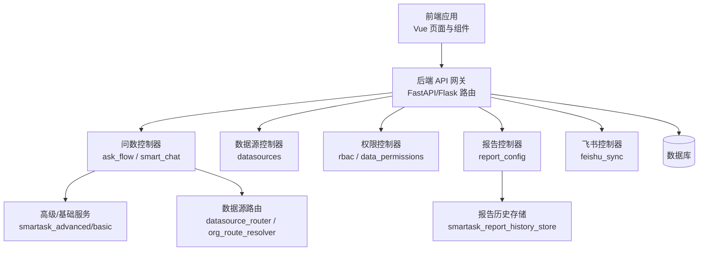
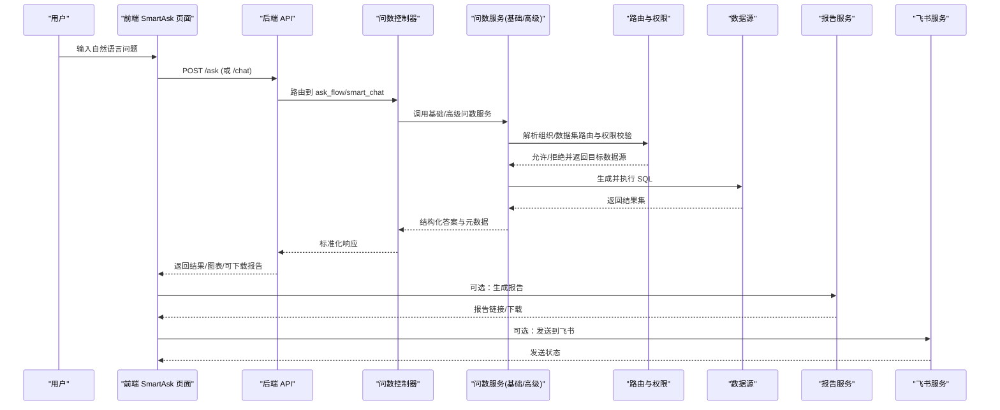
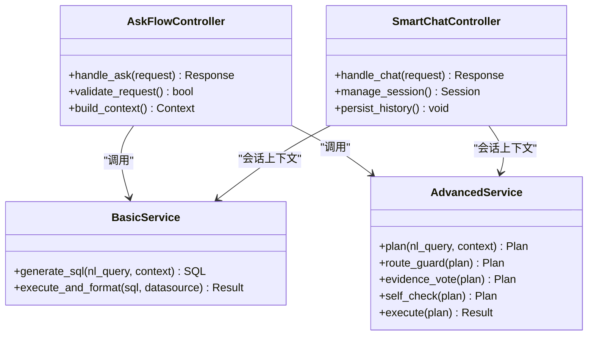
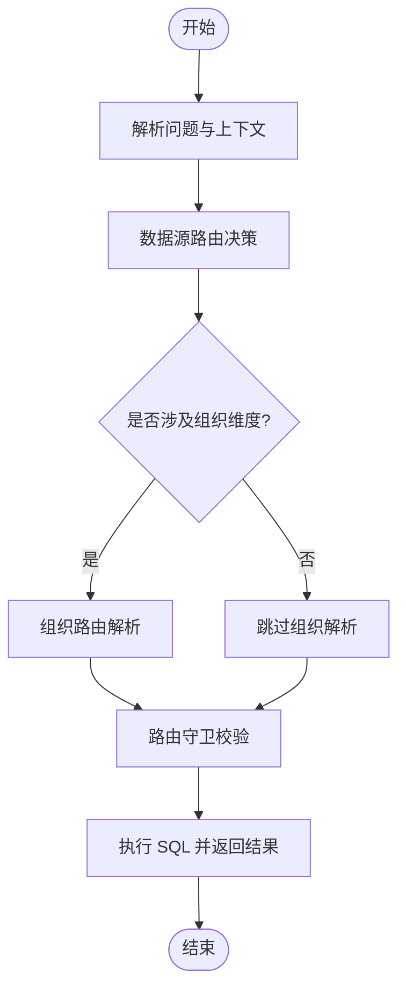
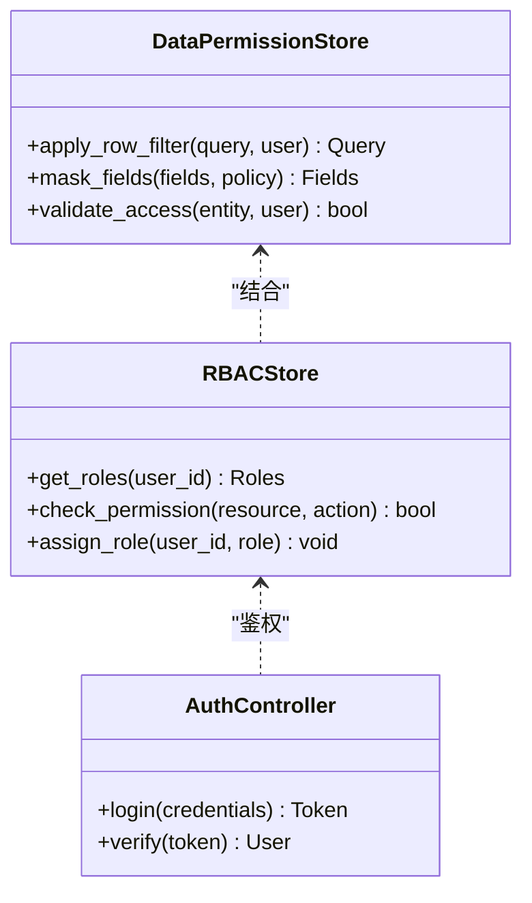
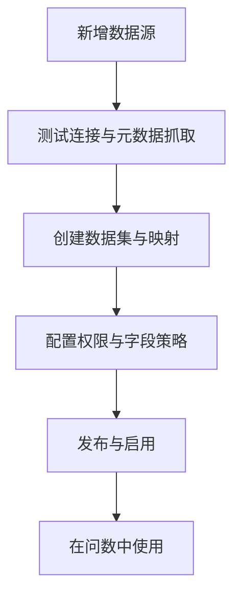
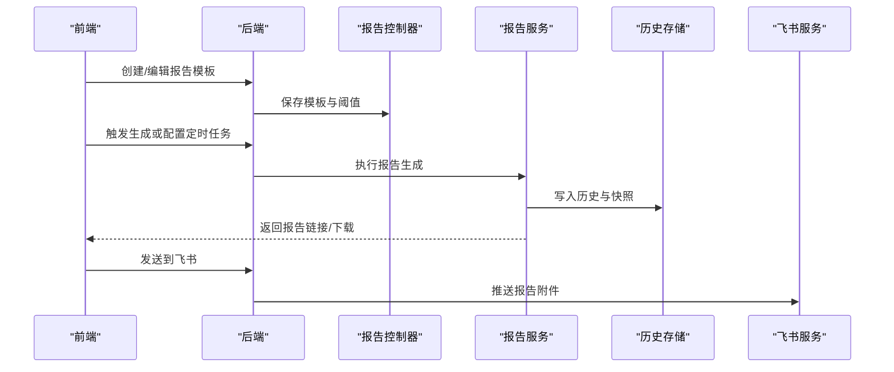
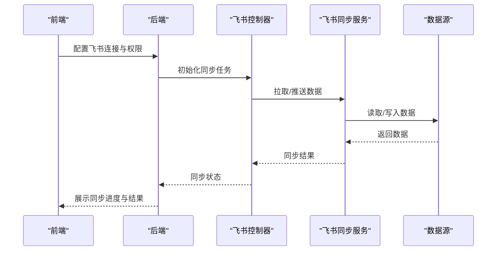
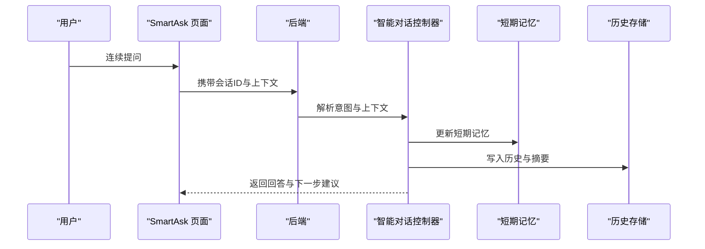
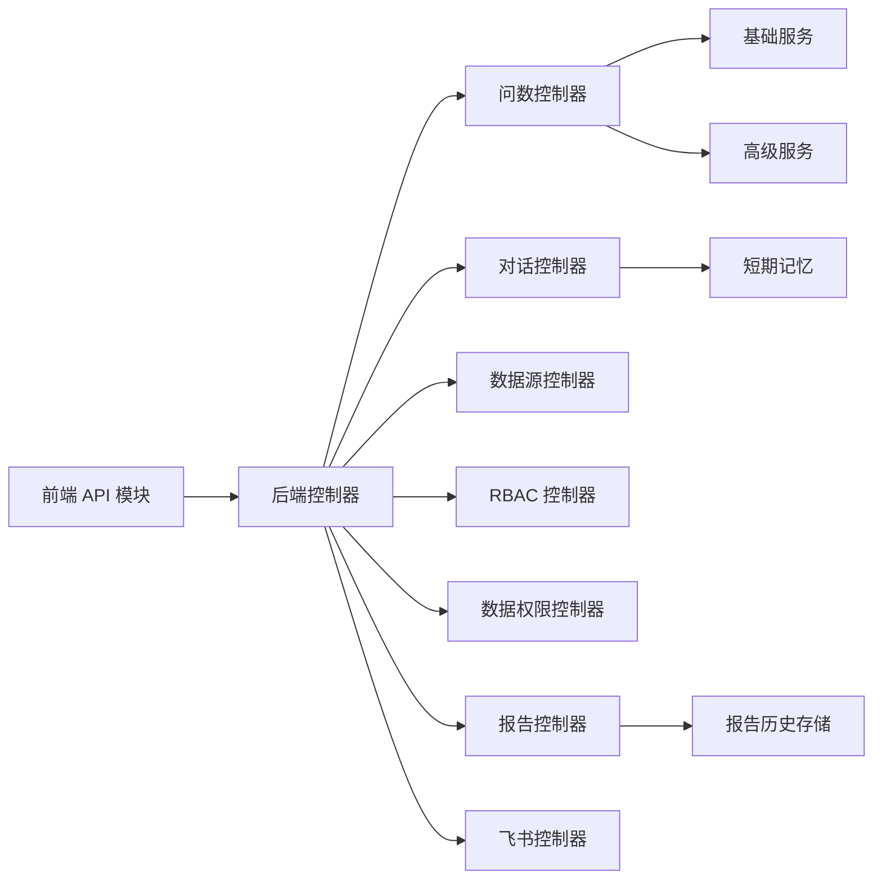

# 核心功能特性

<cite>
**本文引用的文件**   
- [backend/app.py](file://backend/app.py)
- [backend/controllers/ask_flow.py](file://backend/controllers/ask_flow.py)
- [backend/controllers/smart_chat.py](file://backend/controllers/smart_chat.py)
- [backend/controllers/datasources.py](file://backend/controllers/datasources.py)
- [backend/controllers/rbac.py](file://backend/controllers/rbac.py)
- [backend/controllers/data_permissions.py](file://backend/controllers/data_permissions.py)
- [backend/controllers/report_config.py](file://backend/controllers/report_config.py)
- [backend/controllers/feishu_sync.py](file://backend/controllers/feishu_sync.py)
- [backend/controllers/advanced_capabilities.py](file://backend/controllers/advanced_capabilities.py)
- [backend/smartask_advanced/service.py](file://backend/smartask_advanced/service.py)
- [backend/smartask_basic/service.py](file://backend/smartask_basic/service.py)
- [backend/datasource_router.py](file://backend/datasource_router.py)
- [backend/organization_route_resolver.py](file://backend/organization_route_resolver.py)
- [backend/smartask_report_history_store.py](file://backend/smartask_report_history_store.py)
- [frontend/src/views/SmartAsk.vue](file://frontend/src/views/SmartAsk.vue)
- [frontend/src/views/DatasetManagement.vue](file://frontend/src/views/DatasetManagement.vue)
- [frontend/src/views/DatasetReportConfig.vue](file://frontend/src/views/DatasetReportConfig.vue)
- [frontend/src/views/FeishuSync.vue](file://frontend/src/views/FeishuSync.vue)
- [frontend/src/views/AdminConsole.vue](file://frontend/src/views/AdminConsole.vue)
- [frontend/src/api/index.js](file://frontend/src/api/index.js)
</cite>

## 目录
1. [简介](#简介)
2. [项目结构](#项目结构)
3. [核心组件](#核心组件)
4. [架构总览](#架构总览)
5. [详细组件分析](#详细组件分析)
6. [依赖关系分析](#依赖关系分析)
7. [性能考量](#性能考量)
8. [故障排查指南](#故障排查指南)
9. [结论](#结论)
10. [附录](#附录)

## 简介
本文件面向 SmartAsk 智能问数平台的使用者与实施人员，系统化梳理并说明平台的核心与高级功能特性，包括：
- 自然语言到 SQL 的智能转换、多数据集路由、权限控制、结果可视化
- 多轮对话、查询历史管理、报告生成、飞书集成等高级能力
- RBAC 权限体系（用户角色、数据权限、字段级权限）
- 数据集管理（数据源连接、元数据管理、权限配置）
- 报告系统（模板管理、定时任务、导出格式）
并提供使用说明、配置要点与最佳实践，以及版本功能对比与典型使用场景。

## 项目结构
SmartAsk 采用前后端分离架构：
- 后端以 Python 提供 REST API，包含问数流程、权限、报告、飞书同步等控制器与服务模块
- 前端基于 Vue，提供问答界面、数据集管理、报告配置、飞书同步与管理控制台等页面
- 数据库与迁移脚本位于 docker/postgres/init 与 backend/migrations

图表来源
- [backend/app.py:1-200](file://backend/app.py#L1-L200)
- [backend/controllers/ask_flow.py:1-200](file://backend/controllers/ask_flow.py#L1-L200)
- [backend/controllers/smart_chat.py:1-200](file://backend/controllers/smart_chat.py#L1-L200)
- [backend/controllers/datasources.py:1-200](file://backend/controllers/datasources.py#L1-L200)
- [backend/controllers/rbac.py:1-200](file://backend/controllers/rbac.py#L1-L200)
- [backend/controllers/data_permissions.py:1-200](file://backend/controllers/data_permissions.py#L1-L200)
- [backend/controllers/report_config.py:1-200](file://backend/controllers/report_config.py#L1-L200)
- [backend/controllers/feishu_sync.py:1-200](file://backend/controllers/feishu_sync.py#L1-L200)
- [backend/smartask_advanced/service.py:1-200](file://backend/smartask_advanced/service.py#L1-L200)
- [backend/smartask_basic/service.py:1-200](file://backend/smartask_basic/service.py#L1-L200)
- [backend/datasource_router.py:1-200](file://backend/datasource_router.py#L1-L200)
- [backend/organization_route_resolver.py:1-200](file://backend/organization_route_resolver.py#L1-L200)
- [backend/smartask_report_history_store.py:1-200](file://backend/smartask_report_history_store.py#L1-L200)

章节来源
- [backend/app.py:1-200](file://backend/app.py#L1-L200)
- [frontend/src/views/SmartAsk.vue:1-200](file://frontend/src/views/SmartAsk.vue#L1-L200)

## 核心组件
- 问数引擎（基础版/高级版）
  - 基础版服务：快速将自然语言转为 SQL 并执行，返回结果与简要解释
  - 高级版服务：引入规划、路由守卫、证据投票、SQL 质量评估、自我检查、模板策略等增强能力
- 数据源与路由
  - 统一数据源接入与元数据管理
  - 组织维度路由解析，按租户/部门自动选择目标库或视图
- 权限与安全
  - RBAC 角色与资源访问控制
  - 行级与字段级数据权限校验
- 报告系统
  - 报告模板、阈值、定时任务与历史归档
- 飞书集成
  - 飞书表格/文档同步、消息推送与图片/PDF 导出

章节来源
- [backend/smartask_basic/service.py:1-200](file://backend/smartask_basic/service.py#L1-L200)
- [backend/smartask_advanced/service.py:1-200](file://backend/smartask_advanced/service.py#L1-L200)
- [backend/datasource_router.py:1-200](file://backend/datasource_router.py#L1-L200)
- [backend/organization_route_resolver.py:1-200](file://backend/organization_route_resolver.py#L1-L200)
- [backend/controllers/rbac.py:1-200](file://backend/controllers/rbac.py#L1-L200)
- [backend/controllers/data_permissions.py:1-200](file://backend/controllers/data_permissions.py#L1-L200)
- [backend/controllers/report_config.py:1-200](file://backend/controllers/report_config.py#L1-L200)
- [backend/controllers/feishu_sync.py:1-200](file://backend/controllers/feishu_sync.py#L1-L200)

## 架构总览
SmartAsk 的端到端调用链路如下：
- 前端通过 API 发起“智能问数”请求
- 后端控制器编排问数流程（基础/高级），进行意图识别、SQL 生成与执行
- 路由与权限层确保数据访问安全与正确目标库选择
- 结果经可视化渲染后返回；支持报告生成与飞书推送

图表来源
- [backend/controllers/ask_flow.py:1-200](file://backend/controllers/ask_flow.py#L1-L200)
- [backend/controllers/smart_chat.py:1-200](file://backend/controllers/smart_chat.py#L1-L200)
- [backend/smartask_basic/service.py:1-200](file://backend/smartask_basic/service.py#L1-L200)
- [backend/smartask_advanced/service.py:1-200](file://backend/smartask_advanced/service.py#L1-L200)
- [backend/datasource_router.py:1-200](file://backend/datasource_router.py#L1-L200)
- [backend/organization_route_resolver.py:1-200](file://backend/organization_route_resolver.py#L1-L200)
- [backend/controllers/report_config.py:1-200](file://backend/controllers/report_config.py#L1-L200)
- [backend/controllers/feishu_sync.py:1-200](file://backend/controllers/feishu_sync.py#L1-L200)

## 详细组件分析

### 智能问数与自然语言转 SQL
- 基础版服务：面向快速问答，强调低延迟与高可用
- 高级版服务：引入规划器、路由守卫、证据投票、SQL 质量评估、自我检查、模板策略等，提升准确率与可解释性
- 控制器层：封装 HTTP 接口，处理参数校验、上下文注入、错误码与日志

图表来源
- [backend/controllers/ask_flow.py:1-200](file://backend/controllers/ask_flow.py#L1-L200)
- [backend/controllers/smart_chat.py:1-200](file://backend/controllers/smart_chat.py#L1-L200)
- [backend/smartask_basic/service.py:1-200](file://backend/smartask_basic/service.py#L1-L200)
- [backend/smartask_advanced/service.py:1-200](file://backend/smartask_advanced/service.py#L1-L200)

章节来源
- [backend/controllers/ask_flow.py:1-200](file://backend/controllers/ask_flow.py#L1-L200)
- [backend/controllers/smart_chat.py:1-200](file://backend/controllers/smart_chat.py#L1-L200)
- [backend/smartask_basic/service.py:1-200](file://backend/smartask_basic/service.py#L1-L200)
- [backend/smartask_advanced/service.py:1-200](file://backend/smartask_advanced/service.py#L1-L200)

### 多数据集路由与组织维度解析
- 数据源路由：根据问题语义、上下文与配置，自动选择目标数据源或视图
- 组织路由：结合组织架构树，按租户/部门隔离数据访问范围
- 路由守卫：在高级模式下对计划进行合法性与安全性校验

图表来源
- [backend/datasource_router.py:1-200](file://backend/datasource_router.py#L1-L200)
- [backend/organization_route_resolver.py:1-200](file://backend/organization_route_resolver.py#L1-L200)
- [backend/smartask_advanced/service.py:1-200](file://backend/smartask_advanced/service.py#L1-L200)

章节来源
- [backend/datasource_router.py:1-200](file://backend/datasource_router.py#L1-L200)
- [backend/organization_route_resolver.py:1-200](file://backend/organization_route_resolver.py#L1-L200)
- [backend/smartask_advanced/service.py:1-200](file://backend/smartask_advanced/service.py#L1-L200)

### 权限控制与 RBAC
- 角色与资源：定义用户角色、资源类型与访问级别
- 数据权限：行级过滤与字段级可见性控制
- 控制器集成：在问数与报告接口中强制校验权限

图表来源
- [backend/controllers/rbac.py:1-200](file://backend/controllers/rbac.py#L1-L200)
- [backend/controllers/data_permissions.py:1-200](file://backend/controllers/data_permissions.py#L1-L200)

章节来源
- [backend/controllers/rbac.py:1-200](file://backend/controllers/rbac.py#L1-L200)
- [backend/controllers/data_permissions.py:1-200](file://backend/controllers/data_permissions.py#L1-L200)

### 数据集管理与数据源连接
- 数据源连接：支持多种数据库类型与连接参数管理
- 元数据管理：表/字段描述、标签、血缘与索引
- 权限配置：为数据集绑定角色与字段级可见性策略

图表来源
- [backend/controllers/datasources.py:1-200](file://backend/controllers/datasources.py#L1-L200)
- [frontend/src/views/DatasetManagement.vue:1-200](file://frontend/src/views/DatasetManagement.vue#L1-L200)

章节来源
- [backend/controllers/datasources.py:1-200](file://backend/controllers/datasources.py#L1-L200)
- [frontend/src/views/DatasetManagement.vue:1-200](file://frontend/src/views/DatasetManagement.vue#L1-L200)

### 报告系统与模板管理
- 模板管理：定义报告结构、指标、图表与阈值
- 定时任务：按周期生成并分发报告
- 导出格式：支持 PDF、图片、Excel 等
- 历史归档：记录每次生成的报告元数据与内容快照

图表来源
- [backend/controllers/report_config.py:1-200](file://backend/controllers/report_config.py#L1-L200)
- [backend/smartask_report_history_store.py:1-200](file://backend/smartask_report_history_store.py#L1-L200)
- [frontend/src/views/DatasetReportConfig.vue:1-200](file://frontend/src/views/DatasetReportConfig.vue#L1-L200)

章节来源
- [backend/controllers/report_config.py:1-200](file://backend/controllers/report_config.py#L1-L200)
- [backend/smartask_report_history_store.py:1-200](file://backend/smartask_report_history_store.py#L1-L200)
- [frontend/src/views/DatasetReportConfig.vue:1-200](file://frontend/src/views/DatasetReportConfig.vue#L1-L200)

### 飞书集成
- 数据同步：从飞书表格导入/导出数据
- 消息推送：将报告或结果以图片或 PDF 形式发送至飞书群/个人
- URL 解析：支持解析飞书分享链接，提取关键信息

图表来源
- [backend/controllers/feishu_sync.py:1-200](file://backend/controllers/feishu_sync.py#L1-L200)
- [frontend/src/views/FeishuSync.vue:1-200](file://frontend/src/views/FeishuSync.vue#L1-L200)

章节来源
- [backend/controllers/feishu_sync.py:1-200](file://backend/controllers/feishu_sync.py#L1-L200)
- [frontend/src/views/FeishuSync.vue:1-200](file://frontend/src/views/FeishuSync.vue#L1-L200)

### 多轮对话与查询历史
- 会话管理：维护上下文、澄清选项与历史消息
- 历史存储：持久化对话与结果摘要，便于回溯与分析
- 前端交互：聊天界面、思考卡片、结果摘要与 SQL 块展示

图表来源
- [backend/controllers/smart_chat.py:1-200](file://backend/controllers/smart_chat.py#L1-L200)
- [backend/memory/short_term_memory.py:1-200](file://backend/memory/short_term_memory.py#L1-L200)
- [backend/smartask_report_history_store.py:1-200](file://backend/smartask_report_history_store.py#L1-L200)
- [frontend/src/views/SmartAsk.vue:1-200](file://frontend/src/views/SmartAsk.vue#L1-L200)

章节来源
- [backend/controllers/smart_chat.py:1-200](file://backend/controllers/smart_chat.py#L1-L200)
- [backend/memory/short_term_memory.py:1-200](file://backend/memory/short_term_memory.py#L1-L200)
- [backend/smartask_report_history_store.py:1-200](file://backend/smartask_report_history_store.py#L1-L200)
- [frontend/src/views/SmartAsk.vue:1-200](file://frontend/src/views/SmartAsk.vue#L1-L200)

### 高级功能特性总览
- 多轮对话支持：上下文感知、澄清与追问
- 查询历史管理：会话与结果持久化
- 报告生成：模板驱动、阈值告警、定时任务
- 飞书集成：数据同步与消息推送
- 高级问数能力：规划、路由守卫、证据投票、SQL 质量评估、自我检查、模板策略

章节来源
- [backend/controllers/advanced_capabilities.py:1-200](file://backend/controllers/advanced_capabilities.py#L1-L200)
- [backend/smartask_advanced/service.py:1-200](file://backend/smartask_advanced/service.py#L1-L200)

## 依赖关系分析
- 控制器层依赖问数服务（基础/高级）、数据源路由、权限与报告服务
- 前端通过统一的 API 模块调用后端接口
- 报告与飞书作为外部系统集成点

图表来源
- [frontend/src/api/index.js:1-200](file://frontend/src/api/index.js#L1-L200)
- [backend/controllers/ask_flow.py:1-200](file://backend/controllers/ask_flow.py#L1-L200)
- [backend/controllers/smart_chat.py:1-200](file://backend/controllers/smart_chat.py#L1-L200)
- [backend/controllers/datasources.py:1-200](file://backend/controllers/datasources.py#L1-L200)
- [backend/controllers/rbac.py:1-200](file://backend/controllers/rbac.py#L1-L200)
- [backend/controllers/data_permissions.py:1-200](file://backend/controllers/data_permissions.py#L1-L200)
- [backend/controllers/report_config.py:1-200](file://backend/controllers/report_config.py#L1-L200)
- [backend/controllers/feishu_sync.py:1-200](file://backend/controllers/feishu_sync.py#L1-L200)
- [backend/smartask_basic/service.py:1-200](file://backend/smartask_basic/service.py#L1-L200)
- [backend/smartask_advanced/service.py:1-200](file://backend/smartask_advanced/service.py#L1-L200)
- [backend/memory/short_term_memory.py:1-200](file://backend/memory/short_term_memory.py#L1-L200)
- [backend/smartask_report_history_store.py:1-200](file://backend/smartask_report_history_store.py#L1-L200)

章节来源
- [frontend/src/api/index.js:1-200](file://frontend/src/api/index.js#L1-L200)
- [backend/app.py:1-200](file://backend/app.py#L1-L200)

## 性能考量
- 问数服务优化
  - 基础版优先保证低延迟，适合高频简单查询
  - 高级版引入规划与校验，建议在复杂场景使用，必要时开启缓存与批处理
- 数据源路由
  - 合理划分数据集与组织维度，减少跨库查询
  - 利用视图与物化表提升聚合性能
- 报告生成
  - 定时任务错峰执行，避免与高峰问数冲突
  - 大报表分页与增量生成，降低内存占用
- 权限校验
  - 行级与字段级策略尽量前置，减少无效计算
- 前端渲染
  - 大数据集采用虚拟滚动与懒加载
  - 图表按需渲染，避免重复计算

## 故障排查指南
- 问数失败
  - 检查数据源连接与元数据完整性
  - 查看 SQL 生成日志与执行错误码
  - 确认权限策略未拦截必要字段
- 路由异常
  - 验证组织维度解析是否正确
  - 检查路由守卫规则与白名单
- 报告生成失败
  - 核对模板配置与阈值设置
  - 查看历史存储写入状态与磁盘空间
- 飞书同步失败
  - 确认飞书 API 权限与令牌有效性
  - 检查网络连通性与速率限制

章节来源
- [backend/controllers/ask_flow.py:1-200](file://backend/controllers/ask_flow.py#L1-L200)
- [backend/controllers/smart_chat.py:1-200](file://backend/controllers/smart_chat.py#L1-L200)
- [backend/controllers/report_config.py:1-200](file://backend/controllers/report_config.py#L1-L200)
- [backend/controllers/feishu_sync.py:1-200](file://backend/controllers/feishu_sync.py#L1-L200)

## 结论
SmartAsk 通过基础与高级问数服务、灵活的数据源路由与严格的权限控制，构建了从自然语言到数据洞察的完整闭环。报告系统与飞书集成进一步提升了交付效率与协作体验。建议在生产环境结合组织维度与数据集治理，持续优化 SQL 质量与执行性能，保障数据安全与稳定性。

## 附录

### 功能对比（基础版 vs 高级版）
- 基础版
  - 自然语言转 SQL、单数据集查询、基础权限校验、结果可视化
  - 适用场景：日常快速问答、简单指标查询
- 高级版
  - 多轮对话、多数据集路由、路由守卫、证据投票、SQL 质量评估、自我检查、模板策略
  - 报告模板、定时任务、飞书集成
  - 适用场景：复杂分析、跨域数据整合、自动化报告与协同

### 使用场景与效果展示
- 销售日报自动生成：按组织维度汇总各区域销售额，生成 PDF 并推送到飞书群
- 库存预警与复盘：设定阈值，触发告警并生成对比图表，支持历史回溯
- 多轮业务探讨：围绕某主题连续追问，逐步收敛到关键指标与根因分析

### 最佳实践
- 数据集建模：清晰命名与描述，建立字段标签与血缘
- 权限最小化：仅开放必要字段与行级范围
- 报告设计：模板复用、阈值合理、输出格式统一
- 监控与审计：记录问数与报告执行轨迹，定期复盘