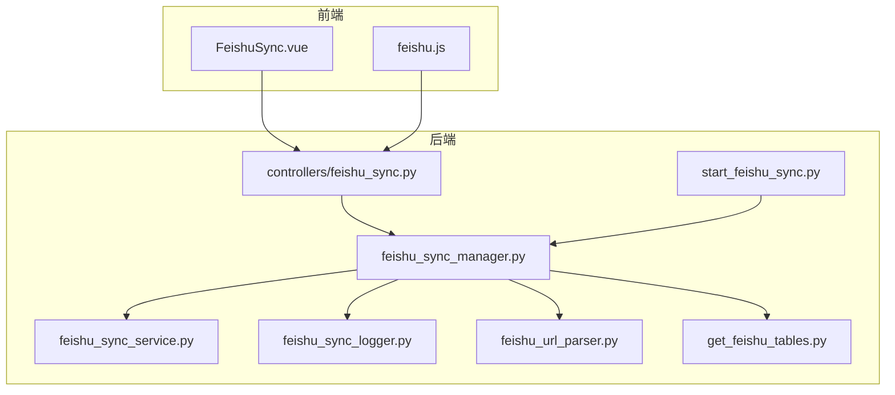
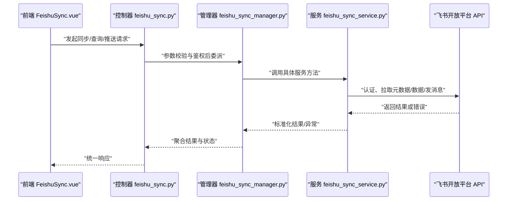
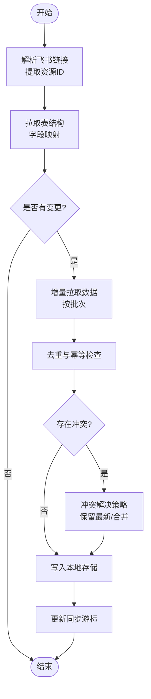
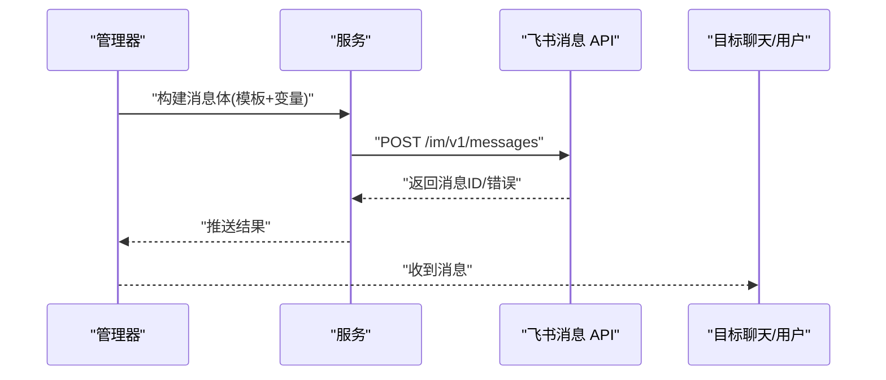
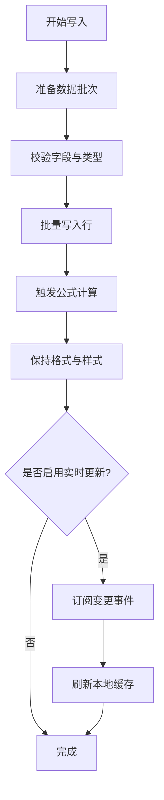
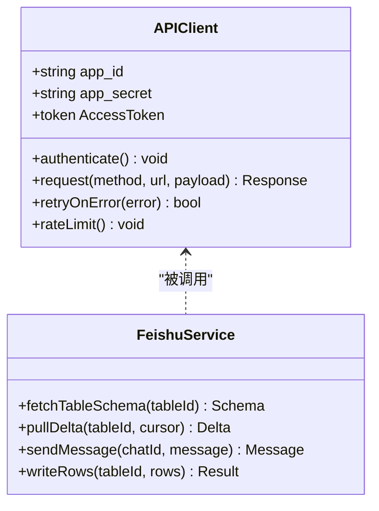
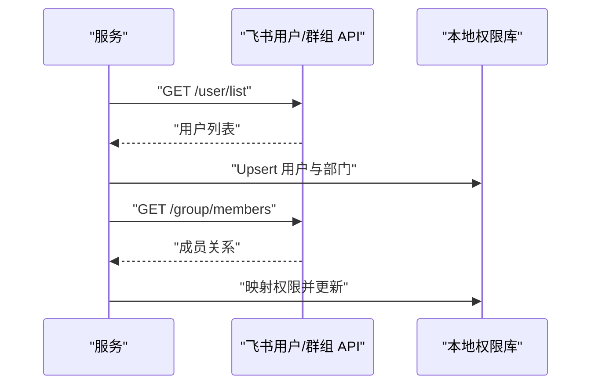
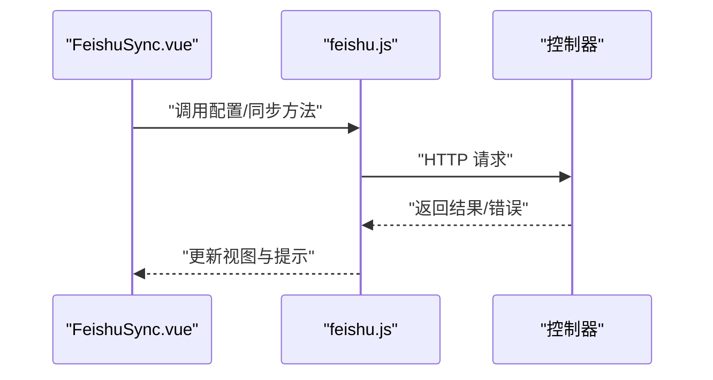
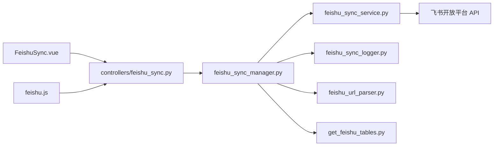

# 飞书集成

<cite>
**本文引用的文件**   
- [feishu_sync_manager.py](file://backend/feishu_sync_manager.py)
- [feishu_sync_service.py](file://backend/feishu_sync_service.py)
- [feishu_sync_logger.py](file://backend/feishu_sync_logger.py)
- [feishu_url_parser.py](file://backend/feishu_url_parser.py)
- [get_feishu_tables.py](file://backend/get_feishu_tables.py)
- [start_feishu_sync.py](file://backend/start_feishu_sync.py)
- [controllers/feishu_sync.py](file://backend/controllers/feishu_sync.py)
- [frontend/src/views/FeishuSync.vue](file://frontend/src/views/FeishuSync.vue)
- [frontend/src/utils/feishu.js](file://frontend/src/utils/feishu.js)
</cite>

## 目录
1. [简介](#简介)
2. [项目结构](#项目结构)
3. [核心组件](#核心组件)
4. [架构总览](#架构总览)
5. [详细组件分析](#详细组件分析)
6. [依赖关系分析](#依赖关系分析)
7. [性能考虑](#性能考虑)
8. [故障排查指南](#故障排查指南)
9. [结论](#结论)
10. [附录](#附录)

## 简介
本文件为 SmartAsk 的飞书集成功能提供完整、深入的技术文档，覆盖以下关键主题：
- 飞书数据同步机制：表结构同步、增量数据同步、冲突处理与错误恢复
- 飞书消息推送：报告发送、查询结果通知、异常告警与自定义消息模板
- 飞书表格集成：数据写入、公式计算、格式保持与实时更新
- 飞书 API 封装：认证管理、请求限流、错误处理与重试机制
- 飞书权限对接：用户同步、群组管理与权限映射
- 应用配置步骤、API 密钥管理与安全注意事项
- 完整的集成示例与故障排查指南

## 项目结构
SmartAsk 的飞书集成由后端服务、控制器与前端页面组成。后端负责与飞书开放平台交互（认证、拉取元数据、增量同步、消息推送等），控制器暴露 REST 接口供前端调用，前端提供可视化配置与操作入口。

图表来源
- [controllers/feishu_sync.py](file://backend/controllers/feishu_sync.py)
- [feishu_sync_manager.py](file://backend/feishu_sync_manager.py)
- [feishu_sync_service.py](file://backend/feishu_sync_service.py)
- [feishu_sync_logger.py](file://backend/feishu_sync_logger.py)
- [feishu_url_parser.py](file://backend/feishu_url_parser.py)
- [get_feishu_tables.py](file://backend/get_feishu_tables.py)
- [start_feishu_sync.py](file://backend/start_feishu_sync.py)
- [frontend/src/views/FeishuSync.vue](file://frontend/src/views/FeishuSync.vue)
- [frontend/src/utils/feishu.js](file://frontend/src/utils/feishu.js)

章节来源
- [controllers/feishu_sync.py](file://backend/controllers/feishu_sync.py)
- [feishu_sync_manager.py](file://backend/feishu_sync_manager.py)
- [feishu_sync_service.py](file://backend/feishu_sync_service.py)
- [feishu_sync_logger.py](file://backend/feishu_sync_logger.py)
- [feishu_url_parser.py](file://backend/feishu_url_parser.py)
- [get_feishu_tables.py](file://backend/get_feishu_tables.py)
- [start_feishu_sync.py](file://backend/start_feishu_sync.py)
- [frontend/src/views/FeishuSync.vue](file://frontend/src/views/FeishuSync.vue)
- [frontend/src/utils/feishu.js](file://frontend/src/utils/feishu.js)

## 核心组件
- 控制器层（controllers/feishu_sync.py）
  - 职责：对外暴露飞书同步相关 REST 接口，接收前端请求并委派给管理器执行具体逻辑。
  - 关键点：参数校验、鉴权、响应封装、错误码统一。
- 管理器（feishu_sync_manager.py）
  - 职责：编排飞书同步流程，协调服务层、日志、URL 解析、元数据获取等子模块。
  - 关键点：任务调度、状态跟踪、幂等控制、重试策略。
- 服务层（feishu_sync_service.py）
  - 职责：实现与飞书开放平台的交互细节（认证、拉取表结构、增量拉取、消息推送、表格写入等）。
  - 关键点：API 封装、限流、重试、错误分类与恢复。
- 日志（feishu_sync_logger.py）
  - 职责：记录同步过程的关键事件、错误与审计信息。
  - 关键点：结构化日志、分级输出、可观测性。
- URL 解析（feishu_url_parser.py）
  - 职责：解析飞书链接（如多维表格、知识库、消息等）以提取资源标识。
  - 关键点：多类型识别、正则匹配、容错处理。
- 元数据获取（get_feishu_tables.py）
  - 职责：从飞书多维表格或相关资源中拉取表结构与字段定义。
  - 关键点：字段类型映射、空值处理、变更检测。
- 启动器（start_feishu_sync.py）
  - 职责：作为独立进程或定时任务启动同步流程。
  - 关键点：环境初始化、配置加载、任务循环。

章节来源
- [controllers/feishu_sync.py](file://backend/controllers/feishu_sync.py)
- [feishu_sync_manager.py](file://backend/feishu_sync_manager.py)
- [feishu_sync_service.py](file://backend/feishu_sync_service.py)
- [feishu_sync_logger.py](file://backend/feishu_sync_logger.py)
- [feishu_url_parser.py](file://backend/feishu_url_parser.py)
- [get_feishu_tables.py](file://backend/get_feishu_tables.py)
- [start_feishu_sync.py](file://backend/start_feishu_sync.py)

## 架构总览
整体采用分层架构：前端通过控制器访问后端能力；管理器编排流程；服务层封装飞书 API；日志与工具模块提供支撑。

图表来源
- [controllers/feishu_sync.py](file://backend/controllers/feishu_sync.py)
- [feishu_sync_manager.py](file://backend/feishu_sync_manager.py)
- [feishu_sync_service.py](file://backend/feishu_sync_service.py)

## 详细组件分析

### 数据同步机制（表结构同步、增量同步、冲突处理、错误恢复）
- 表结构同步
  - 通过元数据获取模块拉取飞书多维表格字段定义，进行本地映射与缓存。
  - 支持字段类型转换、默认值与约束对齐。
- 增量数据同步
  - 基于时间戳或游标定位变更，按批次拉取差异数据，降低带宽与延迟。
  - 支持去重与幂等写入，避免重复记录。
- 冲突处理
  - 对主键/唯一键冲突采用“保留最新”或“合并策略”，并提供回滚点。
  - 冲突日志与告警，便于人工介入。
- 错误恢复
  - 网络异常自动重试（指数退避），失败记录至持久化队列。
  - 断点续传与补偿任务，保障最终一致性。

图表来源
- [feishu_url_parser.py](file://backend/feishu_url_parser.py)
- [get_feishu_tables.py](file://backend/get_feishu_tables.py)
- [feishu_sync_service.py](file://backend/feishu_sync_service.py)
- [feishu_sync_manager.py](file://backend/feishu_sync_manager.py)

章节来源
- [feishu_url_parser.py](file://backend/feishu_url_parser.py)
- [get_feishu_tables.py](file://backend/get_feishu_tables.py)
- [feishu_sync_service.py](file://backend/feishu_sync_service.py)
- [feishu_sync_manager.py](file://backend/feishu_sync_manager.py)

### 飞书消息推送（报告发送、查询结果通知、异常告警、自定义模板）
- 报告发送
  - 将分析报告生成富文本或卡片消息，推送到指定群或用户。
  - 支持附件（图片/PDF）与超链接。
- 查询结果通知
  - 根据查询结果动态生成摘要卡片，包含关键指标与趋势。
- 异常告警
  - 捕获同步失败、API 限流、权限不足等异常，发送告警消息。
- 自定义消息模板
  - 支持变量替换与条件渲染，适配不同业务场景。

图表来源
- [feishu_sync_service.py](file://backend/feishu_sync_service.py)
- [feishu_sync_manager.py](file://backend/feishu_sync_manager.py)

章节来源
- [feishu_sync_service.py](file://backend/feishu_sync_service.py)
- [feishu_sync_manager.py](file://backend/feishu_sync_manager.py)

### 飞书表格集成（数据写入、公式计算、格式保持、实时更新）
- 数据写入
  - 批量插入/更新行，支持事务性与回滚。
- 公式计算
  - 写入后触发公式重算，确保展示一致。
- 格式保持
  - 保留单元格样式、数据类型与注释。
- 实时更新
  - 使用 Webhook 或轮询监听变更，驱动本地缓存刷新。

图表来源
- [feishu_sync_service.py](file://backend/feishu_sync_service.py)
- [get_feishu_tables.py](file://backend/get_feishu_tables.py)

章节来源
- [feishu_sync_service.py](file://backend/feishu_sync_service.py)
- [get_feishu_tables.py](file://backend/get_feishu_tables.py)

### 飞书 API 调用封装（认证管理、请求限流、错误处理、重试机制）
- 认证管理
  - 维护 App ID/Secret，获取并刷新访问令牌，支持多租户隔离。
- 请求限流
  - 基于令牌桶或滑动窗口限制 QPS，避免触发平台限流。
- 错误处理
  - 区分网络错误、业务错误与权限错误，统一转换为标准异常。
- 重试机制
  - 针对瞬时错误（超时、限流）实施指数退避与最大重试次数。

图表来源
- [feishu_sync_service.py](file://backend/feishu_sync_service.py)

章节来源
- [feishu_sync_service.py](file://backend/feishu_sync_service.py)

### 飞书权限对接（用户同步、群组管理、权限映射）
- 用户同步
  - 定期拉取用户列表与部门信息，映射到本地 RBAC 模型。
- 群组管理
  - 同步群组与成员关系，用于消息推送与数据访问控制。
- 权限映射
  - 将飞书角色/权限映射到系统权限，实现细粒度控制。

图表来源
- [feishu_sync_service.py](file://backend/feishu_sync_service.py)

章节来源
- [feishu_sync_service.py](file://backend/feishu_sync_service.py)

### 前端集成（配置与操作入口）
- FeishuSync.vue
  - 提供飞书应用配置、同步任务启停、日志查看与消息测试界面。
- feishu.js
  - 封装前端与后端控制器的交互，处理鉴权与错误提示。

图表来源
- [frontend/src/views/FeishuSync.vue](file://frontend/src/views/FeishuSync.vue)
- [frontend/src/utils/feishu.js](file://frontend/src/utils/feishu.js)
- [controllers/feishu_sync.py](file://backend/controllers/feishu_sync.py)

章节来源
- [frontend/src/views/FeishuSync.vue](file://frontend/src/views/FeishuSync.vue)
- [frontend/src/utils/feishu.js](file://frontend/src/utils/feishu.js)
- [controllers/feishu_sync.py](file://backend/controllers/feishu_sync.py)

## 依赖关系分析
- 控制器依赖管理器，管理器依赖服务层与工具模块。
- 服务层依赖飞书开放平台 API，内部包含认证、限流与重试逻辑。
- 日志模块贯穿各层，提供可观测性。
- 前端通过控制器间接访问所有能力。

图表来源
- [controllers/feishu_sync.py](file://backend/controllers/feishu_sync.py)
- [feishu_sync_manager.py](file://backend/feishu_sync_manager.py)
- [feishu_sync_service.py](file://backend/feishu_sync_service.py)
- [feishu_sync_logger.py](file://backend/feishu_sync_logger.py)
- [feishu_url_parser.py](file://backend/feishu_url_parser.py)
- [get_feishu_tables.py](file://backend/get_feishu_tables.py)
- [frontend/src/views/FeishuSync.vue](file://frontend/src/views/FeishuSync.vue)
- [frontend/src/utils/feishu.js](file://frontend/src/utils/feishu.js)

章节来源
- [controllers/feishu_sync.py](file://backend/controllers/feishu_sync.py)
- [feishu_sync_manager.py](file://backend/feishu_sync_manager.py)
- [feishu_sync_service.py](file://backend/feishu_sync_service.py)
- [feishu_sync_logger.py](file://backend/feishu_sync_logger.py)
- [feishu_url_parser.py](file://backend/feishu_url_parser.py)
- [get_feishu_tables.py](file://backend/get_feishu_tables.py)
- [frontend/src/views/FeishuSync.vue](file://frontend/src/views/FeishuSync.vue)
- [frontend/src/utils/feishu.js](file://frontend/src/utils/feishu.js)

## 性能考虑
- 增量同步优先：减少全量拉取，提升吞吐与降低延迟。
- 批处理与分页：合理设置批次大小，平衡内存与网络开销。
- 并发与限流：控制并发度，遵循飞书 API 限流策略。
- 缓存与去重：对元数据与热点数据进行缓存，避免重复计算。
- 异步任务：将耗时操作放入后台任务，提升用户体验。

[本节为通用指导，不直接分析具体文件]

## 故障排查指南
- 常见问题
  - 认证失败：检查 App ID/Secret 与权限范围，确认令牌有效。
  - 限流错误：降低请求频率，启用指数退避重试。
  - 权限不足：核对用户/群组权限映射，确保目标资源可见。
  - 数据不一致：检查增量游标与去重逻辑，必要时回滚并重放。
- 诊断步骤
  - 查看同步日志与错误堆栈，定位失败阶段。
  - 验证飞书链接解析是否正确，确认资源 ID。
  - 使用最小数据集复现问题，逐步缩小范围。
  - 检查网络与代理配置，排除外部因素。

章节来源
- [feishu_sync_logger.py](file://backend/feishu_sync_logger.py)
- [feishu_sync_manager.py](file://backend/feishu_sync_manager.py)
- [feishu_sync_service.py](file://backend/feishu_sync_service.py)

## 结论
SmartAsk 的飞书集成通过清晰的分层设计与完善的错误恢复机制，实现了稳定的表结构同步、增量数据同步、消息推送与表格集成。配合前端可视化配置，用户可快速完成应用接入与日常运维。建议在生产环境中启用监控与告警，持续优化限流与重试策略，确保高可用与一致性。

[本节为总结性内容，不直接分析具体文件]

## 附录
- 应用配置步骤
  - 在飞书开放平台创建应用，获取 App ID/Secret。
  - 配置所需权限（用户、群组、多维表格、消息等）。
  - 在后端配置中填入凭证，并验证连通性。
- API 密钥管理
  - 使用环境变量或密钥管理服务存储敏感信息。
  - 定期轮换密钥，限制访问范围。
- 安全注意事项
  - 最小权限原则，仅授予必要权限。
  - 传输加密与签名校验，防止篡改。
  - 审计日志与访问记录，满足合规要求。

[本节为通用指导，不直接分析具体文件]