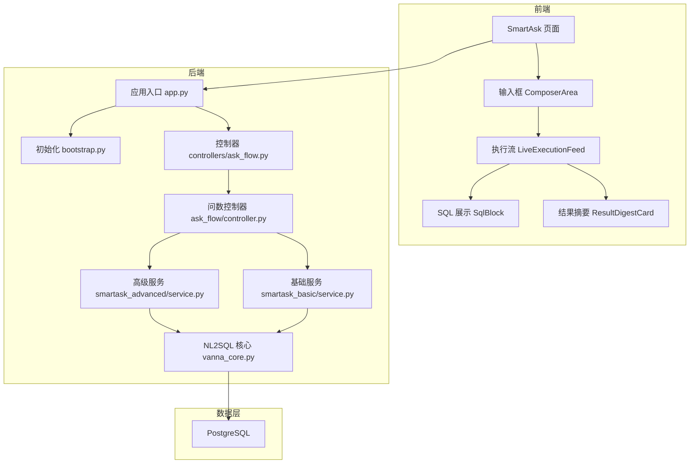
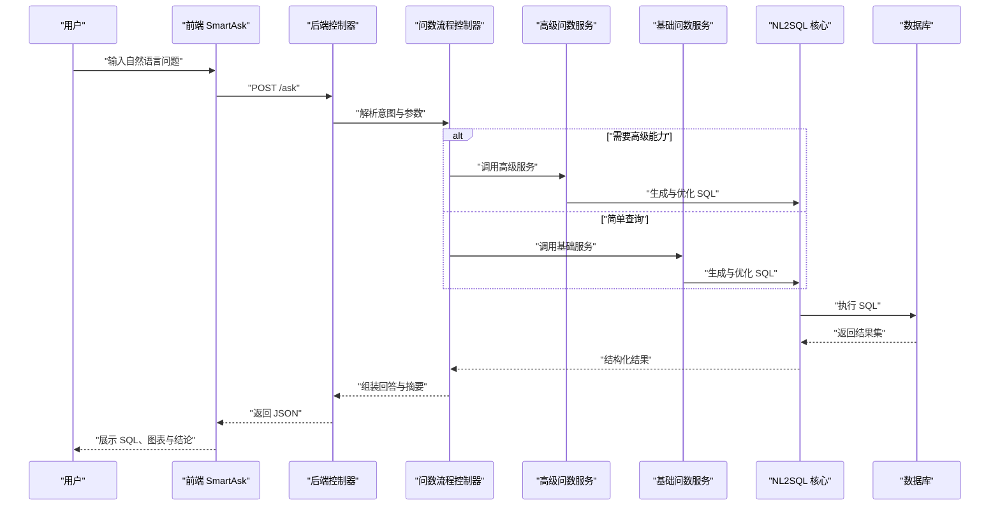
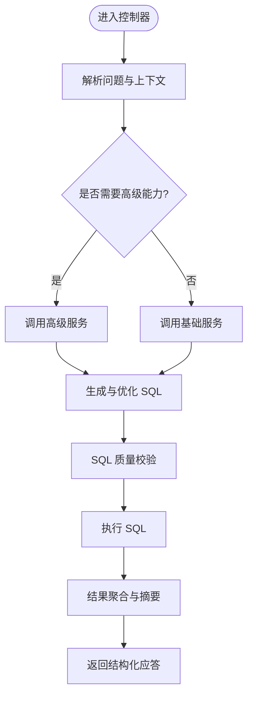
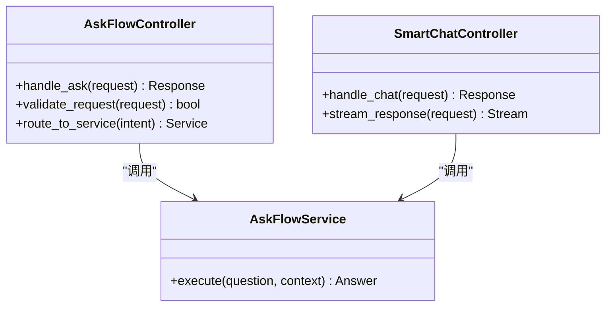
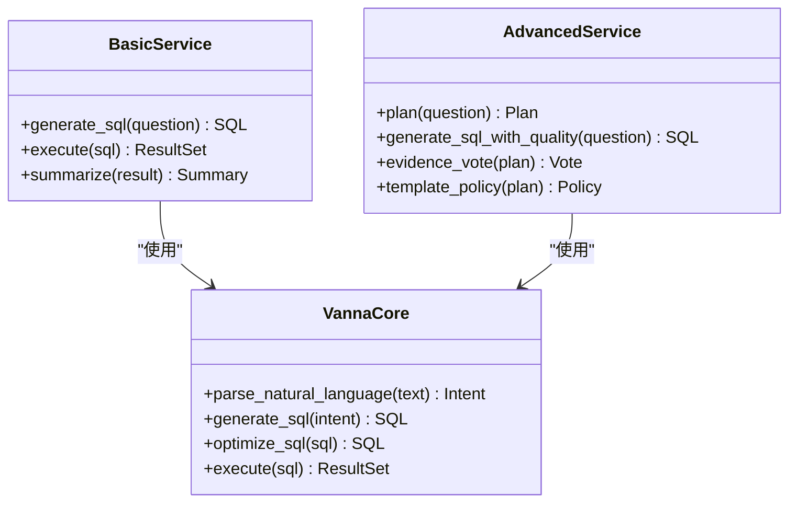
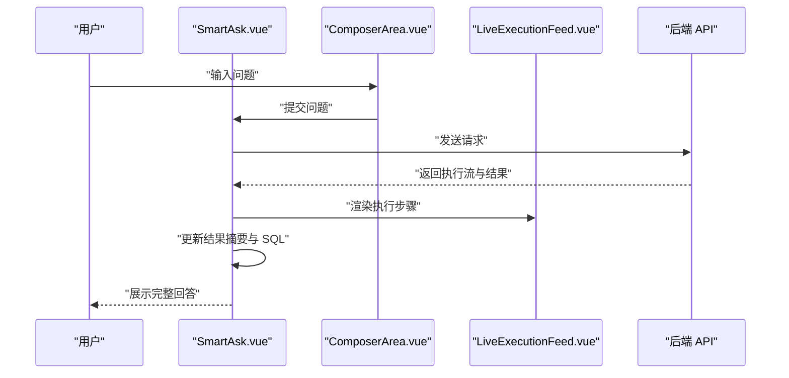
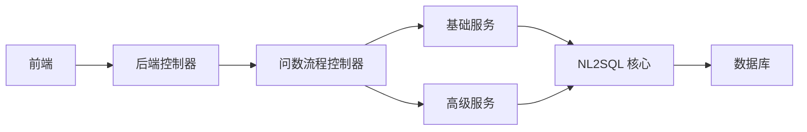

# 项目介绍与价值

<cite>
**本文引用的文件**   
- [README.md](file://README.md)
- [项目说明书.md](file://项目说明书.md)
- [app.py](file://backend/app.py)
- [bootstrap.py](file://backend/bootstrap.py)
- [ask_flow/controller.py](file://backend/ask_flow/controller.py)
- [controllers/ask_flow.py](file://backend/controllers/ask_flow.py)
- [controllers/smart_chat.py](file://backend/controllers/smart_chat.py)
- [smartask_advanced/service.py](file://backend/smartask_advanced/service.py)
- [smartask_basic/service.py](file://backend/smartask_basic/service.py)
- [vanna_core.py](file://backend/vanna_core.py)
- [frontend/src/views/SmartAsk.vue](file://frontend/src/views/SmartAsk.vue)
- [frontend/src/components/smartask/ChatHeader.vue](file://frontend/src/components/smartask/ChatHeader.vue)
- [frontend/src/components/smartask/ComposerArea.vue](file://frontend/src/components/smartask/ComposerArea.vue)
- [frontend/src/components/smartask/LiveExecutionFeed.vue](file://frontend/src/components/smartask/LiveExecutionFeed.vue)
- [frontend/src/components/smartask/PlanCard.vue](file://frontend/src/components/smartask/PlanCard.vue)
- [frontend/src/components/smartask/ResultDigestCard.vue](file://frontend/src/components/smartask/ResultDigestCard.vue)
- [frontend/src/components/smartask/SqlBlock.vue](file://frontend/src/components/smartask/SqlBlock.vue)
- [frontend/src/components/smartask/ThinkingCard.vue](file://frontend/src/components/smartask/ThinkingCard.vue)
- [frontend/src/api/index.js](file://frontend/src/api/index.js)
- [docker-compose.yml](file://docker-compose.yml)
- [Dockerfile (backend)](file://backend/Dockerfile)
- [Dockerfile (frontend)](file://frontend/Dockerfile)
</cite>

## 目录
1. [引言](#引言)
2. [项目结构](#项目结构)
3. [核心组件](#核心组件)
4. [架构总览](#架构总览)
5. [详细组件分析](#详细组件分析)
6. [依赖关系分析](#依赖关系分析)
7. [性能考量](#性能考量)
8. [故障排查指南](#故障排查指南)
9. [结论](#结论)
10. [附录](#附录)

## 引言
SmartAsk 智能问数平台是一个企业级自然语言到 SQL（NL2SQL）平台，致力于通过自然语言查询简化数据分析流程、降低数据使用门槛、提升企业决策效率。其核心价值主张在于：
- 让业务人员用“说人话”的方式获取数据洞察，无需掌握 SQL；
- 为数据分析师提供高效的数据探索与验证工具，缩短从问题到答案的路径；
- 为开发者提供可扩展的 NL2SQL 引擎与集成能力，快速构建企业数据应用。

与传统 SQL 查询方式相比，SmartAsk 解决了以下痛点：
- 学习成本高：非技术人员难以快速上手 SQL；
- 沟通成本高：业务需求与数据实现之间存在理解偏差；
- 响应速度慢：临时取数需求频繁，排期长、迭代慢；
- 质量不可控：手工编写 SQL 易出错，缺乏统一治理与可追溯性。

技术愿景是“人人都是数据分析师”，通过自然语言驱动的数据问答，将复杂的数据分析过程抽象为对话式交互，使组织内不同角色都能以最低门槛获得高质量的数据洞察。

典型应用场景包括：
- 销售分析：按区域、渠道、时间维度查看销售额、转化率、客单价等指标；
- 运营监控：实时或近实时观察关键运营指标，异常自动预警；
- 财务报表：自动生成利润表、资产负债表、现金流量表的摘要与明细；
- 用户增长：拉新、留存、活跃、转化漏斗分析与归因；
- 供应链与库存：库存周转、缺货率、采购计划建议。

赋能角色与价值：
- 业务人员：直接提问即得图表与结论，减少等待与沟通成本；
- 数据分析师：聚焦指标口径与模型设计，自动化生成 SQL 与报告；
- 开发者：基于标准化接口与插件化能力，快速集成与扩展。

**章节来源**
- [README.md](file://README.md)
- [项目说明书.md](file://项目说明书.md)

## 项目结构
SmartAsk 采用前后端分离架构，后端以 Python 为主，前端基于 Vue 生态，容器化部署支持 Docker Compose。整体结构如下：
- 后端模块：
  - ask_flow：问数流程编排与控制器；
  - controllers：REST API 控制器集合（认证、权限、数据集、报表、飞书同步等）；
  - smartask_advanced / smartask_basic：高级与基础问数服务；
  - vanna_core：NL2SQL 核心转换与执行；
  - 其他：配置管理、迁移、日志、权限、组织树等。
- 前端模块：
  - views：页面路由（SmartAsk、数据库管理、报表配置等）；
  - components：聊天界面、执行反馈、SQL 展示、思考卡片等；
  - api：与后端交互的 HTTP 客户端封装；
  - state：会话与缓存状态管理。
- 基础设施：
  - docker-compose.yml：一键编排后端、数据库等；
  - Dockerfile：前后端镜像构建脚本。

**图示来源**
- [app.py](file://backend/app.py)
- [bootstrap.py](file://backend/bootstrap.py)
- [ask_flow/controller.py](file://backend/ask_flow/controller.py)
- [controllers/ask_flow.py](file://backend/controllers/ask_flow.py)
- [smartask_advanced/service.py](file://backend/smartask_advanced/service.py)
- [smartask_basic/service.py](file://backend/smartask_basic/service.py)
- [vanna_core.py](file://backend/vanna_core.py)
- [docker-compose.yml](file://docker-compose.yml)

**章节来源**
- [docker-compose.yml](file://docker-compose.yml)
- [Dockerfile (backend)](file://backend/Dockerfile)
- [Dockerfile (frontend)](file://frontend/Dockerfile)

## 核心组件
- 问数流程控制器（ask_flow/controller.py）：负责解析用户意图、调度路由、协调基础与高级问数服务，并返回结构化结果。
- 控制器层（controllers/ask_flow.py、controllers/smart_chat.py）：对外暴露 REST API，处理请求校验、鉴权、限流与错误码。
- 高级问数服务（smartask_advanced/service.py）：提供多步推理、SQL 质量评估、证据投票、模板策略等增强能力。
- 基础问数服务（smartask_basic/service.py）：提供快速路径的 NL2SQL 转换与执行，适合简单查询场景。
- NL2SQL 核心（vanna_core.py）：将自然语言转换为 SQL，并进行语法检查、优化与执行。
- 前端交互（SmartAsk.vue 及相关组件）：提供对话式输入、执行过程可视化、SQL 可读性与结果摘要展示。

**章节来源**
- [ask_flow/controller.py](file://backend/ask_flow/controller.py)
- [controllers/ask_flow.py](file://backend/controllers/ask_flow.py)
- [controllers/smart_chat.py](file://backend/controllers/smart_chat.py)
- [smartask_advanced/service.py](file://backend/smartask_advanced/service.py)
- [smartask_basic/service.py](file://backend/smartask_basic/service.py)
- [vanna_core.py](file://backend/vanna_core.py)
- [frontend/src/views/SmartAsk.vue](file://frontend/src/views/SmartAsk.vue)
- [frontend/src/components/smartask/ChatHeader.vue](file://frontend/src/components/smartask/ChatHeader.vue)
- [frontend/src/components/smartask/ComposerArea.vue](file://frontend/src/components/smartask/ComposerArea.vue)
- [frontend/src/components/smartask/LiveExecutionFeed.vue](file://frontend/src/components/smartask/LiveExecutionFeed.vue)
- [frontend/src/components/smartask/PlanCard.vue](file://frontend/src/components/smartask/PlanCard.vue)
- [frontend/src/components/smartask/ResultDigestCard.vue](file://frontend/src/components/smartask/ResultDigestCard.vue)
- [frontend/src/components/smartask/SqlBlock.vue](file://frontend/src/components/smartask/SqlBlock.vue)
- [frontend/src/components/smartask/ThinkingCard.vue](file://frontend/src/components/smartask/ThinkingCard.vue)
- [frontend/src/api/index.js](file://frontend/src/api/index.js)

## 架构总览
SmartAsk 的整体架构围绕“对话式问数”展开，前端通过聊天界面收集用户意图，后端控制器进行路由与编排，调用基础或高级问数服务完成 NL2SQL 转换与执行，最终将 SQL、结果与摘要返回前端展示。

**图示来源**
- [controllers/ask_flow.py](file://backend/controllers/ask_flow.py)
- [ask_flow/controller.py](file://backend/ask_flow/controller.py)
- [smartask_advanced/service.py](file://backend/smartask_advanced/service.py)
- [smartask_basic/service.py](file://backend/smartask_basic/service.py)
- [vanna_core.py](file://backend/vanna_core.py)
- [frontend/src/views/SmartAsk.vue](file://frontend/src/views/SmartAsk.vue)

## 详细组件分析

### 问数流程控制器（ask_flow/controller.py）
职责：
- 接收来自控制器的请求，解析用户问题与上下文；
- 根据问题复杂度选择基础或高级服务；
- 编排执行步骤（意图识别、SQL 生成、质量校验、结果聚合）；
- 返回统一的应答结构（SQL、结果、摘要、思考过程）。

**图示来源**
- [ask_flow/controller.py](file://backend/ask_flow/controller.py)
- [smartask_advanced/service.py](file://backend/smartask_advanced/service.py)
- [smartask_basic/service.py](file://backend/smartask_basic/service.py)
- [vanna_core.py](file://backend/vanna_core.py)

**章节来源**
- [ask_flow/controller.py](file://backend/ask_flow/controller.py)

### 控制器层（controllers/ask_flow.py、controllers/smart_chat.py）
职责：
- 暴露 REST API，处理请求校验、鉴权、限流；
- 将前端请求转发至问数流程控制器；
- 统一错误码与响应格式，便于前端消费。

**图示来源**
- [controllers/ask_flow.py](file://backend/controllers/ask_flow.py)
- [controllers/smart_chat.py](file://backend/controllers/smart_chat.py)
- [ask_flow/controller.py](file://backend/ask_flow/controller.py)

**章节来源**
- [controllers/ask_flow.py](file://backend/controllers/ask_flow.py)
- [controllers/smart_chat.py](file://backend/controllers/smart_chat.py)

### 高级与基础问数服务（smartask_advanced/service.py、smartask_basic/service.py）
职责：
- 基础服务：快速路径，适用于简单查询，强调低延迟与高吞吐；
- 高级服务：多步推理、SQL 质量评估、证据投票、模板策略，适用于复杂分析场景；
- 两者均依赖 NL2SQL 核心进行 SQL 生成与优化。

**图示来源**
- [smartask_basic/service.py](file://backend/smartask_basic/service.py)
- [smartask_advanced/service.py](file://backend/smartask_advanced/service.py)
- [vanna_core.py](file://backend/vanna_core.py)

**章节来源**
- [smartask_basic/service.py](file://backend/smartask_basic/service.py)
- [smartask_advanced/service.py](file://backend/smartask_advanced/service.py)
- [vanna_core.py](file://backend/vanna_core.py)

### 前端交互组件（SmartAsk.vue 及子组件）
职责：
- SmartAsk.vue：页面主入口，管理会话状态与消息流；
- ChatHeader.vue：显示会话标题与操作按钮；
- ComposerArea.vue：用户输入框，支持快捷指令与历史记忆；
- LiveExecutionFeed.vue：实时展示执行步骤与进度；
- PlanCard.vue：展示分析计划与分支；
- ResultDigestCard.vue：结果摘要与关键结论；
- SqlBlock.vue：SQL 代码块展示与复制；
- ThinkingCard.vue：思考过程与推理链展示。

**图示来源**
- [frontend/src/views/SmartAsk.vue](file://frontend/src/views/SmartAsk.vue)
- [frontend/src/components/smartask/ChatHeader.vue](file://frontend/src/components/smartask/ChatHeader.vue)
- [frontend/src/components/smartask/ComposerArea.vue](file://frontend/src/components/smartask/ComposerArea.vue)
- [frontend/src/components/smartask/LiveExecutionFeed.vue](file://frontend/src/components/smartask/LiveExecutionFeed.vue)
- [frontend/src/components/smartask/PlanCard.vue](file://frontend/src/components/smartask/PlanCard.vue)
- [frontend/src/components/smartask/ResultDigestCard.vue](file://frontend/src/components/smartask/ResultDigestCard.vue)
- [frontend/src/components/smartask/SqlBlock.vue](file://frontend/src/components/smartask/SqlBlock.vue)
- [frontend/src/components/smartask/ThinkingCard.vue](file://frontend/src/components/smartask/ThinkingCard.vue)
- [frontend/src/api/index.js](file://frontend/src/api/index.js)

**章节来源**
- [frontend/src/views/SmartAsk.vue](file://frontend/src/views/SmartAsk.vue)
- [frontend/src/components/smartask/ChatHeader.vue](file://frontend/src/components/smartask/ChatHeader.vue)
- [frontend/src/components/smartask/ComposerArea.vue](file://frontend/src/components/smartask/ComposerArea.vue)
- [frontend/src/components/smartask/LiveExecutionFeed.vue](file://frontend/src/components/smartask/LiveExecutionFeed.vue)
- [frontend/src/components/smartask/PlanCard.vue](file://frontend/src/components/smartask/PlanCard.vue)
- [frontend/src/components/smartask/ResultDigestCard.vue](file://frontend/src/components/smartask/ResultDigestCard.vue)
- [frontend/src/components/smartask/SqlBlock.vue](file://frontend/src/components/smartask/SqlBlock.vue)
- [frontend/src/components/smartask/ThinkingCard.vue](file://frontend/src/components/smartask/ThinkingCard.vue)
- [frontend/src/api/index.js](file://frontend/src/api/index.js)

## 依赖关系分析
SmartAsk 的依赖关系清晰分层：
- 前端依赖后端 API；
- 后端控制器依赖问数流程控制器；
- 问数流程控制器依赖基础与高级服务；
- 服务层依赖 NL2SQL 核心；
- NL2SQL 核心依赖数据库。

**图示来源**
- [app.py](file://backend/app.py)
- [bootstrap.py](file://backend/bootstrap.py)
- [controllers/ask_flow.py](file://backend/controllers/ask_flow.py)
- [ask_flow/controller.py](file://backend/ask_flow/controller.py)
- [smartask_basic/service.py](file://backend/smartask_basic/service.py)
- [smartask_advanced/service.py](file://backend/smartask_advanced/service.py)
- [vanna_core.py](file://backend/vanna_core.py)

**章节来源**
- [app.py](file://backend/app.py)
- [bootstrap.py](file://backend/bootstrap.py)

## 性能考量
- 查询路径选择：简单问题走基础服务，复杂问题走高级服务，平衡延迟与准确性；
- SQL 优化：在 NL2SQL 核心中进行语法检查与执行计划优化，避免全表扫描；
- 结果缓存：对高频问题与相同参数的查询进行结果缓存，降低数据库压力；
- 流式响应：前端实时展示执行步骤，提升用户体验；
- 资源隔离：通过容器化部署与进程隔离，保障稳定性与可扩展性。

[本节为通用指导，不直接分析具体文件]

## 故障排查指南
常见问题与定位方法：
- 无法连接数据库：检查 docker-compose 配置与网络连通性；
- NL2SQL 生成失败：查看 SQL 质量校验日志与错误码；
- 权限不足：确认 RBAC 配置与数据权限设置；
- 前端无响应：检查 API 地址与跨域配置；
- 执行超时：优化 SQL 或调整超时阈值。

**章节来源**
- [docker-compose.yml](file://docker-compose.yml)
- [controllers/ask_flow.py](file://backend/controllers/ask_flow.py)
- [vanna_core.py](file://backend/vanna_core.py)

## 结论
SmartAsk 智能问数平台通过自然语言驱动的数据问答，显著降低了数据分析门槛，提升了企业决策效率。其模块化架构与插件化能力为不同角色提供了灵活的使用方式，同时保障了系统的可扩展性与稳定性。未来将继续强化 NL2SQL 准确性、丰富分析能力与优化用户体验，助力企业实现数据民主化。

[本节为总结性内容，不直接分析具体文件]

## 附录
- 部署说明：参考 docker-compose.yml 与 Dockerfile；
- API 文档：参考 controllers 下的各控制器文件；
- 前端组件：参考 frontend/src/components 与 views；
- 测试用例：参考 backend/tests 与 scripts 下的测试脚本。

[本节为补充信息，不直接分析具体文件]