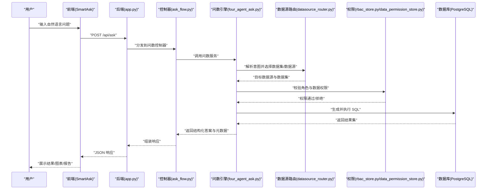
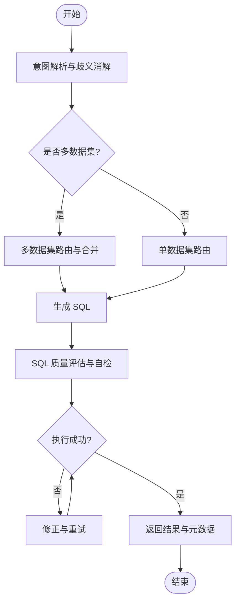
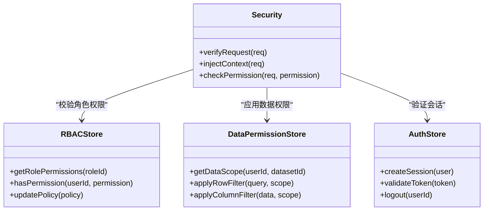
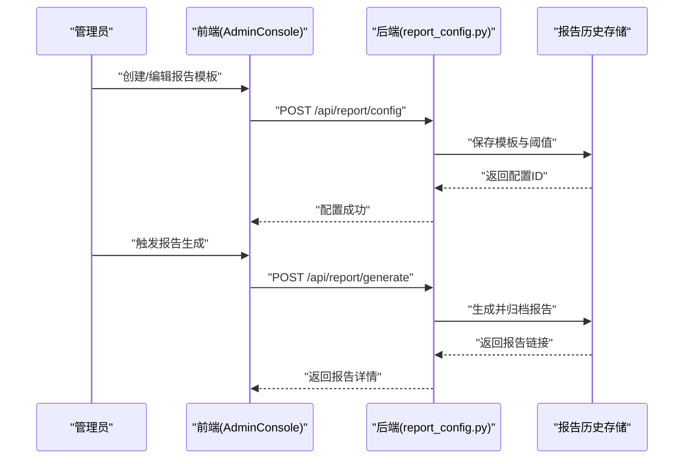
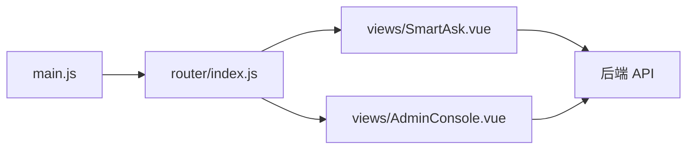
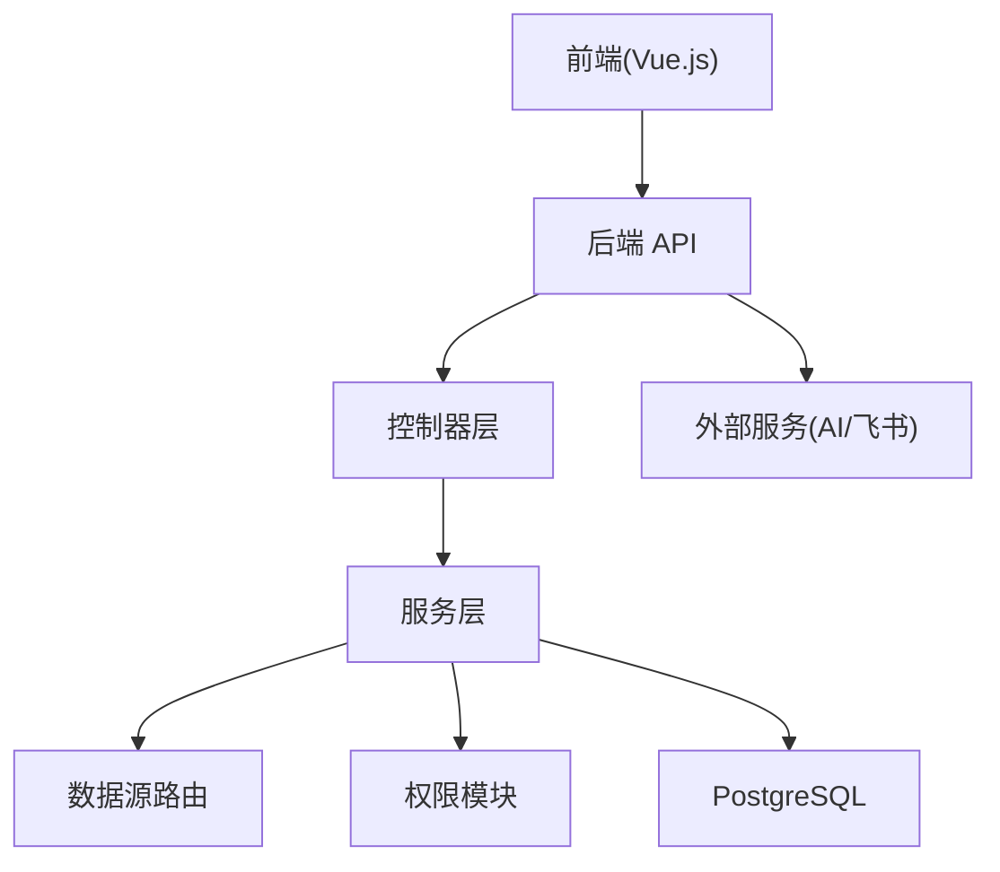

# 项目概述

<cite>
**本文引用的文件**   
- [README.md](file://README.md)
- [docker-compose.yml](file://docker-compose.yml)
- [backend/app.py](file://backend/app.py)
- [backend/bootstrap.py](file://backend/bootstrap.py)
- [backend/agent_registry.py](file://backend/agent_registry.py)
- [backend/config_manager.py](file://backend/config_manager.py)
- [backend/security.py](file://backend/security.py)
- [backend/auth_store.py](file://backend/auth_store.py)
- [backend/rbac_store.py](file://backend/rbac_store.py)
- [backend/data_permission_store.py](file://backend/data_permission_store.py)
- [backend/datasource_router.py](file://backend/datasource_router.py)
- [backend/four_agent_ask.py](file://backend/four_agent_ask.py)
- [backend/smartask_advanced/service.py](file://backend/smartask_advanced/service.py)
- [backend/smartask_basic/service.py](file://backend/smartask_basic/service.py)
- [backend/controllers/ask_flow.py](file://backend/controllers/ask_flow.py)
- [backend/controllers/auth.py](file://backend/controllers/auth.py)
- [backend/controllers/rbac.py](file://backend/controllers/rbac.py)
- [backend/controllers/data_permissions.py](file://backend/controllers/data_permissions.py)
- [backend/controllers/report_config.py](file://backend/controllers/report_config.py)
- [backend/controllers/dashboard.py](file://backend/controllers/dashboard.py)
- [backend/controllers/ai_models.py](file://backend/controllers/ai_models.py)
- [backend/controllers/agents.py](file://backend/controllers/agents.py)
- [backend/controllers/bookshelf.py](file://backend/controllers/bookshelf.py)
- [backend/controllers/dataset_transforms.py](file://backend/controllers/dataset_transforms.py)
- [backend/controllers/datasources.py](file://backend/controllers/datasources.py)
- [backend/controllers/feature_flags.py](file://backend/controllers/feature_flags.py)
- [backend/controllers/feishu_sync.py](file://backend/controllers/feishu_sync.py)
- [backend/controllers/organization_trees.py](file://backend/controllers/organization_trees.py)
- [backend/controllers/system_logs.py](file://backend/controllers/system_logs.py)
- [backend/smartask_advanced/skills/dataset_route.py](file://backend/smartask_advanced/skills/dataset_route.py)
- [backend/smartask_advanced/skills/route_guard.py](file://backend/smartask_advanced/skills/route_guard.py)
- [backend/smartask_advanced/skills/sql_quality.py](file://backend/smartask_advanced/skills/sql_quality.py)
- [frontend/src/main.js](file://frontend/src/main.js)
- [frontend/src/router/index.js](file://frontend/src/router/index.js)
- [frontend/src/views/SmartAsk.vue](file://frontend/src/views/SmartAsk.vue)
- [frontend/src/views/AdminConsole.vue](file://frontend/src/views/AdminConsole.vue)
- [frontend/Dockerfile](file://frontend/Dockerfile)
- [backend/Dockerfile](file://backend/Dockerfile)
</cite>

## 目录
1. [简介](#简介)
2. [项目结构](#项目结构)
3. [核心组件](#核心组件)
4. [架构总览](#架构总览)
5. [详细组件分析](#详细组件分析)
6. [依赖关系分析](#依赖关系分析)
7. [性能考量](#性能考量)
8. [故障排查指南](#故障排查指南)
9. [结论](#结论)
10. [附录](#附录)

## 简介
SmartAsk 智能问数平台是一个面向企业级的“自然语言到 SQL（NL2SQL）”数据问答与报告生成系统。它通过对话式交互，将业务人员的自然语言问题自动转化为可执行的 SQL，并在多数据集、多数据源环境中进行路由与权限控制，最终返回结构化结果、可视化图表或报告。平台支持 RBAC 权限模型、组织树管理、飞书同步、报告配置与历史管理等能力，提供前后端分离的 Web 界面与容器化部署方案，便于快速落地与规模化使用。

核心价值
- 降低数据获取门槛：业务人员用自然语言即可提问，无需掌握 SQL。
- 统一数据入口：跨库、跨表、跨数据集的智能路由与权限治理。
- 安全可控：基于角色与数据的细粒度权限控制，保障数据安全。
- 可观测与可演进：完善的日志、测试与迁移脚本，支撑持续迭代。

主要功能特性
- NL2SQL 智能转换：基础版与进阶版双引擎，支持意图识别、歧义消解、SQL 质量评估与自我校验。
- 多数据集路由：按组织、主题域、指标口径等维度自动选择合适的数据集与数据源。
- 权限控制：RBAC + 数据级权限，确保“可见即可用”。
- 报告生成：报告模板、阈值规则、历史归档与导出。
- 集成与扩展：AI 模型管理、Agent 注册、飞书同步、特征开关、系统日志。

设计理念
- 前后端分离：前端 Vue.js 3 构建 SPA，后端 Python 提供 REST API。
- 微服务风格：模块化控制器与技能（Skills）体系，职责清晰、易于扩展。
- 可配置与可观测：集中配置、特征开关、审计日志与运行态迁移。
- 容器化优先：Docker 镜像与编排，一键部署与弹性伸缩。

技术栈概览
- 后端：Python（Flask/FastAPI 风格），模块化控制器与服务层，PostgreSQL 持久化。
- 前端：Vue.js 3 + Vite，组件化 UI，状态管理与路由。
- 部署：Docker + docker-compose，Nginx 静态资源托管。

快速开始（环境要求、安装步骤、基本使用示例）
- 环境要求
  - Docker 与 docker-compose
  - PostgreSQL 数据库（由 compose 初始化）
  - Node.js（仅本地开发前端时）
- 安装步骤
  - 克隆仓库并进入根目录
  - 启动服务：执行 docker-compose up -d
  - 访问前端：浏览器打开 http://localhost（端口以 compose 配置为准）
- 基本使用示例
  - 登录控制台：AdminConsole 中配置数据源、数据集与权限
  - 发起问数：在 SmartAsk 页面输入自然语言问题，查看生成的 SQL 与结果
  - 生成报告：在报告配置中设置模板与阈值，触发生成并下载

章节来源
- [README.md](file://README.md)
- [docker-compose.yml](file://docker-compose.yml)

## 项目结构
SmartAsk 采用前后端分离与模块化后端设计：
- backend：核心后端逻辑，包含应用入口、控制器、服务层、权限与路由、迁移脚本等。
- frontend：Vue.js 3 前端应用，包含视图、组件、路由、状态管理与构建配置。
- config：运行时配置与索引文件。
- docker/postgres/init：数据库初始化脚本。
- scripts：运维与测试脚本。
- docs：产品与部署文档。

```mermaid
graph TB
subgraph "前端"
FE_Main["main.js"]
FE_Router["router/index.js"]
FE_SmartAsk["views/SmartAsk.vue"]
FE_Admin["views/AdminConsole.vue"]
end
subgraph "后端"
BE_App["app.py"]
BE_Bootstrap["bootstrap.py"]
BE_AgentReg["agent_registry.py"]
BE_Config["config_manager.py"]
BE_Security["security.py"]
BE_AuthStore["auth_store.py"]
BE_RBAC["rbac_store.py"]
BE_DataPerm["data_permission_store.py"]
BE_DSR["datasource_router.py"]
BE_FourAgent["four_agent_ask.py"]
BE_AdvService["smartask_advanced/service.py"]
BE_BasicService["smartask_basic/service.py"]
BE_CtrlAsk["controllers/ask_flow.py"]
BE_CtrlAuth["controllers/auth.py"]
BE_CtrlRBAC["controllers/rbac.py"]
BE_CtrlDataPerm["controllers/data_permissions.py"]
BE_CtrlReport["controllers/report_config.py"]
BE_CtrlDash["controllers/dashboard.py"]
BE_CtrlModels["controllers/ai_models.py"]
BE_CtrlAgents["controllers/agents.py"]
BE_CtrlBookshelf["controllers/bookshelf.py"]
BE_CtrlTransform["controllers/dataset_transforms.py"]
BE_CtrlDS["controllers/datasources.py"]
BE_CtrlFlags["controllers/feature_flags.py"]
BE_CtrlFeishu["controllers/feishu_sync.py"]
BE_CtrlOrg["controllers/organization_trees.py"]
BE_CtrlLogs["controllers/system_logs.py"]
end
subgraph "数据库"
DB_PG["PostgreSQL"]
end
FE_Main --> FE_Router
FE_Router --> FE_SmartAsk
FE_Router --> FE_Admin
FE_SmartAsk --> BE_App
FE_Admin --> BE_App
BE_App --> BE_Bootstrap
BE_App --> BE_AgentReg
BE_App --> BE_Config
BE_App --> BE_Security
BE_App --> BE_CtrlAsk
BE_App --> BE_CtrlAuth
BE_App --> BE_CtrlRBAC
BE_App --> BE_CtrlDataPerm
BE_App --> BE_CtrlReport
BE_App --> BE_CtrlDash
BE_App --> BE_CtrlModels
BE_App --> BE_CtrlAgents
BE_App --> BE_CtrlBookshelf
BE_App --> BE_CtrlTransform
BE_App --> BE_CtrlDS
BE_App --> BE_CtrlFlags
BE_App --> BE_CtrlFeishu
BE_App --> BE_CtrlOrg
BE_App --> BE_CtrlLogs
BE_FourAgent --> BE_AdvService
BE_FourAgent --> BE_BasicService
BE_FourAgent --> BE_DSR
BE_FourAgent --> BE_RBAC
BE_FourAgent --> BE_DataPerm
BE_App --> DB_PG
```

图示来源
- [backend/app.py](file://backend/app.py)
- [backend/bootstrap.py](file://backend/bootstrap.py)
- [backend/agent_registry.py](file://backend/agent_registry.py)
- [backend/config_manager.py](file://backend/config_manager.py)
- [backend/security.py](file://backend/security.py)
- [backend/auth_store.py](file://backend/auth_store.py)
- [backend/rbac_store.py](file://backend/rbac_store.py)
- [backend/data_permission_store.py](file://backend/data_permission_store.py)
- [backend/datasource_router.py](file://backend/datasource_router.py)
- [backend/four_agent_ask.py](file://backend/four_agent_ask.py)
- [backend/smartask_advanced/service.py](file://backend/smartask_advanced/service.py)
- [backend/smartask_basic/service.py](file://backend/smartask_basic/service.py)
- [backend/controllers/ask_flow.py](file://backend/controllers/ask_flow.py)
- [backend/controllers/auth.py](file://backend/controllers/auth.py)
- [backend/controllers/rbac.py](file://backend/controllers/rbac.py)
- [backend/controllers/data_permissions.py](file://backend/controllers/data_permissions.py)
- [backend/controllers/report_config.py](file://backend/controllers/report_config.py)
- [backend/controllers/dashboard.py](file://backend/controllers/dashboard.py)
- [backend/controllers/ai_models.py](file://backend/controllers/ai_models.py)
- [backend/controllers/agents.py](file://backend/controllers/agents.py)
- [backend/controllers/bookshelf.py](file://backend/controllers/bookshelf.py)
- [backend/controllers/dataset_transforms.py](file://backend/controllers/dataset_transforms.py)
- [backend/controllers/datasources.py](file://backend/controllers/datasources.py)
- [backend/controllers/feature_flags.py](file://backend/controllers/feature_flags.py)
- [backend/controllers/feishu_sync.py](file://backend/controllers/feishu_sync.py)
- [backend/controllers/organization_trees.py](file://backend/controllers/organization_trees.py)
- [backend/controllers/system_logs.py](file://backend/controllers/system_logs.py)
- [frontend/src/main.js](file://frontend/src/main.js)
- [frontend/src/router/index.js](file://frontend/src/router/index.js)
- [frontend/src/views/SmartAsk.vue](file://frontend/src/views/SmartAsk.vue)
- [frontend/src/views/AdminConsole.vue](file://frontend/src/views/AdminConsole.vue)

章节来源
- [backend/app.py](file://backend/app.py)
- [frontend/src/main.js](file://frontend/src/main.js)
- [frontend/src/router/index.js](file://frontend/src/router/index.js)

## 核心组件
- 应用入口与引导
  - app.py：注册路由、挂载控制器、初始化中间件与安全策略。
  - bootstrap.py：启动引导、加载配置、初始化存储与调度器。
- 权限与安全
  - security.py：鉴权中间件、签名校验、请求上下文注入。
  - auth_store.py：用户会话与认证信息存储。
  - rbac_store.py：角色与权限映射、策略缓存。
  - data_permission_store.py：数据级权限（行/列级）与组织树关联。
- 问数引擎
  - four_agent_ask.py：四 Agent 协作流程（意图解析、路由、SQL 生成、质量评估）。
  - smartask_advanced/service.py：进阶版服务（复杂查询、跨数据集、证据投票、模板策略）。
  - smartask_basic/service.py：基础版服务（单数据集、快速回答）。
  - datasource_router.py：数据源与数据集路由决策。
- 控制器层
  - ask_flow.py：问数主流程接口（接收问题、返回计划与结果）。
  - auth.py：登录、登出、回调。
  - rbac.py：角色与权限管理接口。
  - data_permissions.py：数据权限配置与校验接口。
  - report_config.py：报告模板、阈值与历史管理。
  - dashboard.py：看板与聚合统计。
  - ai_models.py：AI 模型配置与调用封装。
  - agents.py：Agent 注册与生命周期管理。
  - bookshelf.py：知识库与提示词管理。
  - dataset_transforms.py：数据集变换与标准化。
  - datasources.py：数据源连接与连通性检测。
  - feature_flags.py：特征开关与灰度发布。
  - feishu_sync.py：飞书表格/文档同步。
  - organization_trees.py：组织树与成员关系。
  - system_logs.py：系统事件与审计日志。

章节来源
- [backend/app.py](file://backend/app.py)
- [backend/bootstrap.py](file://backend/bootstrap.py)
- [backend/security.py](file://backend/security.py)
- [backend/auth_store.py](file://backend/auth_store.py)
- [backend/rbac_store.py](file://backend/rbac_store.py)
- [backend/data_permission_store.py](file://backend/data_permission_store.py)
- [backend/four_agent_ask.py](file://backend/four_agent_ask.py)
- [backend/smartask_advanced/service.py](file://backend/smartask_advanced/service.py)
- [backend/smartask_basic/service.py](file://backend/smartask_basic/service.py)
- [backend/datasource_router.py](file://backend/datasource_router.py)
- [backend/controllers/ask_flow.py](file://backend/controllers/ask_flow.py)
- [backend/controllers/auth.py](file://backend/controllers/auth.py)
- [backend/controllers/rbac.py](file://backend/controllers/rbac.py)
- [backend/controllers/data_permissions.py](file://backend/controllers/data_permissions.py)
- [backend/controllers/report_config.py](file://backend/controllers/report_config.py)
- [backend/controllers/dashboard.py](file://backend/controllers/dashboard.py)
- [backend/controllers/ai_models.py](file://backend/controllers/ai_models.py)
- [backend/controllers/agents.py](file://backend/controllers/agents.py)
- [backend/controllers/bookshelf.py](file://backend/controllers/bookshelf.py)
- [backend/controllers/dataset_transforms.py](file://backend/controllers/dataset_transforms.py)
- [backend/controllers/datasources.py](file://backend/controllers/datasources.py)
- [backend/controllers/feature_flags.py](file://backend/controllers/feature_flags.py)
- [backend/controllers/feishu_sync.py](file://backend/controllers/feishu_sync.py)
- [backend/controllers/organization_trees.py](file://backend/controllers/organization_trees.py)
- [backend/controllers/system_logs.py](file://backend/controllers/system_logs.py)

## 架构总览
SmartAsk 采用前后端分离与微服务风格的模块化架构：
- 前端 SPA：Vue.js 3 构建，Vite 打包，Nginx 托管静态资源。
- 后端 API：Python 应用暴露 RESTful 接口，控制器负责请求处理，服务层实现业务逻辑，存储层管理权限与配置。
- 数据层：PostgreSQL 作为主存储，初始化脚本保证 schema 一致性。
- 部署：Docker 容器化，docker-compose 编排服务，支持一键启停与扩展。

图示来源
- [backend/app.py](file://backend/app.py)
- [backend/controllers/ask_flow.py](file://backend/controllers/ask_flow.py)
- [backend/four_agent_ask.py](file://backend/four_agent_ask.py)
- [backend/datasource_router.py](file://backend/datasource_router.py)
- [backend/rbac_store.py](file://backend/rbac_store.py)
- [backend/data_permission_store.py](file://backend/data_permission_store.py)

章节来源
- [docker-compose.yml](file://docker-compose.yml)
- [backend/Dockerfile](file://backend/Dockerfile)
- [frontend/Dockerfile](file://frontend/Dockerfile)

## 详细组件分析

### 问数引擎（四 Agent 协作）
- 职责
  - 意图解析与歧义消解：根据问题语义确定指标、维度与过滤条件。
  - 数据集路由：结合组织树与主题域选择合适的数据集与数据源。
  - SQL 生成与优化：生成可读、可执行且符合规范的 SQL。
  - 质量评估与自检：SQL 语法检查、性能预估、结果合理性校验。
- 关键模块
  - four_agent_ask.py：协调四个 Agent 的工作流。
  - smartask_advanced/service.py：进阶版能力（跨数据集、证据投票、模板策略）。
  - smartask_basic/service.py：基础版能力（单数据集快速回答）。
  - dataset_route.py、route_guard.py、sql_quality.py：技能（Skills）细化职责。

图示来源
- [backend/four_agent_ask.py](file://backend/four_agent_ask.py)
- [backend/smartask_advanced/service.py](file://backend/smartask_advanced/service.py)
- [backend/smartask_basic/service.py](file://backend/smartask_basic/service.py)
- [backend/smartask_advanced/skills/dataset_route.py](file://backend/smartask_advanced/skills/dataset_route.py)
- [backend/smartask_advanced/skills/route_guard.py](file://backend/smartask_advanced/skills/route_guard.py)
- [backend/smartask_advanced/skills/sql_quality.py](file://backend/smartask_advanced/skills/sql_quality.py)

章节来源
- [backend/four_agent_ask.py](file://backend/four_agent_ask.py)
- [backend/smartask_advanced/service.py](file://backend/smartask_advanced/service.py)
- [backend/smartask_basic/service.py](file://backend/smartask_basic/service.py)
- [backend/smartask_advanced/skills/dataset_route.py](file://backend/smartask_advanced/skills/dataset_route.py)
- [backend/smartask_advanced/skills/route_guard.py](file://backend/smartask_advanced/skills/route_guard.py)
- [backend/smartask_advanced/skills/sql_quality.py](file://backend/smartask_advanced/skills/sql_quality.py)

### 权限与 RBAC
- 职责
  - 角色与权限：定义角色、权限点与策略，支持按钮级与字段级控制。
  - 数据权限：行级与列级过滤，结合组织树与成员关系。
  - 鉴权中间件：统一拦截请求，注入用户上下文与权限校验。
- 关键模块
  - rbac_store.py：角色与权限映射。
  - data_permission_store.py：数据级权限与组织树关联。
  - auth_store.py：会话与认证信息。
  - security.py：鉴权与签名校验。
  - controllers/rbac.py、controllers/data_permissions.py：权限管理接口。

图示来源
- [backend/rbac_store.py](file://backend/rbac_store.py)
- [backend/data_permission_store.py](file://backend/data_permission_store.py)
- [backend/auth_store.py](file://backend/auth_store.py)
- [backend/security.py](file://backend/security.py)
- [backend/controllers/rbac.py](file://backend/controllers/rbac.py)
- [backend/controllers/data_permissions.py](file://backend/controllers/data_permissions.py)

章节来源
- [backend/rbac_store.py](file://backend/rbac_store.py)
- [backend/data_permission_store.py](file://backend/data_permission_store.py)
- [backend/auth_store.py](file://backend/auth_store.py)
- [backend/security.py](file://backend/security.py)
- [backend/controllers/rbac.py](file://backend/controllers/rbac.py)
- [backend/controllers/data_permissions.py](file://backend/controllers/data_permissions.py)

### 报告生成与配置
- 职责
  - 报告模板：定义图表类型、布局与数据绑定。
  - 阈值规则：异常检测与告警阈值。
  - 历史管理：报告版本、归档与导出。
- 关键模块
  - controllers/report_config.py：报告配置与历史接口。
  - dataset_report_config.py：数据集与报告映射。
  - smartask_report_history_store.py：报告历史存储。

图示来源
- [backend/controllers/report_config.py](file://backend/controllers/report_config.py)
- [backend/dataset_report_config.py](file://backend/dataset_report_config.py)
- [backend/smartask_report_history_store.py](file://backend/smartask_report_history_store.py)

章节来源
- [backend/controllers/report_config.py](file://backend/controllers/report_config.py)
- [backend/dataset_report_config.py](file://backend/dataset_report_config.py)
- [backend/smartask_report_history_store.py](file://backend/smartask_report_history_store.py)

### 前端视图与路由
- 职责
  - SmartAsk 视图：对话式问数界面，实时展示思考过程、SQL 与结果。
  - AdminConsole 视图：管理员控制台，配置数据源、权限、报告与系统设置。
  - 路由与状态：SPA 路由、全局状态与缓存。
- 关键模块
  - src/main.js：应用初始化与插件注册。
  - src/router/index.js：路由配置与守卫。
  - src/views/SmartAsk.vue、src/views/AdminConsole.vue：核心视图。

图示来源
- [frontend/src/main.js](file://frontend/src/main.js)
- [frontend/src/router/index.js](file://frontend/src/router/index.js)
- [frontend/src/views/SmartAsk.vue](file://frontend/src/views/SmartAsk.vue)
- [frontend/src/views/AdminConsole.vue](file://frontend/src/views/AdminConsole.vue)

章节来源
- [frontend/src/main.js](file://frontend/src/main.js)
- [frontend/src/router/index.js](file://frontend/src/router/index.js)
- [frontend/src/views/SmartAsk.vue](file://frontend/src/views/SmartAsk.vue)
- [frontend/src/views/AdminConsole.vue](file://frontend/src/views/AdminConsole.vue)

## 依赖关系分析
- 后端依赖
  - 控制器依赖服务层与存储层，服务层依赖路由与权限模块。
  - 问数引擎依赖数据集路由、权限校验与数据库驱动。
- 前端依赖
  - 视图依赖路由与状态管理，通过 API 与后端通信。
- 外部依赖
  - PostgreSQL 数据库、AI 模型服务（可选）、飞书 API（可选）。

图示来源
- [backend/app.py](file://backend/app.py)
- [backend/controllers/ask_flow.py](file://backend/controllers/ask_flow.py)
- [backend/four_agent_ask.py](file://backend/four_agent_ask.py)
- [backend/datasource_router.py](file://backend/datasource_router.py)
- [backend/rbac_store.py](file://backend/rbac_store.py)
- [backend/data_permission_store.py](file://backend/data_permission_store.py)

章节来源
- [backend/app.py](file://backend/app.py)
- [backend/controllers/ask_flow.py](file://backend/controllers/ask_flow.py)
- [backend/four_agent_ask.py](file://backend/four_agent_ask.py)
- [backend/datasource_router.py](file://backend/datasource_router.py)
- [backend/rbac_store.py](file://backend/rbac_store.py)
- [backend/data_permission_store.py](file://backend/data_permission_store.py)

## 性能考量
- 查询优化
  - SQL 质量评估与自检，避免低效查询。
  - 数据集路由减少不必要的数据扫描。
- 缓存与并发
  - 权限与配置缓存，降低重复计算。
  - 异步任务与批处理（如报告生成、飞书同步）。
- 资源隔离
  - 容器化部署，限制 CPU/内存使用。
  - 数据库连接池与慢查询监控。

## 故障排查指南
- 常见问题
  - 登录失败：检查 auth_store 与 security 中间件配置。
  - 权限拒绝：核对 rbac_store 与 data_permission_store 的策略。
  - SQL 执行错误：查看 sql_quality 日志与数据库错误信息。
  - 报告生成失败：检查模板配置与阈值规则。
- 调试工具
  - 系统日志：system_logs 记录关键事件。
  - 特征开关：feature_flags 控制功能灰度。
  - 迁移脚本：migrations 与 runtime_migration 用于版本升级。

章节来源
- [backend/controllers/system_logs.py](file://backend/controllers/system_logs.py)
- [backend/controllers/feature_flags.py](file://backend/controllers/feature_flags.py)
- [backend/runtime_migration.py](file://backend/runtime_migration.py)

## 结论
SmartAsk 智能问数平台以 NL2SQL 为核心，结合多数据集路由、RBAC 权限控制与报告生成能力，为企业提供了高效、安全、可扩展的数据问答解决方案。其前后端分离与微服务风格的架构，配合容器化部署，便于快速落地与持续演进。通过清晰的模块化设计与完善的运维工具，平台既适合初学者快速上手，也为资深开发者提供了足够的技术深度与扩展空间。

## 附录
- 术语解释
  - 智能问数：通过自然语言交互完成数据查询与分析。
  - NL2SQL：自然语言到 SQL 的自动转换技术。
  - RBAC：基于角色的访问控制模型。
  - 数据集路由：根据问题语义与权限选择合适的数据集与数据源。
  - 报告生成：基于模板与阈值自动生成可视化报告。
- 快速开始回顾
  - 环境：Docker、PostgreSQL、Node.js（可选）
  - 启动：docker-compose up -d
  - 使用：登录控制台配置数据源与权限，在 SmartAsk 页面提问