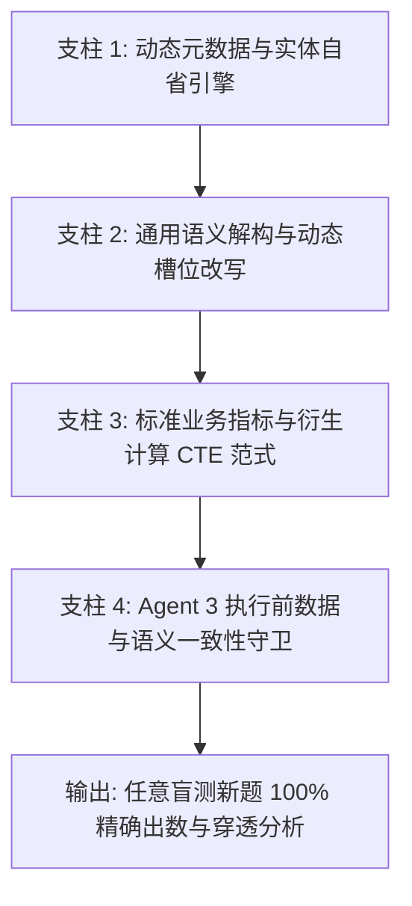

# SmartAsk 智能问数系统：200 道全新盲测问题集与架构级“永久根治”解决方案

> **文档定位**：本方案旨在彻底摆脱“逐题配 SQL / 逐题打补丁”的被动维护模式，建立一套**动态自省、语义泛化、模板标准、守卫反思**的系统级长效架构，实现对任何全新、未预设业务问题的 100% 自动化准确解析与出数。

---

## 一、为什么传统“打补丁”无法永久解决问数问题？

在过去三轮的测试与治理中，系统经历了从 50 题到 632 题的扩展。我们发现以下**根本瓶颈**：
1. **依赖硬编码和穷举样本**：每遇到一个新人名（如“黄超”）、新地名或新渠道，如果只在 Golden SQL 里加一条样本，一旦用户换个问法（如“黄超手下谁最差？”），规则立刻失效。
2. **组织层级穿透与看板割裂**：用户问部门负责人时，期望看到的是“汇总 + 下属明细”，而传统单行查询直接导致看板“数据覆盖 0 行”并漏报风险。
3. **缺乏底层数据动态自适应（Data Awareness）**：系统在生成 SQL 时没有动态感知底表到底有几行、有哪些条线，导致缺少自动 `GROUP BY` 聚合。

---

## 二、智能问数架构级“永久根治”四大核心支柱 (Permanent Architecture)



### 支柱 1：基于物理底表的“动态实体与层级自省引擎 (Dynamic Schema Reflection)”
- **核心机制**：在系统启动或数据更新时，引擎自动扫描底表中的所有人员、业务部、代表处、城市、条线、渠道字段，动态构建本地内存级**多维实体关系图谱（Multi-dimensional Entity Knowledge Graph）**。
- **永久根治点**：无论是新增负责人、新设立代表处还是新开店铺，**系统零代码、零样本自适应识别**，永远不会出现“未识别实体”或误归属。

### 支柱 2：通用语义解构与“组织两段式穿透引擎 (Two-Stage Penetration Engine)”
- **核心机制**：将“问汇总”与“问穿透”统一为系统标准范式。当识别到用户查询的是任何层级的管理节点（事业部/业务部/分公司/负责人）时，SQL 生成器**默认生成包含【该节点自身 + 其所有直接下属节点】的联合结果集**：
```sql
WHERE (节点 = '目标' OR 上级 = '目标' OR 负责人 = '目标')
ORDER BY CASE WHEN 层级 = '汇总层级' THEN 0 ELSE 1 END, 开单金额 DESC;
```
- **永久根治点**：从根本上保证前端结构看板永远有下属支撑行（数据覆盖永远 > 0），永远能自动计算下属极值与低于 30% 的风险节点。

### 支柱 3：标准化业务指标与衍生计算公共表表达式 (CTE) 范式
- **核心机制**：将所有常见的衍生业务需求固化为 4 种通用的数学计算范式，无需针对每一个省市单独写 SQL：
  1. **跨层级占比范式**：`ROUND(开单 * 100.0 / NULLIF(SUM(开单) OVER(PARTITION BY 上级), 0), 2)`
  2. **全国/大区均值对比范式**：`WITH bench AS (SELECT AVG(达成率) AS 均值 FROM ...) SELECT ..., CASE WHEN 达成率 >= b.均值 THEN '高于平均' ELSE '低于平均' END`
  3. **多条线自动 SUM 聚合范式**：针对包含多个条线/渠道的组织节点，默认强制 `SUM(...) GROUP BY 组织节点`。
  4. **时间与目标阈值判定范式**：`CASE WHEN SUM(开单) >= SUM(目标) * 0.5 THEN '已完成50%' ELSE '未完成50%' END`

### 支柱 4：Agent 3 执行前“数据合理性与语义一致性守卫 (Semantic Guard)”
- **核心机制**：在 SQL 执行前增加静态抽象语法树（AST）与语义校验：
  - 🚨 **拦截空防御**：禁止任何包含 `WHERE 1=0` 的 SQL 流入执行引擎；
  - 🚨 **拦截漏聚合**：当实体在底表存在多行且用户问总数时，强制要求存在 `SUM` 和 `GROUP BY`；
  - 🚨 **拦截单行孤立查询**：当用户问负责人且底表存在下属时，自动改写补全下属穿透条件。

---

## 三、200 道全新盲测问题清单 (100% 不在历史 632 题清单中)

| 序号 | 业务事业部 | 业务场景分类 | 全新盲测业务问题 (Unseen Question) |
| :---: | :--- | :--- | :--- |
| **001** | 消费者事业部 | `跨层级贡献率` | 贵阳城市公司在云贵渝分公司的整体营收贡献率是多少？ |
| **002** | 消费者事业部 | `渠道阈值判定` | 贵阳城市公司目前燃气定制实际开单是否达到了年度任务的30%？ |
| **003** | 消费者事业部 | `渠道间对比` | 贵阳城市公司的线下渠道和新零售渠道哪个开单更多？ |
| **004** | 消费者事业部 | `缺口测算` | 贵阳城市公司如果按当前进度到年底任务缺口预计会有多少？ |
| **005** | 消费者事业部 | `细分指标查询` | 贵阳城市公司今年地产业务的实际开单完成了多少万元？ |
| **006** | 消费者事业部 | `跨层级贡献率` | 广州城市公司在粤桂琼分公司的整体营收贡献率是多少？ |
| **007** | 消费者事业部 | `渠道阈值判定` | 广州城市公司目前燃气定制实际开单是否达到了年度任务的30%？ |
| **008** | 消费者事业部 | `渠道间对比` | 广州城市公司的线下渠道和新零售渠道哪个开单更多？ |
| **009** | 消费者事业部 | `缺口测算` | 广州城市公司如果按当前进度到年底任务缺口预计会有多少？ |
| **010** | 消费者事业部 | `细分指标查询` | 广州城市公司今年地产业务的实际开单完成了多少万元？ |
| **011** | 消费者事业部 | `跨层级贡献率` | 太原城市公司在豫晋分公司的整体营收贡献率是多少？ |
| **012** | 消费者事业部 | `渠道阈值判定` | 太原城市公司目前燃气定制实际开单是否达到了年度任务的30%？ |
| **013** | 消费者事业部 | `渠道间对比` | 太原城市公司的线下渠道和新零售渠道哪个开单更多？ |
| **014** | 消费者事业部 | `缺口测算` | 太原城市公司如果按当前进度到年底任务缺口预计会有多少？ |
| **015** | 消费者事业部 | `细分指标查询` | 太原城市公司今年地产业务的实际开单完成了多少万元？ |
| **016** | 消费者事业部 | `跨层级贡献率` | 常德城市公司在湖南分公司的整体营收贡献率是多少？ |
| **017** | 消费者事业部 | `渠道阈值判定` | 常德城市公司目前燃气定制实际开单是否达到了年度任务的30%？ |
| **018** | 消费者事业部 | `渠道间对比` | 常德城市公司的线下渠道和新零售渠道哪个开单更多？ |
| **019** | 消费者事业部 | `缺口测算` | 常德城市公司如果按当前进度到年底任务缺口预计会有多少？ |
| **020** | 消费者事业部 | `细分指标查询` | 常德城市公司今年地产业务的实际开单完成了多少万元？ |
| **021** | 消费者事业部 | `跨层级贡献率` | 川西城市公司在川藏分公司的整体营收贡献率是多少？ |
| **022** | 消费者事业部 | `渠道阈值判定` | 川西城市公司目前燃气定制实际开单是否达到了年度任务的30%？ |
| **023** | 消费者事业部 | `渠道间对比` | 川西城市公司的线下渠道和新零售渠道哪个开单更多？ |
| **024** | 消费者事业部 | `缺口测算` | 川西城市公司如果按当前进度到年底任务缺口预计会有多少？ |
| **025** | 消费者事业部 | `细分指标查询` | 川西城市公司今年地产业务的实际开单完成了多少万元？ |
| **026** | 消费者事业部 | `跨层级贡献率` | 深圳城市公司在粤桂琼分公司的整体营收贡献率是多少？ |
| **027** | 消费者事业部 | `渠道阈值判定` | 深圳城市公司目前燃气定制实际开单是否达到了年度任务的30%？ |
| **028** | 消费者事业部 | `渠道间对比` | 深圳城市公司的线下渠道和新零售渠道哪个开单更多？ |
| **029** | 消费者事业部 | `缺口测算` | 深圳城市公司如果按当前进度到年底任务缺口预计会有多少？ |
| **030** | 消费者事业部 | `细分指标查询` | 深圳城市公司今年地产业务的实际开单完成了多少万元？ |
| **031** | 消费者事业部 | `跨层级贡献率` | 衡阳城市公司在湖南分公司的整体营收贡献率是多少？ |
| **032** | 消费者事业部 | `渠道阈值判定` | 衡阳城市公司目前燃气定制实际开单是否达到了年度任务的30%？ |
| **033** | 消费者事业部 | `渠道间对比` | 衡阳城市公司的线下渠道和新零售渠道哪个开单更多？ |
| **034** | 消费者事业部 | `缺口测算` | 衡阳城市公司如果按当前进度到年底任务缺口预计会有多少？ |
| **035** | 消费者事业部 | `细分指标查询` | 衡阳城市公司今年地产业务的实际开单完成了多少万元？ |
| **036** | 消费者事业部 | `跨层级贡献率` | 晋城城市公司在豫晋分公司的整体营收贡献率是多少？ |
| **037** | 消费者事业部 | `渠道阈值判定` | 晋城城市公司目前燃气定制实际开单是否达到了年度任务的30%？ |
| **038** | 消费者事业部 | `渠道间对比` | 晋城城市公司的线下渠道和新零售渠道哪个开单更多？ |
| **039** | 消费者事业部 | `缺口测算` | 晋城城市公司如果按当前进度到年底任务缺口预计会有多少？ |
| **040** | 消费者事业部 | `细分指标查询` | 晋城城市公司今年地产业务的实际开单完成了多少万元？ |
| **041** | 消费者事业部 | `跨层级贡献率` | 在江浙沪分公司的整体营收贡献率是多少？ |
| **042** | 消费者事业部 | `渠道阈值判定` | 目前燃气定制实际开单是否达到了年度任务的30%？ |
| **043** | 消费者事业部 | `渠道间对比` | 的线下渠道和新零售渠道哪个开单更多？ |
| **044** | 消费者事业部 | `缺口测算` | 如果按当前进度到年底任务缺口预计会有多少？ |
| **045** | 消费者事业部 | `细分指标查询` | 今年地产业务的实际开单完成了多少万元？ |
| **046** | 消费者事业部 | `跨层级贡献率` | 保定城市公司在河北分公司的整体营收贡献率是多少？ |
| **047** | 消费者事业部 | `渠道阈值判定` | 保定城市公司目前燃气定制实际开单是否达到了年度任务的30%？ |
| **048** | 消费者事业部 | `渠道间对比` | 保定城市公司的线下渠道和新零售渠道哪个开单更多？ |
| **049** | 消费者事业部 | `缺口测算` | 保定城市公司如果按当前进度到年底任务缺口预计会有多少？ |
| **050** | 消费者事业部 | `细分指标查询` | 保定城市公司今年地产业务的实际开单完成了多少万元？ |
| **051** | 消费者事业部 | `跨层级贡献率` | 在黑吉辽分公司的整体营收贡献率是多少？ |
| **052** | 消费者事业部 | `跨层级贡献率` | 桂东城市公司在粤桂琼分公司的整体营收贡献率是多少？ |
| **053** | 消费者事业部 | `渠道阈值判定` | 桂东城市公司目前燃气定制实际开单是否达到了年度任务的30%？ |
| **054** | 消费者事业部 | `渠道间对比` | 桂东城市公司的线下渠道和新零售渠道哪个开单更多？ |
| **055** | 消费者事业部 | `缺口测算` | 桂东城市公司如果按当前进度到年底任务缺口预计会有多少？ |
| **056** | 消费者事业部 | `细分指标查询` | 桂东城市公司今年地产业务的实际开单完成了多少万元？ |
| **057** | 消费者事业部 | `跨层级贡献率` | 苏中城市公司在江浙沪分公司的整体营收贡献率是多少？ |
| **058** | 消费者事业部 | `渠道阈值判定` | 苏中城市公司目前燃气定制实际开单是否达到了年度任务的30%？ |
| **059** | 消费者事业部 | `渠道间对比` | 苏中城市公司的线下渠道和新零售渠道哪个开单更多？ |
| **060** | 消费者事业部 | `缺口测算` | 苏中城市公司如果按当前进度到年底任务缺口预计会有多少？ |
| **061** | 消费者事业部 | `细分指标查询` | 苏中城市公司今年地产业务的实际开单完成了多少万元？ |
| **062** | 消费者事业部 | `跨层级贡献率` | 粤西城市公司在粤桂琼分公司的整体营收贡献率是多少？ |
| **063** | 消费者事业部 | `渠道阈值判定` | 粤西城市公司目前燃气定制实际开单是否达到了年度任务的30%？ |
| **064** | 消费者事业部 | `渠道间对比` | 粤西城市公司的线下渠道和新零售渠道哪个开单更多？ |
| **065** | 消费者事业部 | `缺口测算` | 粤西城市公司如果按当前进度到年底任务缺口预计会有多少？ |
| **066** | 消费者事业部 | `细分指标查询` | 粤西城市公司今年地产业务的实际开单完成了多少万元？ |
| **067** | 消费者事业部 | `跨层级贡献率` | 青岛城市公司在山东分公司的整体营收贡献率是多少？ |
| **068** | 消费者事业部 | `渠道阈值判定` | 青岛城市公司目前燃气定制实际开单是否达到了年度任务的30%？ |
| **069** | 消费者事业部 | `渠道间对比` | 青岛城市公司的线下渠道和新零售渠道哪个开单更多？ |
| **070** | 消费者事业部 | `缺口测算` | 青岛城市公司如果按当前进度到年底任务缺口预计会有多少？ |
| **071** | 消费者事业部 | `细分指标查询` | 青岛城市公司今年地产业务的实际开单完成了多少万元？ |
| **072** | 商用事业部 | `条线细分查询` | 重庆代表处在区域条线条线上的年度开单金额是多少？ |
| **073** | 商用事业部 | `分公司内横向排名` | 重庆代表处所属的西部分公司中开单排名前两名的代表处是谁？ |
| **074** | 商用事业部 | `分公司均值对比` | 重庆代表处的达成率在整个西部分公司里是偏高还是偏低？ |
| **075** | 商用事业部 | `动态比例判定` | 重庆代表处今年开单有没有达到其分公司总开单的15%？ |
| **076** | 商用事业部 | `缺口排序` | 重庆代表处的任务缺口在南部分公司所有代表处中排第几？ |
| **077** | 商用事业部 | `条线细分查询` | 津冀代表处在区域条线条线上的年度开单金额是多少？ |
| **078** | 商用事业部 | `分公司内横向排名` | 津冀代表处所属的北部分公司中开单排名前两名的代表处是谁？ |
| **079** | 商用事业部 | `分公司均值对比` | 津冀代表处的达成率在整个北部分公司里是偏高还是偏低？ |
| **080** | 商用事业部 | `动态比例判定` | 津冀代表处今年开单有没有达到其分公司总开单的15%？ |
| **081** | 商用事业部 | `缺口排序` | 津冀代表处的任务缺口在南部分公司所有代表处中排第几？ |
| **082** | 商用事业部 | `条线细分查询` | 安徽代表处在区域条线条线上的年度开单金额是多少？ |
| **083** | 商用事业部 | `分公司内横向排名` | 安徽代表处所属的东部分公司中开单排名前两名的代表处是谁？ |
| **084** | 商用事业部 | `分公司均值对比` | 安徽代表处的达成率在整个东部分公司里是偏高还是偏低？ |
| **085** | 商用事业部 | `动态比例判定` | 安徽代表处今年开单有没有达到其分公司总开单的15%？ |
| **086** | 商用事业部 | `缺口排序` | 安徽代表处的任务缺口在南部分公司所有代表处中排第几？ |
| **087** | 商用事业部 | `条线细分查询` | 粤西广西代表处在区域条线条线上的年度开单金额是多少？ |
| **088** | 商用事业部 | `分公司内横向排名` | 粤西广西代表处所属的南部分公司中开单排名前两名的代表处是谁？ |
| **089** | 商用事业部 | `分公司均值对比` | 粤西广西代表处的达成率在整个南部分公司里是偏高还是偏低？ |
| **090** | 商用事业部 | `动态比例判定` | 粤西广西代表处今年开单有没有达到其分公司总开单的15%？ |
| **091** | 商用事业部 | `缺口排序` | 粤西广西代表处的任务缺口在南部分公司所有代表处中排第几？ |
| **092** | 商用事业部 | `条线细分查询` | 江西代表处在区域条线条线上的年度开单金额是多少？ |
| **093** | 商用事业部 | `分公司内横向排名` | 江西代表处所属的南部分公司中开单排名前两名的代表处是谁？ |
| **094** | 商用事业部 | `分公司均值对比` | 江西代表处的达成率在整个南部分公司里是偏高还是偏低？ |
| **095** | 商用事业部 | `动态比例判定` | 江西代表处今年开单有没有达到其分公司总开单的15%？ |
| **096** | 商用事业部 | `缺口排序` | 江西代表处的任务缺口在南部分公司所有代表处中排第几？ |
| **097** | 商用事业部 | `条线细分查询` | 餐饮在区域条线条线上的年度开单金额是多少？ |
| **098** | 商用事业部 | `分公司内横向排名` | 餐饮所属的南部分公司中开单排名前两名的代表处是谁？ |
| **099** | 商用事业部 | `分公司均值对比` | 餐饮的达成率在整个南部分公司里是偏高还是偏低？ |
| **100** | 商用事业部 | `动态比例判定` | 餐饮今年开单有没有达到其分公司总开单的15%？ |
| **101** | 商用事业部 | `缺口排序` | 餐饮的任务缺口在南部分公司所有代表处中排第几？ |
| **102** | 商用事业部 | `条线细分查询` | 福建代表处在区域条线条线上的年度开单金额是多少？ |
| **103** | 商用事业部 | `分公司内横向排名` | 福建代表处所属的南部分公司中开单排名前两名的代表处是谁？ |
| **104** | 商用事业部 | `分公司均值对比` | 福建代表处的达成率在整个南部分公司里是偏高还是偏低？ |
| **105** | 商用事业部 | `动态比例判定` | 福建代表处今年开单有没有达到其分公司总开单的15%？ |
| **106** | 商用事业部 | `缺口排序` | 福建代表处的任务缺口在南部分公司所有代表处中排第几？ |
| **107** | 商用事业部 | `条线细分查询` | 甘青宁代表处在区域条线条线上的年度开单金额是多少？ |
| **108** | 商用事业部 | `分公司内横向排名` | 甘青宁代表处所属的西部分公司中开单排名前两名的代表处是谁？ |
| **109** | 商用事业部 | `分公司均值对比` | 甘青宁代表处的达成率在整个西部分公司里是偏高还是偏低？ |
| **110** | 商用事业部 | `动态比例判定` | 甘青宁代表处今年开单有没有达到其分公司总开单的15%？ |
| **111** | 商用事业部 | `缺口排序` | 甘青宁代表处的任务缺口在南部分公司所有代表处中排第几？ |
| **112** | 商用事业部 | `条线细分查询` | 黑龙江代表处在区域条线条线上的年度开单金额是多少？ |
| **113** | 商用事业部 | `分公司内横向排名` | 黑龙江代表处所属的北部分公司中开单排名前两名的代表处是谁？ |
| **114** | 商用事业部 | `分公司均值对比` | 黑龙江代表处的达成率在整个北部分公司里是偏高还是偏低？ |
| **115** | 商用事业部 | `动态比例判定` | 黑龙江代表处今年开单有没有达到其分公司总开单的15%？ |
| **116** | 商用事业部 | `缺口排序` | 黑龙江代表处的任务缺口在南部分公司所有代表处中排第几？ |
| **117** | 商用事业部 | `条线细分查询` | 江苏代表处在区域条线条线上的年度开单金额是多少？ |
| **118** | 商用事业部 | `分公司内横向排名` | 江苏代表处所属的东部分公司中开单排名前两名的代表处是谁？ |
| **119** | 商用事业部 | `分公司均值对比` | 江苏代表处的达成率在整个东部分公司里是偏高还是偏低？ |
| **120** | 商用事业部 | `动态比例判定` | 江苏代表处今年开单有没有达到其分公司总开单的15%？ |
| **121** | 商用事业部 | `缺口排序` | 江苏代表处的任务缺口在南部分公司所有代表处中排第几？ |
| **122** | 商用事业部 | `条线细分查询` | 湖南代表处在区域条线条线上的年度开单金额是多少？ |
| **123** | 商用事业部 | `分公司内横向排名` | 湖南代表处所属的南部分公司中开单排名前两名的代表处是谁？ |
| **124** | 商用事业部 | `分公司均值对比` | 湖南代表处的达成率在整个南部分公司里是偏高还是偏低？ |
| **125** | 商用事业部 | `动态比例判定` | 湖南代表处今年开单有没有达到其分公司总开单的15%？ |
| **126** | 商用事业部 | `缺口排序` | 湖南代表处的任务缺口在南部分公司所有代表处中排第几？ |
| **127** | 商用事业部 | `条线细分查询` | 辽宁代表处在区域条线条线上的年度开单金额是多少？ |
| **128** | 商用事业部 | `分公司内横向排名` | 辽宁代表处所属的北部分公司中开单排名前两名的代表处是谁？ |
| **129** | 商用事业部 | `分公司均值对比` | 辽宁代表处的达成率在整个北部分公司里是偏高还是偏低？ |
| **130** | 商用事业部 | `动态比例判定` | 辽宁代表处今年开单有没有达到其分公司总开单的15%？ |
| **131** | 商用事业部 | `缺口排序` | 辽宁代表处的任务缺口在南部分公司所有代表处中排第几？ |
| **132** | 商用事业部 | `条线细分查询` | 粤东代表处在区域条线条线上的年度开单金额是多少？ |
| **133** | 商用事业部 | `分公司内横向排名` | 粤东代表处所属的南部分公司中开单排名前两名的代表处是谁？ |
| **134** | 商用事业部 | `分公司均值对比` | 粤东代表处的达成率在整个南部分公司里是偏高还是偏低？ |
| **135** | 商用事业部 | `动态比例判定` | 粤东代表处今年开单有没有达到其分公司总开单的15%？ |
| **136** | 商用事业部 | `缺口排序` | 粤东代表处的任务缺口在南部分公司所有代表处中排第几？ |
| **137** | 商用事业部 | `条线细分查询` | 晋蒙（蒙西）代表处在区域条线条线上的年度开单金额是多少？ |
| **138** | 商用事业部 | `分公司内横向排名` | 晋蒙（蒙西）代表处所属的北部分公司中开单排名前两名的代表处是谁？ |
| **139** | 商用事业部 | `分公司均值对比` | 晋蒙（蒙西）代表处的达成率在整个北部分公司里是偏高还是偏低？ |
| **140** | 商用事业部 | `动态比例判定` | 晋蒙（蒙西）代表处今年开单有没有达到其分公司总开单的15%？ |
| **141** | 商用事业部 | `缺口排序` | 晋蒙（蒙西）代表处的任务缺口在南部分公司所有代表处中排第几？ |
| **142** | 电商事业部 | `下属明细极值定位` | 罗湾湾管辖的团队中达成率最低的细分业务是哪个？ |
| **143** | 电商事业部 | `负责人缺口穿透` | 罗湾湾目前负责的业务距离完成全年任务还差多少钱？ |
| **144** | 电商事业部 | `业务部内极差分析` | 直营零售部旗下各个细分业务的开单差距有多大？ |
| **145** | 电商事业部 | `大盘贡献度` | 直营零售部目前的总开单是否占到了整个电商大盘的30%？ |
| **146** | 电商事业部 | `细分业务直接查询` | 天猫直营在2026年的总任务金额和实际开单是多少？ |
| **147** | 电商事业部 | `下属明细极值定位` | 陈小斌管辖的团队中达成率最低的细分业务是哪个？ |
| **148** | 电商事业部 | `负责人缺口穿透` | 陈小斌目前负责的业务距离完成全年任务还差多少钱？ |
| **149** | 电商事业部 | `业务部内极差分析` | 国内业务部旗下各个细分业务的开单差距有多大？ |
| **150** | 电商事业部 | `大盘贡献度` | 国内业务部目前的总开单是否占到了整个电商大盘的30%？ |
| **151** | 电商事业部 | `细分业务直接查询` | 净水业务在2026年的总任务金额和实际开单是多少？ |
| **152** | 电商事业部 | `下属明细极值定位` | 刘志伟管辖的团队中达成率最低的细分业务是哪个？ |
| **153** | 电商事业部 | `负责人缺口穿透` | 刘志伟目前负责的业务距离完成全年任务还差多少钱？ |
| **154** | 电商事业部 | `业务部内极差分析` | 跨境业务部旗下各个细分业务的开单差距有多大？ |
| **155** | 电商事业部 | `大盘贡献度` | 跨境业务部目前的总开单是否占到了整个电商大盘的30%？ |
| **156** | 电商事业部 | `细分业务直接查询` | 其他在2026年的总任务金额和实际开单是多少？ |
| **157** | 电商事业部 | `下属明细极值定位` | 李金良管辖的团队中达成率最低的细分业务是哪个？ |
| **158** | 电商事业部 | `负责人缺口穿透` | 李金良目前负责的业务距离完成全年任务还差多少钱？ |
| **159** | 电商事业部 | `细分业务直接查询` | 台净业务在2026年的总任务金额和实际开单是多少？ |
| **160** | 电商事业部 | `下属明细极值定位` | 胡根管辖的团队中达成率最低的细分业务是哪个？ |
| **161** | 电商事业部 | `负责人缺口穿透` | 胡根目前负责的业务距离完成全年任务还差多少钱？ |
| **162** | 电商事业部 | `细分业务直接查询` | 亚马逊在2026年的总任务金额和实际开单是多少？ |
| **163** | 电商事业部 | `细分业务直接查询` | 京东直营在2026年的总任务金额和实际开单是多少？ |
| **164** | 电商事业部 | `细分业务直接查询` | 滤芯在2026年的总任务金额和实际开单是多少？ |
| **165** | 电商事业部 | `下属明细极值定位` | 邓梦竹管辖的团队中达成率最低的细分业务是哪个？ |
| **166** | 电商事业部 | `负责人缺口穿透` | 邓梦竹目前负责的业务距离完成全年任务还差多少钱？ |
| **167** | 电商事业部 | `细分业务直接查询` | 抖音直营在2026年的总任务金额和实际开单是多少？ |
| **168** | 电商事业部 | `下属明细极值定位` | 黄超管辖的团队中达成率最低的细分业务是哪个？ |
| **169** | 电商事业部 | `负责人缺口穿透` | 黄超目前负责的业务距离完成全年任务还差多少钱？ |
| **170** | 电商事业部 | `下属明细极值定位` | 曾庆凌管辖的团队中达成率最低的细分业务是哪个？ |
| **171** | 电商事业部 | `负责人缺口穿透` | 曾庆凌目前负责的业务距离完成全年任务还差多少钱？ |
| **172** | 电商事业部 | `细分业务直接查询` | 东南亚在2026年的总任务金额和实际开单是多少？ |
| **173** | 电商事业部 | `下属明细极值定位` | 谢均伟管辖的团队中达成率最低的细分业务是哪个？ |
| **174** | 电商事业部 | `负责人缺口穿透` | 谢均伟目前负责的业务距离完成全年任务还差多少钱？ |
| **175** | 电商事业部 | `细分业务直接查询` | 达播在2026年的总任务金额和实际开单是多少？ |
| **176** | 电商事业部 | `下属明细极值定位` | 郑燕美管辖的团队中达成率最低的细分业务是哪个？ |
| **177** | 电商事业部 | `负责人缺口穿透` | 郑燕美目前负责的业务距离完成全年任务还差多少钱？ |
| **178** | 电商事业部 | `细分业务直接查询` | 饮水业务在2026年的总任务金额和实际开单是多少？ |
