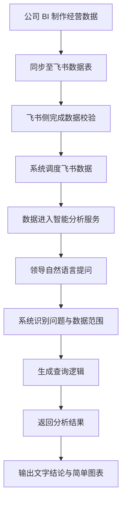
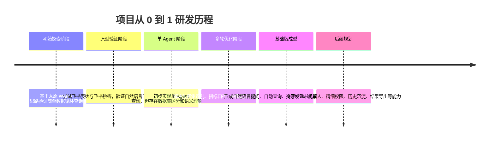

# 智能数据分析项目汇报材料与演讲稿草稿

> 适用场景：下周领导汇报  
> 汇报策略：展示基础版本成果，将部分高级能力统一定义为后续待开发方向  
> 版本定位：基础版演示材料，历史对话、日志导出、详情报告等均按待开发能力表述  
> 待确认数据：研发投入已按行业口径预估，服务器部署限制说明仍需结合公司环境补充

## 一、汇报文档

### 1. 项目概述

本项目是一套面向经营分析场景的智能数据分析工作台，核心目标是把公司已有经营数据转化为可被自然语言直接调用的分析能力。领导无需理解底层数据表、SQL 语法或指标口径，只需要用业务语言提出问题，系统即可自动识别数据范围、生成查询逻辑，并输出文字结论与基础图表。

本次汇报展示基础版本能力，重点呈现三个核心价值：

- 降低经营数据使用门槛：把“找数、查数、算数”转化为自然语言问答。
- 提升分析效率：将人工取数、整理、计算、归纳的流程压缩为系统自动生成。
- 建立后续智能分析平台基础：为权限管控、飞书机器人、历史分析沉淀、结果导出等待开发能力奠定基础。

本次汇报仅演示基础版核心链路：自然语言提问、数据查询、文字结论生成、简单图表展示。

### 2. 项目背景与问题

目前公司经营数据已经通过 BI、飞书表格等方式沉淀，但在实际使用过程中仍存在几类问题：

- 数据入口分散：业务人员需要知道数据在哪个系统、哪个表、哪个字段。
- 查询门槛较高：复杂问题仍依赖人工筛选、计算和汇总。
- 结果表达不统一：同一份数据经过不同人员整理，结论口径可能不一致。
- 领导查询场景即时性强：临时想看某项经营进展时，传统流程响应较慢。

因此，本项目尝试构建一条从数据同步、自然语言理解、指标查询到结果表达的智能分析链路，让数据使用方式从“人找数据”逐步转向“数据主动服务业务问题”。

### 3. 基础版展示边界

本次汇报只展示基础版能力，确保汇报聚焦、节奏清晰，同时将更多增强能力纳入后续待开发计划。

| 能力模块 | 本次是否展示 | 说明 |
| --- | --- | --- |
| 自然语言提问 | 展示 | 领导用业务语言提出问题 |
| 数据集自动匹配 | 展示 | 系统自动识别对应数据范围 |
| 文字结论生成 | 展示 | 输出核心分析判断 |
| 简单图表展示 | 展示 | 用基础图表辅助理解结果 |
| 右侧详情报告 | 待开发 | 后续建设报告增强能力 |
| 历史对话记录 | 待开发 | 后续建设分析沉淀能力 |
| 日志导入导出 | 待开发 | 后续建设运维审计能力 |
| 查询结果导出 | 待开发 | 后续建设办公协同能力 |
| 精细化权限管理 | 待开发 | 当前仅面向高层领导粗放开放，后续升级 |

基础版虽然只覆盖核心链路，但可以完整体现项目核心价值：领导提出问题，系统理解问题，自动查询数据，并输出可读的分析结果。

### 4. 系统整体架构

架构说明：

- 上游由公司 BI 完成基础数据制作和口径沉淀。
- 中间通过飞书数据表完成数据承接与校验，保证数据准确性。
- 本系统从飞书侧调度数据进入智能分析链路。
- 用户通过自然语言表达业务问题，系统自动完成理解、查询和表达。

### 5. 数据链路说明

当前链路强调“先保证数据准确，再提升分析效率”。其中飞书数据已经完成校验，系统侧主要承担智能理解、自动查询、结果组织与表达的职责。

### 6. 基础版核心功能

#### 6.1 自然语言提问

领导可以直接用业务语言提问，例如：

- “商用事业部整体达成率怎么样？”
- “某个区域当前进度如何？”
- “哪些单位达成率偏低？”
- “某个代表处下面的人做得怎么样？”

系统会根据问题自动识别查询目标、指标口径和数据范围，减少人工查找字段和编写查询逻辑的成本。

#### 6.2 文字版分析结论

系统输出不是单纯的数据列表，而是将查询结果转换为业务可读的文字结论，包括：

- 当前完成情况。
- 关键指标表现。
- 高低表现对象。
- 初步风险判断。
- 后续关注方向。

本次汇报重点展示这一部分，让领导直观看到“问一句话，得到一段经营判断”的效果。

#### 6.3 简单图表展示

基础版会配合展示少量简单图表，用于辅助说明数据差异和指标趋势。图表不追求复杂交互，重点服务于汇报理解。

展示原则：

- 图表数量不宜过多。
- 图表只承接核心结论。
- 右侧详情报告和复杂钻取面板按后续待开发能力处理。
- 保持基础版清爽，避免把后续建设内容提前展开。

### 7. 当前权限管理现状

当前系统主要面向高层领导开放，权限管理采取较粗放策略，重点保障核心领导查询体验和基础访问安全。

当前状态：

- 仅针对高层领导开放。
- 暂未面向全组织架构人员全面推广。
- 暂未实现精细到组织层级、人员范围、数据集范围的权限体系。
- 后续计划结合公司组织架构进行权限升级。

这也是后续项目迭代的重要方向：从“高层领导试点使用”逐步升级为“全组织可控开放”。

### 8. 研发历程与攻坚过程

本项目从零开始自主探索，经历了多轮原型验证和技术路线调整。

#### 8.1 研发投入量化

以下数据按“2 人连续投入 30 多天”的研发周期进行行业口径预估，正式汇报时可根据实际情况微调：

| 投入项 | 数值 | 说明 |
| --- | --- | --- |
| 总研发工时 | 约 520-620 小时 | 按 2 人、30 多天、日均 8-9 小时投入估算，包含原型、开发、调试、验证和汇报准备 |
| 总研发人天 | 约 65-75 人天 | 按完整研发周期折算，包含工作日、晚间调试和周末阶段性攻关 |
| AI Token 消耗 | 约 3,000 万-5,000 万 Token | 包含方案设计、代码生成、Prompt 调优、问题诊断、文档整理、反复改版等消耗 |
| AI 调用次数 | 约 3,500-6,000 次 | 包含功能开发、报错排查、逻辑验证、SQL 优化、界面调整、汇报材料生成等高频调用 |
| AI 辅助研发实际支出 | 约 800 元 | 包含 AI 工具开发费用和大模型调用费用；通过免费额度、免费软件和试用资源降低了实际现金成本 |
| AI 辅助研发等效成本 | 约 1,600-2,400 元以上 | 如全部按商业化工具和模型调用计费，预计成本至少放大 2-3 倍 |
| 阅读文献/资料数量 | 约 40-60 篇/份 | 包含智能问数、RAG、Agent、多轮问答、数据权限、可视化、飞书开放平台等方向 |
| 原型迭代次数 | 约 7-9 次 | 从早期 Demo、飞书秒答、单 Agent，到当前基础版闭环的多轮迭代 |

#### 8.2 研发时间线

#### 8.3 关键攻坚点

研发过程中主要攻坚点包括：

- 如何让系统理解业务问题，而不是只做关键词匹配。
- 如何区分不同数据集，避免问题进入错误数据范围。
- 如何保证查询结果符合业务口径，而不是生成表面正确的答案。
- 如何把查询结果转换为领导能直接理解的经营结论。
- 如何在没有成熟外部模板的情况下，自主摸索智能问数的工程链路。
- 如何在数据准确性、响应速度、表达质量之间取得平衡。

这个过程并不是简单调用大模型，而是围绕数据、语义、权限、口径、展示和部署做了一整套工程化探索。

### 9. 当前成果总结

目前基础版已经形成完整闭环：

| 成果方向 | 当前成果 |
| --- | --- |
| 数据接入 | 完成 BI 到飞书，再到系统侧的基础数据链路 |
| 数据校验 | 飞书侧数据已完成校验，保证基础准确性 |
| 智能问数 | 支持领导使用自然语言提出经营问题 |
| 查询生成 | 系统可自动识别数据范围并生成查询逻辑 |
| 结果表达 | 支持输出文字版经营分析结论 |
| 图表辅助 | 支持通过简单图表展示关键指标 |
| 试点范围 | 当前面向高层领导场景进行验证 |

一句话概括：项目已经具备从“业务问题”到“数据分析结果”的基础智能化闭环。

### 10. 部署计划

后续计划将项目部署至公司服务器，提升访问稳定性和使用便利性。

当前需要进一步明确的问题：

- 公司服务器环境是否支持当前项目运行所需的后端服务。
- 是否支持数据库、容器、端口、网络访问等基础部署条件。
- 是否符合公司信息安全和数据管理要求。
- 飞书开放平台回调地址、内网访问、公网访问策略是否满足要求。

待补充说明：

> 【待补充：当前“不符合公司服务器”的具体原因，例如服务器系统版本、Docker 支持情况、端口开放限制、网络访问限制、数据库权限限制、安全合规限制等。】

### 11. 后续发展规划

后续待开发规划分为两类：一类是围绕基础能力继续增强，另一类是面向组织级推广进行平台化升级。

#### 11.1 分析体验增强

规划方向：

- 优化历史对话记录，让领导可以回看历史问题和分析结果。
- 增加日志导入导出，提升运维排查和问题复盘能力。
- 增加查询结果导出，方便沉淀到汇报材料、会议纪要或飞书文档。
- 优化报告展示形态，让系统从“查数工具”升级为“经营分析助手”。

#### 11.2 飞书机器人推送

规划集成飞书开放平台，开发智能机器人推送能力。

目标场景：

- 定时向领导飞书对话框推送常用问题的自动查询结果。
- 自动生成重点经营指标摘要。
- 推送内容中包含系统链接，领导点击后可直接进入系统查看。
- 支持按角色、组织、关注指标配置不同推送内容。

价值：

- 从“领导主动问”升级为“系统主动提醒”。
- 让经营异常、低达成风险、重点指标变化更早触达。
- 提升系统在日常经营管理中的存在感和使用频率。

#### 11.3 权限体系升级

当前系统仅面向高层领导粗放开放，后续建议升级为基于公司组织架构的精细权限体系。

目标能力：

- 支持公司全组织架构人员接入。
- 按事业部、分公司、代表处、业务人员等组织层级控制数据范围。
- 不同角色看到不同数据、不同功能、不同报告粒度。
- 支持权限审计，记录谁在什么时间查询了什么范围的数据。

价值：

- 让系统从领导试点工具升级为组织级智能数据平台。
- 降低数据越权风险。
- 支撑更多业务团队安全使用。

#### 11.4 指标与知识体系沉淀

建议后续逐步沉淀统一指标口径和业务知识库。

可规划能力：

- 指标口径库：统一管理达成率、缺口、开单金额等核心指标定义。
- 常用问题库：沉淀领导和业务团队高频问题。
- 分析模板库：不同经营场景复用不同分析框架。
- 问答质量评估：对每次回答进行准确性和可用性评估。

价值：

- 让系统越用越懂业务。
- 降低重复开发和重复解释成本。
- 为后续智能经营分析平台打基础。

#### 11.5 服务器部署与运维升级

后续服务器部署完成后，建议补齐运维能力：

- 服务健康检查。
- 异常日志追踪。
- 数据同步状态监控。
- 定时备份。
- 版本更新与回滚机制。

目标是从“个人研发项目”升级为“可稳定运行的内部系统”。

### 12. 汇报结论

本项目目前已经完成基础版闭环验证，证明了自然语言问数在经营分析场景中的可行性。项目不是单点 Demo，而是覆盖数据链路、问题理解、查询生成、结果表达和基础展示的完整探索。

当前阶段建议以高层领导试点为切入点，先验证价值，再逐步扩展到飞书机器人推送、精细化权限、历史沉淀、结果导出和组织级推广。

最终目标是建设一套面向公司经营管理的智能数据分析底座，让数据从静态报表转向可对话、可推送、可沉淀、可扩展的智能服务。

## 二、演讲稿草稿

### 开场

各位领导好，今天我汇报的是我最近自主研发的一套智能数据分析项目。

这个项目的出发点很简单：公司其实已经有不少经营数据，但真正到使用的时候，领导或者业务人员往往还需要知道数据在哪、字段叫什么、口径怎么算，最后还要人工整理成结论。所以我想尝试做一套系统，让领导可以直接用业务语言提问，系统自动去找数据、查数据，并生成一段能看懂的经营分析结论。

今天我先展示基础版本。基础版本重点看一件事：它是否已经能完成从“领导提问”到“经营分析结果”的核心闭环。

### 项目背景怎么讲

可以这样展开：

我们现在不是没有数据，而是数据使用门槛还比较高。BI、飞书、报表都能承载数据，但当领导临时问一个经营问题时，中间往往还需要人工查表、筛选、计算、归纳。这个过程有时候慢，有时候口径也不够统一。

所以我做这个项目，不是为了再造一个报表，而是希望把数据变成一个可以直接对话的分析助手。领导只要问问题，系统自动理解问题并返回结果。

讲解重点：

- 强调不是替代 BI，而是补齐“自然语言分析入口”。
- 强调领导临时查询场景。
- 强调项目价值是降低数据使用门槛。

### 基础版能力怎么讲

可以这样讲：

这次展示的基础版只保留最核心的几项能力：自然语言提问、自动识别数据范围、输出文字结论、展示简单图表。

有些能力当前还放在后续待开发计划里，比如历史记录、详情报告、日志导出、结果导出等。今天先聚焦基础闭环，避免一次讲太散。

讲解重点：

- 主动说明“本次只展示基础版”，增强能力统一作为后续待开发方向。
- 强调基础版已经能体现核心价值。
- 统一口径为“后续待开发、待建设、待完善”，不要暗示相关能力已经完成。

### 数据链路怎么讲

可以这样讲：

目前这套系统的数据链路是这样的：公司 BI 先制作经营数据，然后同步到飞书数据表。飞书侧的数据已经做过校验，保证基础准确性。系统再从飞书调度数据，进入智能分析服务。

当领导输入自然语言问题后，系统会识别问题涉及的数据范围和指标口径，然后生成查询逻辑，最终输出文字结论和简单图表。

这里我想强调一点：项目不是直接把大模型接到数据上随便问，而是先保证数据链路和口径，再做智能分析。这样结果才更可控。

讲解重点：

- 公司 BI 是数据源头。
- 飞书是经过校验的数据承接层。
- 系统承担智能分析层。
- 强调准确性优先。

### 研发历程怎么讲

这里是“卖惨”重点，但表达要真诚，不要抱怨。

可以这样讲：

这个项目是我从零开始摸索出来的。最早是基于太原 WANA 的思路，先验证一个简单的数据循环查询，也就是数据能不能从一个问题开始流转起来。

后来我尝试过飞书表达和飞书秒答，希望直接基于飞书完成问数，但实际效果没有达到预期。主要问题是复杂业务问题理解不稳定，也很难做数据集区分和权限语义。

再往后，我做过单 Agent 版本。那个阶段系统能回答一些问题，但问题也很明显：它不知道该查哪个数据集，不知道不同数据之间的边界，也很难判断领导问的是哪个组织、哪个指标、哪个层级。

所以后续我持续迭代，把数据集识别、语义理解、查询生成、结果表达、权限边界这些问题一点点补上。这个过程里也看了不少资料和文献，很多地方没有现成模板，只能自己试、自己推翻、再重做。

这里正式汇报时可以补一句量化数据：

截至目前，按 2 人连续 30 多天投入估算，项目累计研发工时约 520-620 小时，折算约 65-75 人天；AI Token 消耗约 3,000 万-5,000 万，AI 调用约 3,500-6,000 次；阅读相关技术资料和文献约 40-60 份。

另外，AI 辅助研发实际现金支出约 800 元，主要包含 AI 工具开发费用和大模型调用费用。这里我也尽量使用了不少免费软件、试用资源和模型免费额度，把成本压了下来；如果完全按商业化工具和模型调用价格计算，整体成本预计至少会放大到 2-3 倍以上。

讲解重点：

- 用时间线讲，不要只说“很辛苦”。
- 把困难讲成技术攻坚点。
- 强调自主探索、反复试错、从 0 到 1。
- 数字一定要补上，会显得更有说服力。

### 当前成果怎么讲

可以这样讲：

目前基础版已经形成了一个完整闭环：数据从 BI 到飞书，再进入系统；领导通过自然语言提问；系统识别问题并生成查询逻辑；最后输出文字结论和基础图表。

这说明项目已经不是单纯 Demo，而是具备了经营分析场景落地的雏形。后面只要继续补权限、推送、历史沉淀和导出能力，就可以逐步从试点工具升级为内部智能数据平台。

讲解重点：

- 说“闭环”，不要只说“功能”。
- 说“雏形”，给后续空间。
- 强调现阶段价值已经可验证。

### 权限现状怎么讲

可以这样讲：

目前权限这一块还是比较粗放的，主要面向高层领导试点开放。这样做的原因是先保证核心场景跑通，不一开始就把系统复杂度拉满。

后续如果要面向公司更多人员开放，就必须结合组织架构做精细化权限。比如事业部、分公司、代表处、业务人员，不同层级看到不同范围的数据。

讲解重点：

- 不回避当前权限粗放。
- 解释这是试点阶段的合理选择。
- 自然引出未来规划。

### 部署计划怎么讲

可以这样讲：

下一步计划是把系统部署到公司服务器上，让访问更稳定，也便于后续正式试点。

不过这块还需要结合公司服务器环境确认几个问题，比如服务器是否支持当前服务运行环境、是否支持容器或后端服务、端口和网络策略是否允许、飞书回调地址是否能打通，以及是否符合公司安全要求。

这里我后续会根据服务器实际情况补充部署方案。

讲解重点：

- 表达有部署计划。
- 不要把不确定性说成问题，而说成“需要确认的部署条件”。
- 后续补上“不符合公司服务器”的具体原因。

### 未来展望怎么讲

可以分三段讲。

第一，分析体验增强：

后续会优化历史对话记录、结果导出、日志导入导出等能力，让系统不只是能回答一次问题，还能把分析过程沉淀下来，方便复盘和汇报。

第二，飞书机器人推送：

后续计划集成飞书开放平台，做机器人推送。比如每天或每周自动把领导关注的常用问题跑一遍，把结果和报告推送到飞书对话框里，领导点击链接可以直接进入系统查看。

这会让系统从“领导主动问”变成“系统主动提醒”。

第三，权限体系升级：

如果后续要推广到公司全组织，就需要做基于组织架构的精细化权限。不同层级看到不同数据范围，既能扩大使用范围，也能控制数据安全。

讲解重点：

- 未来规划要贴着当前基础能力讲。
- 不要讲太空泛。
- 每个规划都说明业务价值。

### 收尾

可以这样收：

总结一下，这个项目目前已经完成基础版闭环验证：领导可以用自然语言提问，系统可以基于已校验的数据链路自动查询，并输出文字结论和简单图表。

我认为它的价值不只是一个问数工具，而是后续可以发展成公司经营分析的智能入口。短期先服务高层领导试点，中期接入飞书机器人和权限体系，长期沉淀指标口径、分析模板和组织级数据服务能力。

后续我会继续完善部署方案、权限方案和飞书推送方案，也希望领导能给一些试点场景和重点指标方向，我可以围绕真实管理需求继续迭代。

## 三、正式汇报前待确认清单

| 待确认项 | 建议填写位置 | 说明 |
| --- | --- | --- |
| 总研发工时 | 8.1、演讲稿研发历程 | 已按行业口径预估，可按实际投入微调 |
| 总研发人天 | 8.1、演讲稿研发历程 | 已按 2 人 30 多天折算，可按实际出勤微调 |
| AI Token 消耗 | 8.1、演讲稿研发历程 | 已给区间预估，可按平台统计数据修正 |
| AI 调用次数 | 8.1、演讲稿研发历程 | 已给区间预估，可按平台统计数据修正 |
| AI 辅助研发实际支出 | 8.1、演讲稿研发历程 | 已按约 800 元填写，可按账单记录微调 |
| AI 辅助研发等效成本 | 8.1、演讲稿研发历程 | 已按实际支出的 2-3 倍估算，用于体现成本优化 |
| 阅读资料/文献数量 | 8.1、演讲稿研发历程 | 已给区间预估，可按实际阅读数量修正 |
| 原型迭代次数 | 8.1 | 已给区间预估，可按实际版本节点修正 |
| 基础版截图 | 6.1-6.3 | 只放文字结论和简单图表，不放详情报告 |
| 服务器限制说明 | 10 | 补充不符合公司服务器的具体原因 |
| 汇报演示问题 | 6.1 | 准备 2-3 个稳妥问题 |

## 四、建议演示问题

正式汇报建议只准备少量稳定问题，避免现场随机提问导致演示不可控。

推荐问题：

1. 商用事业部整体达成率怎么样？
2. 哪些单位当前达成率偏低？
3. 黑龙江代表处下面的人做得怎么样？

演示策略：

- 第一个问题展示总体分析。
- 第二个问题展示简单排序和图表。
- 第三个问题展示系统能理解组织层级，但详情报告能力统一放入后续待开发计划。

## 五、PPT 拆页建议

如果后续转成 PPT，可以按以下结构拆页：

| 页码 | 标题 | 内容 |
| --- | --- | --- |
| 1 | 项目概述 | 一句话定位、核心价值 |
| 2 | 背景痛点 | 数据入口分散、查询门槛高、响应慢 |
| 3 | 基础版展示边界 | 本次展示什么、后续待开发什么 |
| 4 | 系统架构 | 系统整体架构流程图 |
| 5 | 数据链路 | BI 到飞书到系统到报告 |
| 6 | 核心功能 | 自然语言提问、文字结论、简单图表 |
| 7 | 研发历程 | 从原型到基础版的时间线 |
| 8 | 攻坚难点 | 数据集识别、语义理解、口径一致、结果表达 |
| 9 | 当前成果 | 基础闭环已具备 |
| 10 | 部署计划 | 公司服务器部署与待确认条件 |
| 11 | 未来规划 | 飞书机器人、权限体系、历史沉淀、结果导出 |
| 12 | 总结 | 试点价值与下一步请求 |
