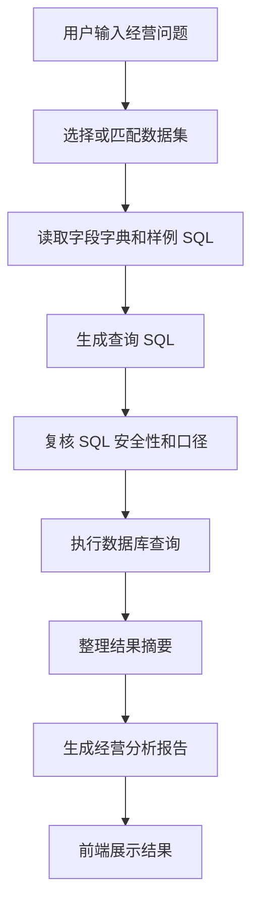

# 基础版本：自然语言问数闭环

## 一句话定位

基础版本解决的是“智能问数能不能跑通”的问题：用户输入一句经营问题，系统完成数据集选择、SQL 生成、查询执行、结果展示和报告生成。

## 建设背景

传统经营分析通常依赖人工找表、写 SQL、核口径、做汇总。这个过程响应慢、门槛高，也容易因为口径理解不同导致结果不一致。

基础版本的目标不是替代所有分析工作，而是先把最核心的问数链路跑通，让业务人员可以从一个统一入口开始提问。

## 核心功能

| 能力 | 说明 |
|---|---|
| 自然语言输入 | 用户可以直接用口语化问题提问，不需要写 SQL |
| 数据集选择 | 支持选择或自动匹配当前问题对应的数据集 |
| SQL 生成 | 根据字段、样例 SQL、数据集上下文生成可执行查询 |
| SQL 执行 | 连接 PostgreSQL 执行查询并返回结构化结果 |
| 结果展示 | 前端展示表格、指标、摘要和分析报告 |
| 执行轨迹 | 展示理解问题、准备数据、生成 SQL、复核 SQL、执行查询等步骤 |

## 基础版本流程

## 典型演示问题

| 场景 | 示例问题 |
|---|---|
| 总体完成情况 | 商用事业部整体达成率是多少 |
| 分公司排名 | 哪个分公司完成最好 |
| 指标对比 | 各分公司年度开单金额排名 |
| 明细下钻 | 东部分公司下面哪些城市公司表现较好 |

## 演讲稿

基础版本主要解决的是从零到一的问题。过去业务人员想知道一个经营指标，通常要先找数据表，再找懂 SQL 的同事处理，还要等人工整理结论。

现在我们把这个过程收敛到一个智能问数入口里。用户只需要输入一句自然语言问题，系统就会自动读取当前数据集的字段信息、样例 SQL 和上下文，生成查询语句，执行数据库查询，并把结果整理成可读的经营分析报告。

这一版的价值是验证了完整闭环：问题可以进来，数据可以查到，结果可以展示，报告可以沉淀。它让智能问数从概念变成了一个可使用的工作台。

## 版本价值

基础版本的核心价值有三点：

1. 降低查询门槛，业务人员不用写 SQL 也能查经营数据。
2. 缩短响应时间，常规问题可以直接由系统生成结果。
3. 建立后续迭代底座，为组织识别、权限治理、日志追踪、报告模板等能力提供基础。

## 当前局限

基础版本虽然能跑通链路，但准确率和可控性还需要增强：

1. 用户问题中出现组织名称时，系统可能还会依赖模型自行判断数据集。
2. 同名组织、简称组织、跨层级组织容易导致匹配偏差。
3. SQL 生成有时会走兜底规则，未必优先命中人工配置的标准 SQL。
4. 异常、取消、日志追踪还需要更清晰地沉淀到控制台和管理面板。

这些问题就是中阶版本重点解决的内容。

