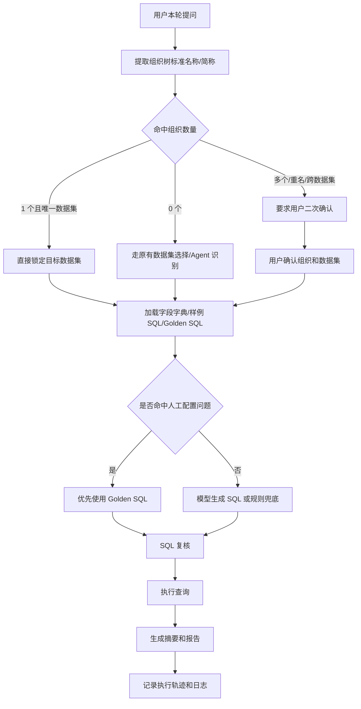

# 中阶版本：准确率与可控性增强

## 一句话定位

中阶版本解决的是“智能问数查得准不准、过程能不能管住”的问题。核心是通过组织树识别、数据集锁定、二次确认、Golden SQL 优先和日志追踪，减少模型误判。

## 建设背景

在企业经营数据场景里，用户的问题往往不会写得很标准。例如：

- 东部分公司怎么样？
- 东部和南部对比一下。
- 线下业务完成最好的分公司是哪个？
- 商用事业部整体达成率是多少？

这些问题里可能包含事业部、分公司、城市分公司等组织名称。由于企业内部可能存在同名、简称、跨层级组织，如果完全交给模型判断，就容易查错数据集或查错组织范围。

中阶版本的重点就是把“当前这一轮问题”作为判断主体，先用确定性规则识别组织和数据集，再让 Agent 做分析。

## 核心功能

| 能力 | 说明 |
|---|---|
| 当前轮问题优先 | 弱化历史上下文干扰，优先分析用户本轮输入 |
| 组织树名称识别 | 从问题文本中识别标准组织名称和常见简称 |
| 数据集自动锁定 | 单一组织且唯一命中时，直接锁定对应数据集 |
| 多组织二次确认 | 多个组织、重名组织、跨数据集命中时，要求用户确认 |
| 权限范围校验 | 用户无权限的数据集不静默切换，避免查错 |
| Golden SQL 优先 | 人工配置的问题与 SQL 优先于规则兜底 SQL |
| 异常日志沉淀 | 问数失败、取消、请求异常进入执行轨迹和日志 |
| 取消体验优化 | 用户主动取消时显示中文状态，不继续转圈计时 |
| 完成定位优化 | 问数完成后定位到报告顶部，方便阅读结论 |

## 中阶版本流程

## 关键规则

### 1. 当前问题优先

同一会话里，历史聊天只作为参考，不再让冗余上下文覆盖当前问题。

例如用户前面问过“东部分公司”，这轮又问“南部分公司怎么样”，系统应以“南部分公司”为准。

### 2. 单组织直接锁定

如果当前问题只命中一个组织，并且这个组织只对应一个可用数据集，系统直接锁定数据集。

例如：

> 云贵渝分公司完成怎么样？

系统识别到“云贵渝分公司”，自动匹配对应数据集，不需要模型猜。

### 3. 多组织强制确认

如果问题里出现多个组织，或者同名组织可能对应多个数据集，系统不直接查，而是要求用户确认。

例如：

> 东部和南部对比一下。

这类问题可能涉及多个组织或多个数据集，必须先确认范围。

### 4. 无权限不静默切换

如果用户提到的组织不在当前权限范围内，系统不能偷偷换成另一个数据集执行，需要提示无法确认或无权限。

### 5. Golden SQL 优先

用户手动配置了标准问题和目标 SQL 时，系统优先使用人工配置的 SQL。只有未命中人工配置时，才走模型生成或规则兜底。

这可以避免“明明配置了标准 SQL，却仍然使用一段写死 SQL”的问题。

## 演讲稿

中阶版本重点解决准确率问题。基础版本已经证明智能问数可以跑通，但真正进入业务场景后，我们发现用户的问题经常包含组织名称，比如事业部、分公司、城市分公司，而且这些名称可能有简称、重名和层级差异。

如果这些判断完全依赖模型，就会出现数据源选错、组织范围选错、SQL 口径不一致的问题。所以中阶版本增加了一套确定性的组织识别和数据集路由机制。

现在系统会优先看用户当前这一轮问题，从文本中提取组织树标准名称。如果只命中一个组织，并且这个组织能唯一定位数据集，就直接锁定数据源。如果出现多个组织、重名组织或跨数据集情况，系统会先让用户确认，而不是贸然查询。

同时，人工配置的问题和 SQL 会拥有更高优先级。也就是说，对于已经沉淀过的标准经营问题，系统优先执行标准 SQL，保证结果口径稳定。

这一版的价值，是让智能问数从“能回答”升级为“尽量查准、过程可控、异常可追踪”。

## 版本价值

1. 减少 Agent 因历史上下文过长导致的意图偏移。
2. 减少同名组织、简称组织造成的数据集误判。
3. 提高人工标准 SQL 的命中优先级。
4. 让失败、取消、异常都能被看见、被追踪。
5. 提升前端阅读体验，结果完成后定位到报告顶部。

## 适合演示的场景

| 演示目标 | 示例问题 |
|---|---|
| 单组织锁定 | 云贵渝分公司完成怎么样 |
| 多组织确认 | 东部和南部对比一下 |
| 标准 SQL 命中 | 线下业务完成最好的分公司是哪个 |
| 当前轮优先 | 上轮问东部，这轮问南部完成情况 |
| 报告定位 | 问数完成后直接查看报告核心结论 |

