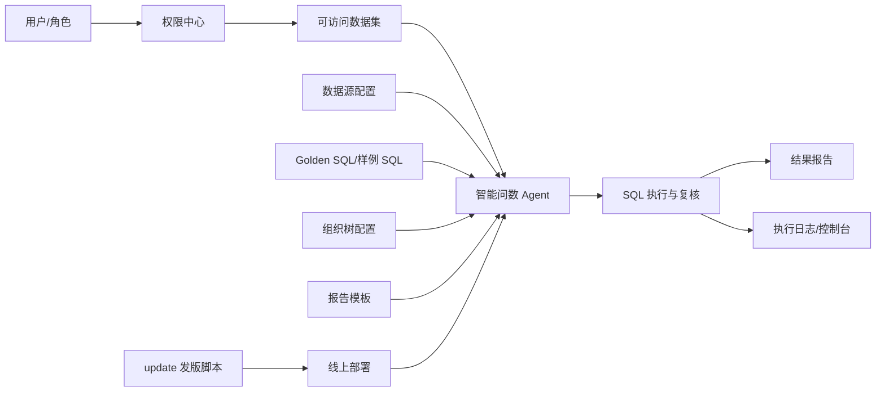

# 高阶版本：平台化治理

## 一句话定位

高阶版本解决的是“智能问数能不能长期稳定运营”的问题。重点从单个问数功能，升级为有权限、有配置、有日志、有模板、有发版机制的平台能力。

## 建设背景

当智能问数从演示功能进入真实使用后，系统要面对更多管理问题：

1. 谁可以看哪些数据？
2. 哪些数据源可以被问数调用？
3. 标准问题和 SQL 谁来维护？
4. 报告格式如何统一？
5. 出错后如何定位？
6. 发版时如何避免覆盖线上配置？
7. 密钥、环境变量、数据源密码如何保护？

高阶版本的重点就是把这些能力平台化，减少人工维护风险。

## 核心功能

| 能力 | 说明 |
|---|---|
| 角色权限管理 | 区分超级管理员、业务管理员、普通用户等角色 |
| 数据权限控制 | 按用户、角色、数据集控制可见范围 |
| 数据源配置管理 | 支持多数据源、运行时配置和加密保存 |
| 密钥保护 | 使用主密钥保护敏感配置，避免明文密码泄露 |
| 报告模板配置 | 经营报告结构、指标卡、结论样式可沉淀 |
| 日志与控制台 | 问数过程、异常、取消、SQL、执行耗时可追踪 |
| 发版脚本加固 | update 流程保留本地配置，校验加密密钥和环境变量 |
| 前端构建发布 | 区分开发源码和生产构建，降低线上暴露风险 |

## 高阶版本架构

## 重点治理规则

### 1. 权限优先

用户只能查询自己有权限的数据集。即使问题文本命中其他组织，也不能直接绕过权限查询。

### 2. 配置不进 Git

运行时配置、密钥、本地数据源、报告历史等应保持本地化或环境化，避免提交到代码仓库。

重点保护对象包括：

- `.env`
- `config/.secret_master_key`
- 数据源密码
- 运行时配置文件
- 报告历史文件

### 3. 发版不覆盖线上配置

发版脚本要保留线上 `.env`、密钥和运行时配置。代码更新后再重建容器，避免因本地密钥不同导致线上密文无法解密。

### 4. 异常可追踪

问数失败不能只在前端弹一段英文错误。应同时在执行轨迹、控制台和日志中记录失败原因，便于后续排查。

## 演讲稿

高阶版本的重点是治理。前两个版本解决了能问和问得准，但真正上线后，系统还必须解决权限、配置、安全、日志和发版问题。

例如，数据源密码不能明文暴露，主密钥不能随意清空；用户只能访问自己有权限的数据集；线上发版不能覆盖生产环境配置；问数失败后也不能只在页面上出现一段英文错误，而要进入日志和控制台，方便定位。

所以高阶版本把智能问数从单个功能升级为平台能力。它不仅有 Agent 链路，也有角色权限、数据权限、数据源配置、报告模板、日志追踪和部署机制。

这一版的价值，是让系统从“能演示、能使用”进一步变成“能管理、能运维、能发版”。

## 版本价值

1. 降低生产环境部署风险。
2. 避免密钥和敏感配置暴露。
3. 支持不同角色、不同数据权限的真实业务使用。
4. 提升异常定位效率。
5. 为更多业务数据集接入提供统一平台底座。

## 适合演示的场景

| 演示目标 | 示例 |
|---|---|
| 权限控制 | 不同用户看到不同数据集 |
| 日志追踪 | 展示一次失败问数的控制台记录 |
| 配置治理 | 展示数据源配置和加密保存 |
| 发版安全 | 说明 update 不覆盖线上密钥和环境变量 |
| 报告模板 | 展示固定报告结构和指标卡 |

