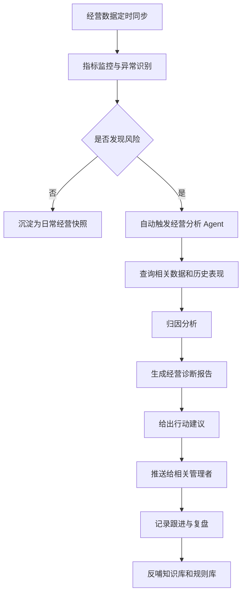

# 终极版本：经营智能体

## 一句话定位

终极版本的目标是从“用户问，系统答”升级为“系统主动发现问题、解释原因、给出建议、推动跟进”的经营智能体。

## 建设背景

智能问数的最终价值不只是替代人工查数，而是帮助经营管理更快发现问题、定位原因和形成行动。

在真实经营场景里，管理者关心的不只是某个指标是多少，还包括：

1. 为什么达成率低？
2. 哪些组织拖了后腿？
3. 哪些指标异常波动？
4. 哪些问题需要优先处理？
5. 应该推送给谁跟进？
6. 下次是否还会出现同类风险？

终极版本围绕这些问题建设主动分析能力。

## 核心功能设想

| 能力 | 说明 |
|---|---|
| 主动预警 | 自动发现达成率低、异常波动、风险节点 |
| 多 Agent 协同 | 问题理解、数据查询、SQL 复核、经营诊断、报告生成分工协同 |
| 经营归因 | 从组织、业务线、区域、时间、指标拆解原因 |
| 行动建议 | 根据问题类型生成可执行的管理建议 |
| 知识沉淀 | 沉淀历史问题、标准 SQL、报告模板、口径规则 |
| 主动推送 | 通过飞书机器人、消息卡片或日报周报推送结果 |
| 复盘闭环 | 记录问题发现、责任人、跟进动作和后续结果 |

## 终极版本流程

## 与前三个版本的关系

终极版本不是另起炉灶，而是建立在前三个版本之上：

| 前置版本 | 为终极版本提供什么 |
|---|---|
| 基础版本 | 自然语言问数、SQL 查询、报告生成闭环 |
| 中阶版本 | 组织识别、数据集锁定、标准 SQL、准确率保障 |
| 高阶版本 | 权限、安全、日志、配置、发版和运维体系 |
| 终极版本 | 主动发现、主动诊断、主动建议、主动推送 |

## 演讲稿

终极版本是我们对这个项目的长期目标。前面的版本主要还是用户主动问，系统负责回答。而终极版本希望进一步变成经营智能体。

也就是说，系统不只是等人来问“哪个分公司完成不好”，而是可以主动发现某个区域达成率异常、某条业务线压力较大、某些城市公司连续低于目标，然后自动形成诊断报告和行动建议。

例如系统发现西部分公司线下达成率低于预期，它可以自动下钻到城市分公司，比较任务额、完成额、缺口、历史趋势和同类区域表现，然后给出重点关注节点和建议动作，并推送给相关管理者。

这一版的价值，是让智能问数从查询工具升级为经营辅助系统。它不仅回答问题，还能帮助发现问题、解释问题，并推动问题被处理。

## 版本价值

1. 从被动问答升级为主动经营洞察。
2. 从单次查询升级为持续监控。
3. 从结果展示升级为原因分析和行动建议。
4. 从个人工具升级为组织经营协同系统。
5. 让历史问数、标准 SQL 和经营报告持续沉淀为企业知识资产。

## 适合演示的场景

| 演示目标 | 示例 |
|---|---|
| 主动预警 | 自动发现达成率低于阈值的组织 |
| 经营归因 | 分析完成差距来自哪个层级或哪条业务线 |
| 行动建议 | 根据低达成率生成推进建议 |
| 主动推送 | 将报告推送到飞书群或管理者消息 |
| 复盘闭环 | 跟踪问题从发现到处理的全过程 |

