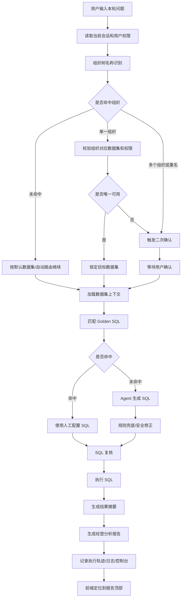

# 智能问数流程图与规则说明

这份文档只放流程和规则，便于单独检查问数链路。

## 一、总体流程图

## 二、四 Agent 链路

| Agent | 职责 | 输出 |
|---|---|---|
| Agent 1：理解问题 | 识别问题意图、数据范围、组织实体 | 问题意图、候选数据集、实体信息 |
| Agent 2：生成 SQL | 结合字段、样例 SQL、Golden SQL 生成查询 | SQL 和生成说明 |
| Agent 3：复核 SQL | 检查字段、过滤条件、统计口径和只读安全 | 复核结论、修正后 SQL |
| Agent 4：解释结果 | 根据查询结果生成摘要、结论和报告 | 结果摘要、经营分析报告 |

## 三、组织树识别规则

| 场景 | 处理方式 |
|---|---|
| 当前问题没有组织名称 | 走默认数据集或自动路由 |
| 当前问题只有一个组织且唯一匹配 | 直接锁定对应数据集 |
| 当前问题包含多个组织 | 二次确认查询范围 |
| 组织名称存在重名 | 二次确认具体组织 |
| 命中组织不在用户权限内 | 不静默切换，提示无法确认或无权限 |
| 历史上下文与当前问题冲突 | 当前问题优先 |

## 四、SQL 选择规则

| 优先级 | 来源 | 说明 |
|---|---|---|
| 1 | 人工配置 Golden SQL | 标准问题优先使用人工维护 SQL |
| 2 | 数据集样例 SQL | 作为模型生成 SQL 的参考 |
| 3 | Agent 生成 SQL | 根据字段字典和问题动态生成 |
| 4 | 规则兜底 SQL | 仅在无标准 SQL、模型不可用或无法生成时使用 |

## 五、异常与取消规则

| 场景 | 处理要求 |
|---|---|
| 用户主动取消 | 前端显示中文取消状态，停止转圈和读秒 |
| 请求失败 | 执行轨迹标记异常，控制台和日志记录失败原因 |
| SQL 执行失败 | 展示可读错误信息，保留 SQL 和执行上下文 |
| 模型返回异常 | 转入可控兜底流程，不直接暴露英文底层错误 |
| 报告生成完成 | 页面定位到报告顶部，而不是跳到最底部输入框 |

## 六、汇报时的简短口径

智能问数不是直接把问题丢给大模型，而是先通过组织树、权限、数据集和标准 SQL 规则做确定性约束，再让 Agent 完成 SQL 生成、复核和结果解释。

这样既保留了自然语言交互的灵活性，也避免了模型随意选择数据源、随意生成口径的问题。

