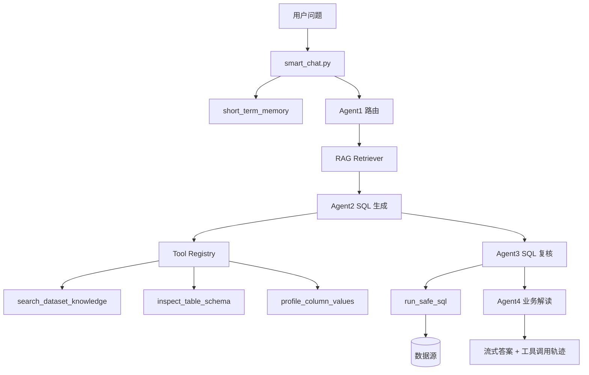
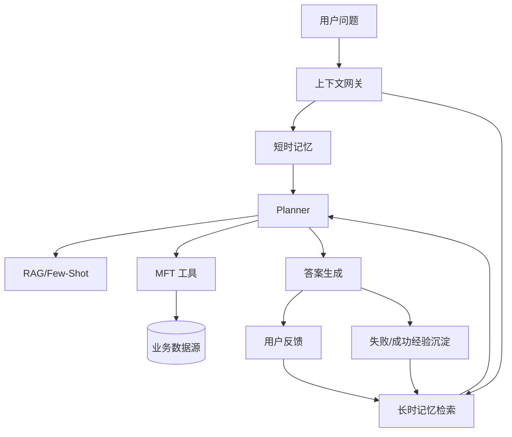
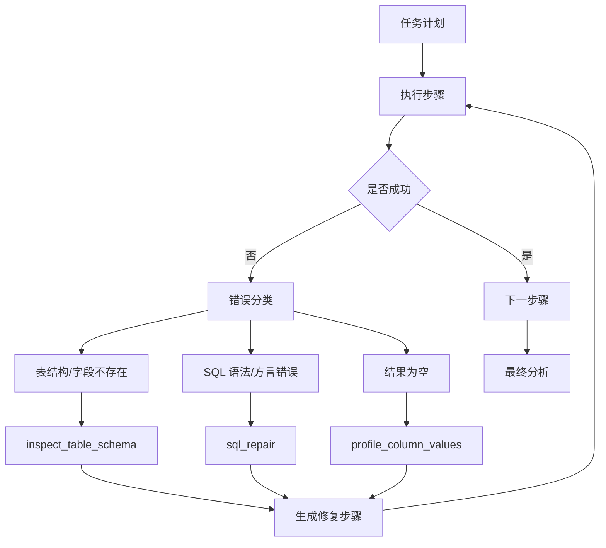

# 企业级智能问数迭代计划

## 1. 当前系统判断

当前项目已经不是空白系统，而是具备企业问数雏形的四 Agent 架构：

- 后端入口：`backend/controllers/smart_chat.py`，提供 `/api/smart-chat`、`/api/smart-chat/stream`、`/api/smart-chat/confirm-by-boss`。
- 核心编排：`backend/four_agent_ask.py`，包含 `route_with_agent1()`、`_agent2_generate_sql()`、`_agent3_review()`、`_agent4_analysis()`、`_run_pipeline()`、`ask()`。
- 数据集书架：`backend/bookshelf_repository.py`，通过 `get_agent1_catalog()` 和 `get_dataset_context()` 把 LLD、DDL、字段字典、Golden SQL、常见问题注入问数链路。
- 数据集维护：`backend/controllers/bookshelf.py` 和 `frontend/src/views/DatasetManagement.vue`，已支持 LLD、DDL、Golden SQL、常见问题、回归题、Agent Prompt 等配置。
- 模型配置：`frontend/src/views/AIModels.vue` 和 `backend/controllers/ai_models.py`，已支持 OpenAI-compatible 多模型配置。

主要短板也很明确：当前 RAG 更像“规则检索 + Prompt 拼接”，还没有统一的检索器、记忆层、工具注册中心、Planner 状态机、自动回归与自愈闭环。

关于 LangChain 和 MCP：LangChain/LangGraph、MCP Python SDK、Chroma、SQLite/PostgreSQL 都可以免费引入；真正可能产生费用的是云端大模型、云端 embedding 或企业级向量库。建议优先采用“免费开源框架 + 本地或现有 OpenAI-compatible 模型”的路线。

## 2. Basic 阶段：用现有素材做 RAG + Few-Shot

目标：先解决“SQL 准确率”和“问错表、漏口径、字段乱猜”的问题。这个阶段不追求复杂智能体，只把 LLD、DDL、Golden SQL、常见问题用好。

### 后端改造

1. 新增 `backend/retrieval/knowledge_indexer.py`
   - `build_dataset_documents(dataset_id)`：把 LLD、DDL、data_dictionary、Golden SQL、common_questions 拆成标准文档。
   - `sync_dataset_to_vector_store(dataset_id)`：保存数据集后同步到 Chroma。
   - `delete_dataset_index(dataset_id)`：删除数据集时同步清理索引。

2. 新增 `backend/retrieval/rag_retriever.py`
   - `retrieve_for_question(question, dataset_ids=None, top_k=8)`：返回最相关的 DDL、字段、LLD、Golden SQL。
   - `retrieve_few_shots(question, dataset_id, top_k=5)`：按相似度和 `quality_score` 找 Golden SQL few-shot。

3. 修改 `backend/controllers/bookshelf.py`
   - 在 `PUT /api/bookshelves/datasets/<id>/full` 成功保存后调用 `sync_dataset_to_vector_store()`。
   - 新增 `POST /api/bookshelves/datasets/<id>/reindex`，用于手动重建索引。

4. 修改 `backend/four_agent_ask.py`
   - `_build_context_blob()`：改为优先使用 `rag_retriever.retrieve_for_question()` 结果，不再只按固定条数截断。
   - `_agent2_generate_sql()`：将 `retrieve_few_shots()` 返回的样本作为强 Few-Shot，Prompt 明确要求优先复用样本中的过滤、聚合、JSONB 提取和层级隔离。
   - `_compute_dataset_match()`：加入向量检索得分，降低只靠关键字命中的误判。

5. 修改 `backend/requirements.txt`
   - 可选免费依赖：`langchain-core`、`langchain-community`、`chromadb` 已由 Vanna 间接具备时不重复加。
   - 如果使用本地 embedding，可加 `sentence-transformers`；如果机器资源不够，则先复用现有 Vanna/Chroma。

### 前端改造

1. 修改 `frontend/src/views/DatasetManagement.vue`
   - 在质量区增加“索引状态”和“重建索引”按钮。
   - Golden SQL 表格增加“命中次数、最近命中、质量分”列。
   - 保存后提示“已保存并刷新检索索引”。

2. 修改 `frontend/src/views/SmartAsk.vue`
   - 问答步骤中展示“命中的 DDL / Golden SQL / LLD 片段”。
   - 答案底部显示“参考样本”和“口径依据”。

### 用户可感知变化

- 同样的问题更容易命中正确数据集。
- SQL 更接近已有 Golden SQL，不再频繁忘记年份、组织层级、JSONB 字段提取。
- 答案里能看到“本次参考了哪些 DDL、Golden SQL、LLD”，可解释性明显增强。

## 3. Intermediate 阶段：短时记忆 + CoT + MFT 工具调用

目标：解决多轮对话、复杂指标拆解、查询前验证和执行中工具使用问题。

### 短时记忆

新增 `backend/memory/short_term_memory.py`：

- `create_session(user_id=None)`：创建对话会话。
- `append_turn(session_id, role, content, metadata)`：记录用户问题、系统路由、SQL、结果摘要。
- `get_recent_context(session_id, limit=6)`：返回最近多轮上下文。
- `summarize_session(session_id)`：对长会话生成短摘要，避免上下文无限膨胀。

修改：

- `backend/controllers/smart_chat.py`：接收 `session_id`，SSE 事件返回 `session_id`。
- `backend/four_agent_ask.py` 的 `ask()` 和 `confirm_by_boss()`：读取短时记忆，用于补全“刚才那个部门”“继续看上个月”等省略表达。
- `frontend/src/state/smartAskSession.js`：保存后端返回的 `session_id`，多轮发送时带上。
- `frontend/src/api/index.js`：`sendSmartChatStream()` 增加 `sessionId` 参数。

### CoT 实现边界

不建议把完整私有思维链直接展示给用户。企业系统更适合展示“可审计推理摘要”：

- 新增 `backend/reasoning/reasoning_trace.py`
  - `build_reasoning_plan(question, context)`：输出公开版步骤，如“识别指标、确认口径、生成 SQL、复核安全、解释结果”。
  - `redact_private_chain(raw_text)`：过滤模型内部草稿，只保留可审计摘要。
- 修改 `_run_pipeline()`：每个 Agent 产出 `reasoning_summary`，通过 SSE 的 `trace` 事件发给前端。
- 修改 `frontend/src/views/SmartAsk.vue`：把“思考过程”改成“执行依据”，展示可审计摘要、命中样本、SQL 复核点。

### MFT 工具调用

建议先做基础 MFT，不要一开始就上复杂自主 Agent。工具必须白名单、可审计、可回放。

新增 `backend/tools/tool_registry.py`：

- `register_tool(name, schema, handler, permission)`
- `list_tools(dataset_id=None)`
- `call_tool(name, arguments, context)`

首批工具：

- `search_dataset_knowledge`：检索 LLD、DDL、Golden SQL。
- `inspect_table_schema`：读取真实数据源表结构。
- `run_safe_sql`：执行只读 SQL，内置 limit、超时和危险语句拦截。
- `profile_column_values`：查看字段枚举、空值率、TopN。
- `run_regression_cases`：执行数据集标准题，返回通过率。

修改 `backend/four_agent_ask.py`：

- `_agent2_generate_sql()`：生成 SQL 前可调用 `inspect_table_schema` 和 `search_dataset_knowledge`。
- `_agent3_review()`：复核时可调用 `run_safe_sql` 做 explain 或小样本试跑。
- `_run_pipeline()`：加入 `tool_calls` 列表，所有工具调用写入 trace。

### MFT 数据流图

### 用户可感知变化

- 可以连续追问：“那东部呢？”“继续看代表处”，系统能理解上下文。
- 复杂指标会先拆解：指标口径、字段来源、SQL 生成、执行校验分步可见。
- SQL 出错时不再直接失败，会先自动查表结构、字段枚举、样本数据再修正。

## 4. Advanced 阶段：长时记忆 + Planner + 自愈

目标：从“会问数”升级成“懂人、懂业务、能规划、会自愈”的企业分析助理。

### 长时记忆

新增数据库表或 SQLite 文件：

- `ai_user_profiles`：用户偏好、常看组织、默认时间范围、指标偏好。
- `ai_query_memories`：高质量历史问题、最终 SQL、业务解读、用户反馈。
- `ai_metric_memories`：企业指标口径、别名、风险阈值。
- `ai_failure_memories`：失败 SQL、错误原因、修复方案。

新增 `backend/memory/long_term_memory.py`：

- `write_memory(memory_type, content, metadata)`
- `retrieve_user_memory(user_id, question, top_k=5)`
- `retrieve_metric_memory(question, dataset_id)`
- `remember_success(question, sql, answer, feedback)`
- `remember_failure(question, sql, error, fix)`

修改：

- `backend/four_agent_ask.py` 的 `ask()`：进入 Agent1 前检索用户偏好和指标记忆。
- `_agent4_analysis()`：使用用户偏好决定输出风格，例如老板视角、财务视角、运营视角。
- `frontend/src/views/SmartAsk.vue`：提供“采纳答案 / SQL 有误 / 口径不对”反馈按钮。
- 新增 `frontend/src/views/MemoryCenter.vue`：让管理员查看、禁用、合并、删除记忆。

### Planner 任务编排

新增 `backend/planner/planner.py`：

- `make_plan(question, context, tools)`：生成任务 DAG。
- `execute_plan(plan, context)`：按步骤执行，支持失败重试和降级。
- `repair_step(step, error, context)`：失败自愈。
- `summarize_plan_result(plan_state)`：输出最终答案。

新增 `backend/planner/plan_schema.py`：

- `PlanStep`：`id/name/tool/inputs/depends_on/retry_policy/status/result`。
- `PlanState`：完整任务状态。

修改 `backend/controllers/smart_chat.py`：

- 增加 `mode=agentic` 参数，Advanced 数据集默认走 Planner。
- SSE 增加 `plan_created`、`step_started`、`step_done`、`step_repaired` 事件。

修改 `frontend/src/views/SmartAsk.vue`：

- 新增 Planner 时间线，展示任务拆解、工具调用、重试、自愈。

### 长时记忆数据流图

### Planner 自愈数据流图

### 用户可感知变化

- 系统会记住用户习惯：默认看哪个事业部、常用时间口径、偏好的分析模板。
- 复杂任务会像项目计划一样展开，例如“先确认口径，再查表，再生成 SQL，再复核，再给建议”。
- SQL 失败会自动修：字段不存在时查真实表结构，结果为空时检查枚举值，方言错误时自动改写。
- 管理员可以在记忆中心审计系统“学到了什么”，避免黑盒化。

## 5. 建议实施节奏

### 第 1 周：Basic 可见提升

- 完成 RAG Retriever 与保存后重建索引。
- SmartAsk 展示命中素材。
- 数据集管理增加索引状态。
- 验收：商用事业部 10 个典型问题，SQL 生成成功率达到 80% 以上。

### 第 2 周：Few-Shot 与自动回归

- Golden SQL 命中排序优化。
- 增加 `run_regression_cases`。
- 每次保存数据集后可一键跑标准题。
- 验收：回归题通过率可视化，失败题能看到原因。

### 第 3-4 周：Intermediate

- 短时记忆接入前后端。
- MFT 工具注册中心上线。
- Agent3 支持试跑与修正。
- 验收：支持 3 轮以上上下文追问，复杂指标能自动查字段和修 SQL。

### 第 5-8 周：Advanced

- 长时记忆表和管理页。
- Planner DAG 执行器。
- 自愈闭环与失败记忆沉淀。
- 验收：系统可从失败中复用修复经验，用户偏好能改变答案输出。

## 6. 本次顺手修正与 UI 改造记录

- `frontend/src/views/DatasetManagement.vue`：已修复 `schema_definition` 未参与完整保存的问题，自动补齐商用事业部后可保存通过。
- `frontend/src/App.vue`：已移除仪表盘入口，并统一全局字体变量。
- `frontend/src/styles/volcano-design.css`：新增企业后台页头、统计卡、表格卡、字体与卡片质感样式。
- `frontend/src/views/Databases.vue`：新增专业页头、连接清单区、批量测试活跃连接。
- `frontend/src/views/FeishuSync.vue`：新增专业页头、任务概览和表格卡片结构。
- `frontend/src/views/AgentManagement.vue`：新增 Agent 编排页头和核心指标。

## 7. 风险与决策建议

1. 不建议一开始全面上 LangChain Agent。当前 `four_agent_ask.py` 已经沉淀了大量业务规则，应该先把它模块化，再逐步引入 LangChain/LangGraph。
2. MCP 适合作为工具协议层，而不是替代现有业务后端。建议先封装数据源、飞书、SQL、回归执行为内部工具，再暴露 MCP Server。
3. 长时记忆必须有审计和删除能力。企业数据不能让模型无限制沉淀，必须可查看、可撤销、可禁用。
4. CoT 不应直接暴露完整思维链。对用户展示“执行依据”和“审计摘要”更合适。
5. Basic 阶段优先复用 Vanna + Chroma，最快看到效果；等检索接口稳定后再替换为 LangChain Retriever。