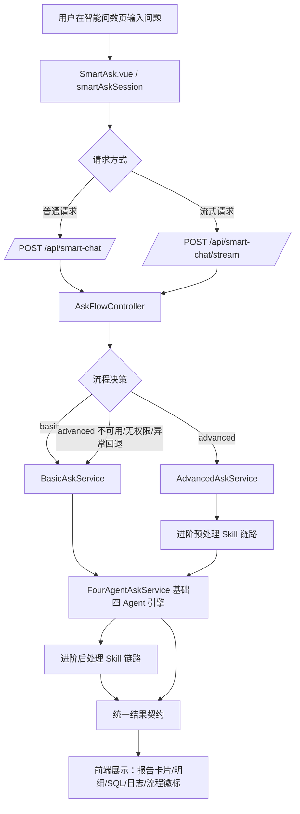
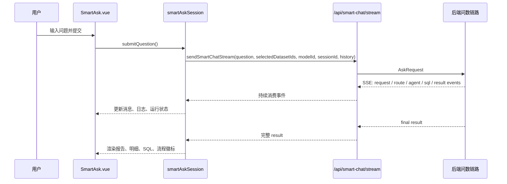
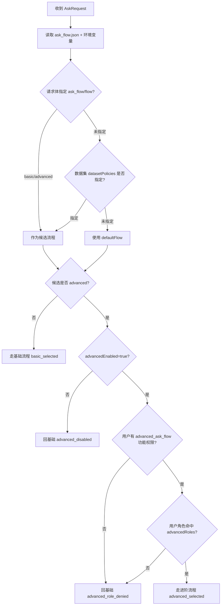
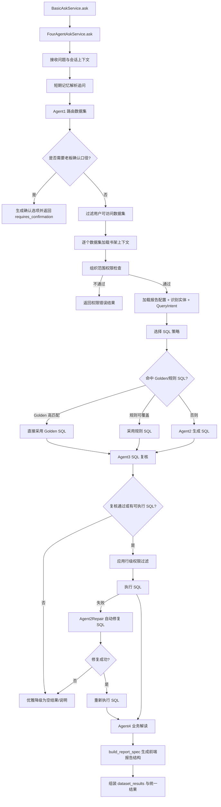
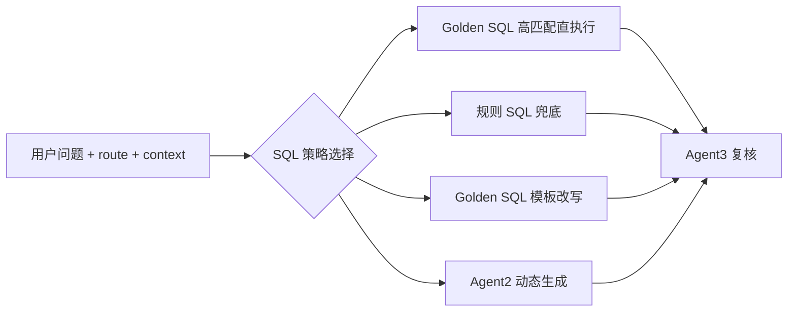
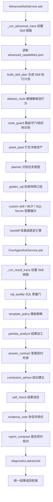
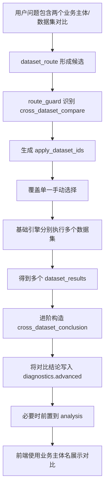
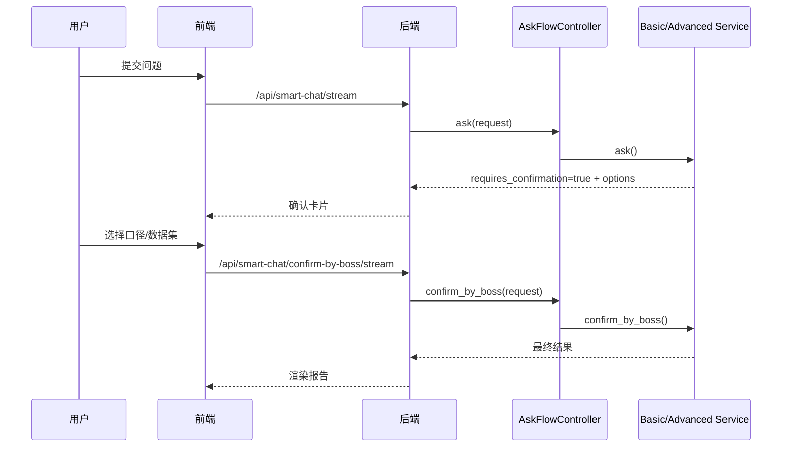
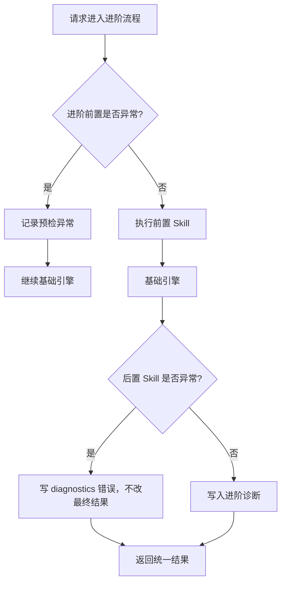

# 基础问数与进阶问数流程说明

> 适用范围：本文说明当前项目中“智能问数”的基础流程与进阶流程。  
> 代码入口主要涉及 `frontend/src/views/SmartAsk.vue`、`frontend/src/state/smartAskSession.js`、`backend/controllers/smart_chat.py`、`backend/ask_flow/controller.py`、`backend/smartask_basic/service.py`、`backend/smartask_advanced/service.py`、`backend/four_agent_ask.py`。

## 1. 结论先看

当前实现是“一个问数入口，两个可选执行引擎”：

- 前端仍然从智能问数页发起问题。
- 后端统一进入 `/api/smart-chat` 或 `/api/smart-chat/stream`。
- `AskFlowController` 决定本轮走基础流程还是进阶流程。
- 基础流程是稳定的四 Agent 问数链路。
- 进阶流程不是替换基础流程，而是在基础流程前后增加 Skill、诊断、自检、跨数据集结论等能力。
- 进阶异常时，按配置可回退基础流程，不应影响基础问数。
- 最终返回给前端的结果契约保持一致：`dataset_results`、`sql`、`rows`、`analysis`、`report_spec` 等仍然由稳定问数协议承载。

## 2. 总体架构图



## 3. 前端问数入口

### 3.1 页面与状态

前端核心位置：

- `frontend/src/views/SmartAsk.vue`
- `frontend/src/state/smartAskSession.js`
- `frontend/src/api/index.js`

关键行为：

- 用户输入问题后，前端调用 `sendSmartChatStream` 或 `sendSmartChat`。
- 请求体会携带：
  - `question`
  - `selected_dataset_ids`
  - `model_id`
  - `session_id`
  - `conversation_history`
  - 可选 `ask_flow` / `flow`
- 流式模式下，后端 SSE 会持续返回执行事件。
- 前端根据返回中的 `ask_flow` 或 `diagnostics.ask_flow` 显示“基础流程/进阶流程”徽标。
- 前端按统一结果结构渲染：
  - `dataset_results`
  - `report_spec`
  - `analysis`
  - `rows`
  - `columns`
  - `sql`
  - `diagnostics`

### 3.2 前端流程图



## 4. 流程分流：AskFlowController

核心位置：

- `backend/ask_flow/controller.py`
- `backend/ask_flow/contracts.py`
- 管理接口：`backend/controllers/ask_flow.py`

### 4.1 配置项

默认配置：

```json
{
  "defaultFlow": "basic",
  "advancedEnabled": false,
  "advancedRoles": ["super_admin"],
  "datasetPolicies": {},
  "fallbackToBasicOnError": true,
  "attachMetadata": true
}
```

含义：

- `defaultFlow`：默认使用 `basic` 或 `advanced`。
- `advancedEnabled`：是否启用进阶流程。
- `advancedRoles`：允许进入进阶流程的角色。
- `datasetPolicies`：按数据集指定流程，例如某数据集固定走 `advanced`。
- `fallbackToBasicOnError`：进阶流程异常时是否回落基础流程。
- `attachMetadata`：是否在结果里附加 `ask_flow` 元信息。

### 4.2 进阶权限开关

进阶流程还有功能权限隔离：

- 功能开关 key：`advanced_ask_flow`
- 如果用户没有该功能权限，即使角色在 `advancedRoles` 里，也不会进入进阶流程。
- 这能避免“给了角色但未放开功能”导致普通用户误进进阶链路。

### 4.3 决策顺序



## 5. 基础问数流程

核心位置：

- `backend/smartask_basic/service.py`
- `backend/four_agent_ask.py`

`BasicAskService` 是一层薄封装，实际执行委托给 `FourAgentAskService`。

### 5.1 基础流程主链路



### 5.2 Agent1：路由

职责：

- 判断问题应该查哪个数据集。
- 结合数据集名称、业务域、路由词、常见问题、用户手动选择等。
- 产出 `route`，包含：
  - `dataset_ids`
  - `candidate_dataset_ids`
  - `split_queries`
  - `requires_confirmation`
  - `confirmation_options`
  - `refined_query`
  - `decision`

关键注意：

- 如果路由不确定，会返回确认卡片。
- 用户确认后走 `/api/smart-chat/confirm-by-boss` 或对应 stream 接口。
- 允许数据集会按当前用户权限过滤，不能访问的数据集会被剔除。

### 5.3 数据集上下文加载

每个数据集执行前会加载：

- 数据集基础信息。
- LLD 文档。
- DDL / 表结构。
- 表关联。
- 数据字典。
- Golden SQL。
- Agent2/3/4 提示片段。
- 报告配置。
- 权限配置。

这些上下文会进入 SQL 生成、SQL 复核和业务解读。

### 5.4 权限检查

基础流程包含两层权限：

1. 数据集访问权限

   - 后端按 `allowed_dataset_ids` 和数据权限配置过滤。
   - 没权限的数据集不会进入执行。

2. 行级组织权限

   - `org_mention_permission_check`：检查用户问题中提到的组织是否在授权范围内。
   - `apply_row_level_filter`：SQL 执行前包一层过滤，限制返回当前用户可见组织。

### 5.5 SQL 策略

基础流程不是每次都纯 LLM 生成 SQL，会按顺序尝试稳定策略：



### 5.6 Agent3 复核

复核重点：

- 只读安全：只允许安全查询。
- 字段校验：避免引用不存在字段。
- JSONB 字段读取方式。
- 聚合口径。
- 是否需要改写最终 SQL。
- 风险与修复说明。

### 5.7 SQL 执行与自动修复

执行失败时：

- 捕获数据库真实错误。
- 调用 SQL 修复链路。
- 再次 Agent3 复核。
- 再次应用行级权限过滤。
- 重新执行。

修复仍失败时：

- 不崩溃整个问数。
- 返回 graceful result，保留 SQL、review、错误诊断。

### 5.8 Agent4 解读与报告结构

执行得到 rows 后：

- Agent4 生成业务分析。
- `build_report_spec` 生成前端可渲染结构。
- 输出统一结果：

```json
{
  "question": "...",
  "route": {},
  "confidence": {},
  "dataset_results": [],
  "report_configs": {},
  "report_config": {},
  "report_spec": {},
  "data_source": "...",
  "sql": "...",
  "columns": [],
  "rows": [],
  "row_count": 0,
  "analysis": "...",
  "steps": [],
  "requires_confirmation": false,
  "total_duration": 0
}
```

## 6. 进阶问数流程

核心位置：

- `backend/smartask_advanced/service.py`
- `backend/smartask_advanced/registry.py`
- `backend/smartask_advanced/config_store.py`
- `backend/smartask_advanced/skills/*`

进阶问数不是另一套 SQL 执行引擎，而是：

1. 前置增强：更强的路由解释、资产包、规划、Golden SQL 检索、路由守门。
2. 复用基础问数：最终 SQL 生成/复核/执行仍交给基础稳定引擎。
3. 后置增强：SQL 质量、模板策略、Pandas 分析、答案契约、自检、多信号择优、跨数据集结论。
4. 保持最终报告契约：前端不需要为进阶重写报告渲染协议。

### 6.1 进阶整体图



### 6.2 进阶前置 Skill

#### 6.2.1 dataset_route

作用：

- 给候选数据集打分。
- 解释为什么某些数据集更相关。
- 参考问题关键词、业务域、数据集别名、手动选择。

输出：

- `candidates`
- 每个候选数据集的 `advanced_score`
- 候选数据集摘要。

#### 6.2.2 route_guard

作用：

- 进阶路由守门。
- 判断手动选择是否与问题语义冲突。
- 识别跨数据集对比。
- 识别组织树成员与业务主体。
- 必要时锁定 `apply_dataset_ids`。

常见动作：

- `accept`：路由可接受。
- `manual_mismatch`：手动选择与问题明显不符。
- `needs_confirmation`：需要用户确认。
- `cross_dataset_compare`：跨数据集/跨业务主体对比。

这次已修正的关键点：

- 当用户明确问两个业务主体/数据集的对比时，进阶守门会覆盖单一手动选择，保证两个数据集都进入执行。
- 跨数据集结论中使用业务主体名称，不再把“数据集名称”直接写到结论里。

#### 6.2.3 asset_pack

作用：

- 对候选数据集读取书架资产。
- 打包字段、DDL、LLD、Golden SQL、常见问题、Agent 提示词。
- 让后续链路能解释“为什么这么查”。

#### 6.2.4 planner

作用：

- 判断问题意图。
- 识别目标层级。
- 识别 TopN。
- 为模板策略和答案契约提供结构化意图。

#### 6.2.5 golden_sql

作用：

- 检索候选 Golden SQL。
- 为基础引擎提供参考口径。
- 不是限制用户只能问样例题。

### 6.3 Handoff：交给基础稳定引擎

进阶链路在前置 Skill 后，会调用基础稳定引擎：

```python
result = self.fallback_service.ask(**fallback_kwargs)
```

其中：

- `fallback_service` 是 `basic_ask_service`。
- 如 `route_guard` 生成了 `effective_preferred_dataset_ids`，会传给基础引擎。
- 如 `route_guard.action == cross_dataset_compare`，会生成一个适合执行的内部问题，但最终对外仍保留用户原始问题。

### 6.4 进阶后置 Skill

#### 6.4.1 sql_quality

检查内容：

- SQL 是否只读。
- 字段/表是否风险。
- SQL 与结果是否为空。
- 首次结果质量。

输出到：

- `diagnostics.advanced.sql_quality`

#### 6.4.2 template_policy

检查内容：

- TopN 策略。
- 报告配置中的 ranking 策略。
- 前端可见结构是否与问题匹配。

输出到：

- `diagnostics.advanced.template_policy`

#### 6.4.3 pandas_analyze

作用：

- 对结果 rows 做结构化加工。
- 汇总 TopN、缺口、风险、分布。
- 不替换最终报告，只提供进阶诊断和辅助结论。

#### 6.4.4 answer_contract

检查内容：

- 核心结论是否直接回答用户问题。
- 排名问题是否先回答榜首/末位。
- 对比问题是否明确“谁领先、差多少”。
- 是否只罗列数据而缺少经营结论。

#### 6.4.5 conclusion_advice

作用：

- 根据证据给出核心结论建议。
- 当前主要作为诊断和辅助，不强制替换基础报告。

#### 6.4.6 self_check

检查内容：

- 是否有结果。
- 是否空列/空行。
- 数据集是否与路由守门期望一致。
- 是否存在路由错配。

#### 6.4.7 evidence_vote

作用：

- 综合 route_guard、sql_quality、pandas_analysis、template_policy、answer_contract、self_check。
- 形成本轮结果是否可采信的多信号判断。

输出：

- `decision`
- `confidence_score`
- `recommended_action`
- `warnings`

#### 6.4.8 report_compose

作用：

- 核对最终报告契约。
- 确保最终仍是前端现有可渲染结构。
- 不破坏 `dataset_results`、`report_spec`、`analysis` 等字段。

### 6.5 跨数据集对比流程



关键约束：

- 中间区和右侧报告模式不改。
- 但核心结论必须做跨主体对比。
- 结论里应使用业务主体名称，例如“商用事业部”“消费者事业部”，而不是直接暴露“某某测试数据集”。

## 7. 确认卡片流程

基础和进阶都沿用确认协议。



## 8. 权限隔离

### 8.1 功能权限

| 能力 | 功能 key | 说明 |
| --- | --- | --- |
| 智能问数工作台 | `smart_ask_workspace` | 控制智能问数入口 |
| 进阶问数流程 | `advanced_ask_flow` | 控制是否允许进入进阶流程 |
| SQL 调试台执行 | `dataset_sql_preview_run` | 控制 SQL 调试台入口、执行 SQL、问数转 SQL |
| SQL 调试结果复制/导出 | `dataset_sql_preview_copy` | 控制复制表格、复制 JSON、导出 CSV |

### 8.2 数据权限

数据权限主要分三层：

1. 数据集可见性

   - 用户只能看到授权的数据集。
   - 问数路由结果会过滤不可访问数据集。

2. 组织提及权限

   - 用户问题中提到未授权组织，会被拦截。

3. SQL 行级过滤

   - SQL 执行前套 `apply_row_level_filter`。
   - 防止用户通过 SQL 查到授权范围外的数据。

## 9. 失败与回退策略

### 9.1 基础流程失败

基础流程内部尽量优雅降级：

- Agent2 生成空 SQL：返回可解释的空结果。
- Agent3 拦截 SQL：返回 review 风险。
- SQL 执行失败：尝试自动修复。
- 修复失败：返回 graceful dataset result。
- 权限失败：返回明确权限错误。

### 9.2 进阶流程失败

进阶流程必须不影响基础交付：

- 前置 Skill 失败：记录 `advanced.preflight_error`，继续基础引擎。
- 后置 Skill 失败：写入 diagnostics，不改变最终报告。
- 整个进阶服务异常：如果 `fallbackToBasicOnError=true`，AskFlowController 回退基础流程。



## 10. SQL 调试台与问数流程的关系

SQL 调试台是辅助验证工具，不参与正式问数主链路。

当前能力：

- 独立导航页：`/sql-debug`
- 全局悬浮开关：在 SQL 调试台页面开启后，可以在任何页面出现悬浮入口。
- 两个 Tab：
  - SQL 查询：手写只读 SQL，直接执行。
  - 问数转 SQL：选择数据集，输入问题，只生成 SQL 和数据，不生成报告。
- 后端接口：
  - `/api/bookshelves/datasets/<id>/sql-preview`
  - `/api/bookshelves/datasets/<id>/ask-sql-debug`

安全约束：

- 只允许 `SELECT` / `WITH` 类只读查询。
- 必须有 `dataset_sql_preview_run` 权限。
- 必须有数据集可见权限。
- 执行前应用行级组织权限过滤。
- 复制/导出受 `dataset_sql_preview_copy` 控制。

## 11. 结果字段对照

### 11.1 顶层结果

| 字段 | 基础流程 | 进阶流程 | 说明 |
| --- | --- | --- | --- |
| `question` | 有 | 有 | 用户原始问题 |
| `route` | 有 | 有 | Agent1/稳定引擎路由 |
| `dataset_results` | 有 | 有 | 数据集结果列表 |
| `sql` | 有 | 有 | 主数据集 SQL |
| `columns` | 有 | 有 | 主数据集列 |
| `rows` | 有 | 有 | 主数据集行 |
| `analysis` | 有 | 有 | 业务解读 |
| `report_spec` | 有 | 有 | 前端报告结构 |
| `diagnostics.ask_flow` | 可有 | 有 | 流程分流元信息 |
| `diagnostics.advanced` | 无 | 有 | 进阶诊断信息 |

### 11.2 `dataset_results[]`

| 字段 | 说明 |
| --- | --- |
| `dataset_id` | 数据集 ID |
| `dataset_code` | 数据集编码 |
| `dataset_name` | 数据集名称 |
| `source_id` | 数据源 ID |
| `columns` | SQL 返回列 |
| `rows` | SQL 返回数据 |
| `row_count` | 行数 |
| `sql` | 最终执行 SQL |
| `agent3_review` | SQL 复核结果 |
| `analysis` | 当前数据集解读 |
| `report_spec` | 当前数据集报告结构 |
| `report_config` | 报告配置 |

## 12. 主要不变式

这些是不应该被进阶流程破坏的约束：

- 基础流程仍可独立运行。
- 进阶流程关闭时，所有问数应回基础流程。
- 未授权用户不能进入进阶流程。
- 进阶异常不应阻断基础结果。
- 最终报告结构不因进阶流程而改变协议。
- SQL 执行前必须做只读校验和行级权限过滤。
- 跨数据集对比可以增强结论，但不改变中间区和右侧报告模式。
- 结论展示业务主体名称，不直接暴露内部数据集名。

## 13. 建议验证清单

每次改问数流程后建议至少验证：

- 普通用户无 `advanced_ask_flow` 权限时，默认走基础流程。
- 超级管理员有 `advanced_ask_flow` 权限且配置开启时，走进阶流程。
- 进阶服务抛错时，可回退基础流程。
- 手动选择单数据集的普通问题，仍只查该数据集。
- 明确问两个主体/数据集对比时，进阶流程能执行多个数据集并生成对比结论。
- 结论中不出现测试数据集名、阶段数据集名等内部名称。
- 无数据权限用户无法通过问数或 SQL 调试查到未授权数据。
- SQL 调试台只跑 SQL 和数据，不生成报告。

