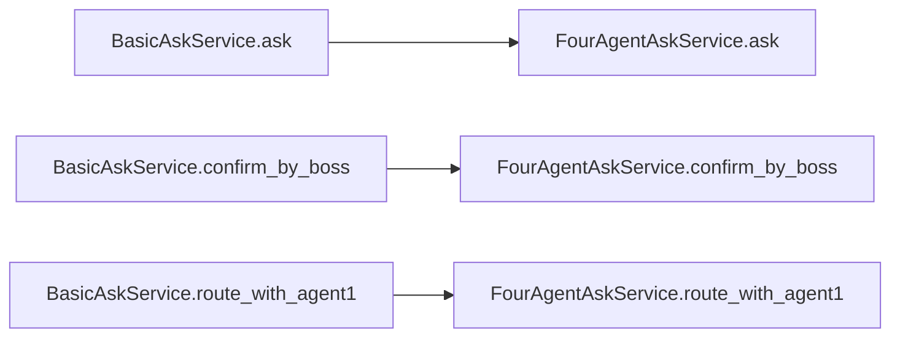
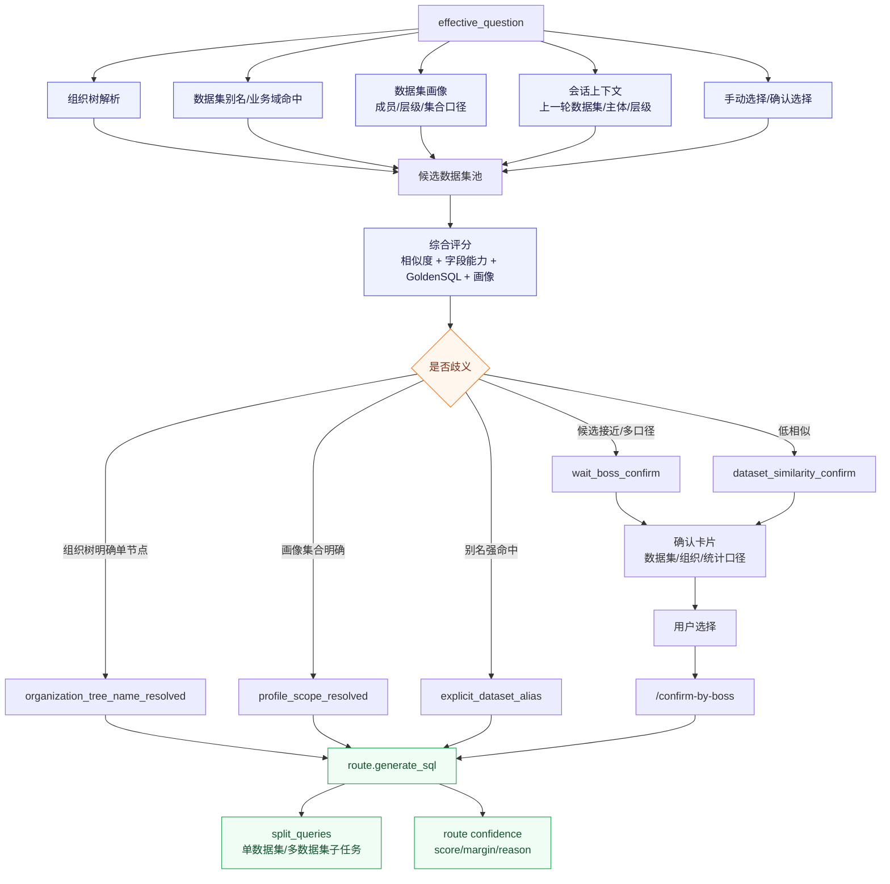
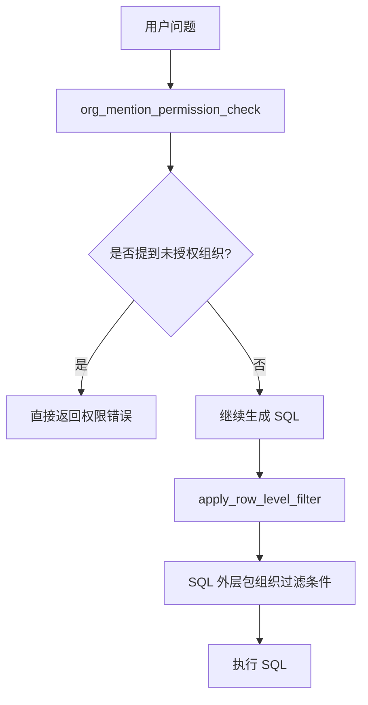
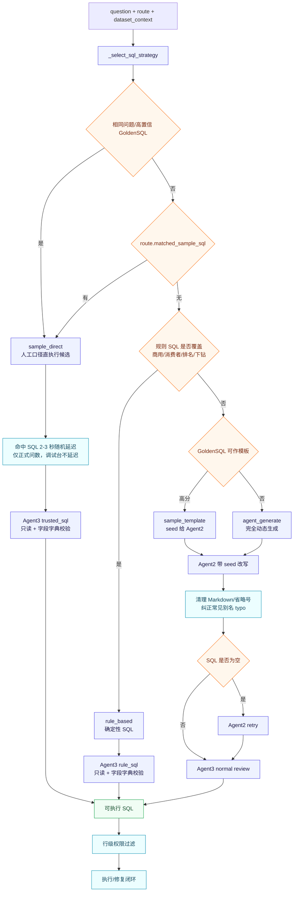
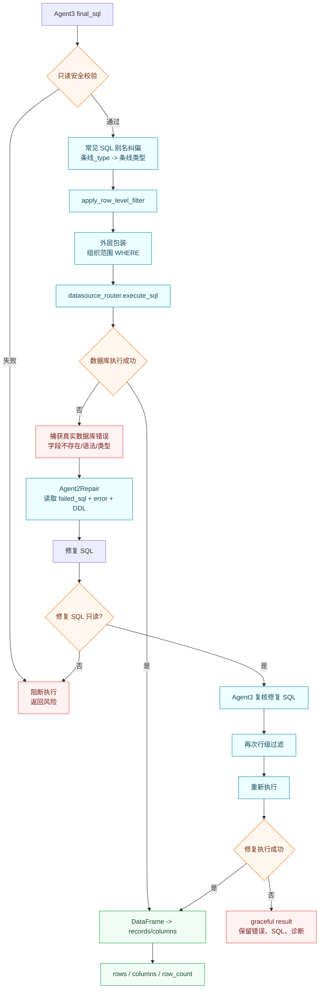

# 基础问数流程

> 本文只讲“基础问数”。进阶流程不在这里展开，避免把两套逻辑看混。  
> 关键代码：`backend/smartask_basic/service.py`、`backend/four_agent_ask.py`、`backend/controllers/smart_chat.py`、`frontend/src/state/smartAskSession.js`。

## 1. 基础问数是什么

基础问数是当前系统的稳定主链路，也就是“四 Agent 问数引擎”：

- Agent1：识别问题意图并路由数据集。
- Agent2：生成 SQL。
- Agent3：复核 SQL。
- 系统：执行 SQL，并在失败时尝试自动修复。
- Agent4：基于数据结果生成业务解读。
- 报告组装：生成前端可渲染的 `report_spec` 和结果数据。

基础流程不依赖进阶 Skill。即使进阶能力关闭、无权限、异常，基础问数仍应正常工作。

## 2. 基础问数入口

```mermaid
flowchart TD
    A[用户在智能问数页提交问题] --> B[SmartAsk.vue]
    B --> C[smartAskSession.js]
    C --> D[/api/smart-chat 或 /api/smart-chat/stream]
    D --> E[controllers/smart_chat.py]
    E --> F[AskFlowController]
    F -->|决策 basic| G[BasicAskService]
    G --> H[FourAgentAskService]
```

基础流程虽然经过 `AskFlowController`，但只要决策为 `basic`，后面就进入 `BasicAskService`。

`BasicAskService` 本身很薄，核心是把请求交给 `FourAgentAskService`：



## 3. 基础问数总流程

```mermaid
flowchart TB
    UI["SmartAsk.vue<br/>用户输入/手动数据集/会话"] --> API["/api/smart-chat 或 stream"]
    API --> CTRL["AskFlowController"]
    CTRL --> MODE{"flow=basic 或进阶回退"}
    MODE -->|否| OTHER["交给进阶流程<br/>本文件不展开"]
    MODE -->|是| BASIC["BasicAskService.ask"]
    BASIC --> SVC["FourAgentAskService.ask"]

    subgraph SESSION["问题与会话层"]
        SVC --> CLEAN["清洗问题<br/>空白/上下文/确认态"]
        CLEAN --> MEM["ShortTermMemory<br/>读取最近多轮"]
        MEM --> FOLLOW["追问解析<br/>effective_question"]
        FOLLOW --> PREFERRED["合并 preferred_dataset_ids<br/>手选/确认/历史口径"]
    end

    subgraph ROUTE["Agent1 路由层"]
        PREFERRED --> ORG["组织树预解析<br/>OrganizationRouteResolver"]
        ORG --> PROFILE["数据集画像/成员集合解析"]
        PROFILE --> SCORE["候选数据集评分<br/>别名/业务域/字段/GoldenSQL"]
        SCORE --> ARB["DisambiguationArbiter<br/>歧义仲裁"]
        ARB --> NEED_CONFIRM{"需要老板确认?"}
        NEED_CONFIRM -->|是| CONFIRM["返回确认卡片<br/>requires_confirmation"]
        NEED_CONFIRM -->|否| ROUTE_OK["route.dataset_ids<br/>split_queries"]
    end

    subgraph PERMISSION["权限门"]
        ROUTE_OK --> FILTER["allowed_dataset_ids 过滤"]
        FILTER --> DATASET_ACCESS{"数据集可访问?"}
        DATASET_ACCESS -->|否| DENY_DS["权限错误/无可用数据集"]
        DATASET_ACCESS -->|是| ORG_CHECK["org_mention_permission_check<br/>未授权组织拦截"]
        ORG_CHECK --> ORG_OK{"组织提及可查?"}
        ORG_OK -->|否| DENY_ORG["组织权限错误"]
        ORG_OK -->|是| PIPE["逐数据集执行 Pipeline"]
    end

    subgraph PIPELINE["单数据集执行流水线"]
        PIPE --> CTX["加载书架上下文<br/>dataset/DDL/dictionary/LLD/prompt"]
        CTX --> REPORT_CFG["加载 report_config<br/>识别 queryIntent"]
        REPORT_CFG --> STRATEGY["_select_sql_strategy"]
        STRATEGY --> SQLSRC{"SQL 来源"}
        SQLSRC -->|Golden 高匹配| GOLDEN["sample_direct<br/>延迟2-3秒模拟生成感"]
        SQLSRC -->|规则命中| RULE["rule_based SQL"]
        SQLSRC -->|样例可改写| TEMPLATE["sample_template seed"]
        SQLSRC -->|无样例| GEN["Agent2 动态生成"]
        GOLDEN --> REVIEW["Agent3 只读/字段/口径复核"]
        RULE --> REVIEW
        TEMPLATE --> GEN
        GEN --> REVIEW
        REVIEW --> APPROVED{"复核通过或有替代 SQL"}
        APPROVED -->|否| GRACE1["优雅降级<br/>返回诊断"]
        APPROVED -->|是| ROWSEC["apply_row_level_filter<br/>套组织行级权限"]
        ROWSEC --> EXEC["datasource_router.execute_sql"]
        EXEC --> EXEC_OK{"执行成功?"}
        EXEC_OK -->|否| REPAIR["Agent2Repair<br/>基于数据库真实错误修复"]
        REPAIR --> R_REVIEW["Agent3 再复核"]
        R_REVIEW --> R_ROWSEC["再次套行级权限"]
        R_ROWSEC --> R_EXEC["重新执行"]
        R_EXEC --> R_OK{"修复后成功?"}
        R_OK -->|否| GRACE2["graceful_dataset_result"]
        EXEC_OK -->|是| ANALYSIS["Agent4 业务解读"]
        R_OK -->|是| ANALYSIS
        ANALYSIS --> SPEC["build_report_spec<br/>KPI/结构树/表格/模板"]
        SPEC --> DS_RESULT["dataset_result"]
    end

    DS_RESULT --> COMBINE["合并多数据集结果<br/>primary + dataset_results"]
    GRACE1 --> COMBINE
    GRACE2 --> COMBINE
    CONFIRM --> OUT["统一响应"]
    OTHER --> OUT
    DENY_DS --> OUT
    DENY_ORG --> OUT
    COMBINE --> OUT

    classDef gate fill:#fff7ed,stroke:#f97316,color:#7c2d12;
    classDef agent fill:#eef2ff,stroke:#4f46e5,color:#1e1b4b;
    classDef perm fill:#fef2f2,stroke:#ef4444,color:#7f1d1d;
    classDef engine fill:#ecfeff,stroke:#0891b2,color:#164e63;
    classDef output fill:#f0fdf4,stroke:#16a34a,color:#14532d;
    class MODE,NEED_CONFIRM,DATASET_ACCESS,ORG_OK,SQLSRC,APPROVED,EXEC_OK,R_OK gate;
    class ORG,PROFILE,SCORE,ARB,GEN,REVIEW,REPAIR,R_REVIEW,ANALYSIS agent;
    class FILTER,ORG_CHECK,DENY_DS,DENY_ORG perm;
    class ROWSEC,EXEC,R_ROWSEC,R_EXEC,STRATEGY engine;
    class OUT,COMBINE,DS_RESULT,SPEC output;
```



## 4. Agent1：数据集路由

Agent1 负责判断“这个问题该查哪个数据集”。

输入：

- 用户问题。
- 用户手动选择的数据集。
- 可访问数据集范围。
- 数据集路由词、别名、常见问题、业务域等。
- 会话上下文。

输出：

```json
{
  "dataset_ids": [1],
  "candidate_dataset_ids": [1, 2],
  "requires_confirmation": false,
  "confirmation_options": [],
  "refined_query": "处理后的问题",
  "decision": "generate_sql",
  "split_queries": []
}
```

如果路由不确定，会进入确认流程。



## 5. 数据集上下文加载

每个命中的数据集都会加载书架上下文。

主要内容：

- 数据集基本信息。
- 数据源 ID。
- LLD 文档。
- DDL / 表结构。
- 表关联。
- 数据字典。
- Golden SQL。
- Agent2/3/4 提示词片段。
- 常见问题。
- 报告配置。
- 数据权限配置。

这些内容会进入 SQL 生成、SQL 复核、业务解读和报告组装。

## 6. 基础流程权限

基础流程有两类核心权限。

### 6.1 数据集访问权限

用户只能查询自己有权限的数据集。

如果 Agent1 选中了用户无权访问的数据集，后端会过滤掉。过滤后如果没有可用数据集，本轮不能继续正常查询。

### 6.2 组织行级权限

基础流程不只看数据集权限，还会看组织范围。

主要两步：



作用：

- 用户不能通过直接提问查未授权组织。
- 即使 SQL 能生成，执行前仍会自动加行级过滤。
- 防止通过 SQL 返回授权范围外的数据。

## 7. SQL 生成策略

基础流程不是每次都完全依赖大模型生成 SQL。它会按稳定策略选择。



### 7.1 Golden SQL 直执行

适用场景：

- 问题与维护的 Golden SQL 高度匹配。
- SQL 口径可信。
- 字段校验通过。

优势：

- 稳定。
- 快。
- 可复用人工沉淀口径。

### 7.2 规则 SQL 兜底

适用场景：

- 特定数据集有确定性规则。
- 问题落入已知组织层级、排名、下级明细等模式。

优势：

- 减少 LLM 随机性。
- 对高频经营问题更稳。

### 7.3 Agent2 动态生成

适用场景：

- 没有高匹配 Golden SQL。
- 规则 SQL 无法覆盖。
- 需要结合 DDL、字典、LLD、报告配置动态生成。

Agent2 输入：

- 用户问题。
- Agent1 路由结果。
- 数据集专属 Agent2 Prompt。
- 报告配置。
- 书架上下文。
- Golden SQL seed。

Agent2 输出：

```json
{
  "sql": "最终 PostgreSQL SQL",
  "notes": "生成说明"
}
```

## 8. Agent3：SQL 复核

Agent3 对 SQL 做安全和口径复核。

检查重点：

- 是否只读。
- 是否包含危险语句。
- 字段是否存在。
- JSONB 字段读取是否合理。
- 是否符合报告配置需要的输出列。
- 聚合、过滤、排序、TopN 是否合理。
- 是否需要改写 SQL。

输出：

```json
{
  "approved": true,
  "final_sql": "复核后的 SQL",
  "review_summary": "复核说明",
  "risks": [],
  "fixes": []
}
```

如果复核不通过：

- 有可替代 SQL：使用替代 SQL。
- 无可执行 SQL：返回空结果和诊断说明。

## 9. SQL 执行与自动修复

执行前会先应用行级权限：

```sql
SELECT *
FROM (
  原始 SQL
) AS __smartask_row_scope
WHERE 当前用户组织范围条件
```

执行失败时：



## 10. Agent4：业务解读

Agent4 基于 SQL 结果生成经营分析。

输入：

- 原始问题。
- LLD 背景。
- Agent3 复核结果。
- SQL 返回数据。
- 数据集专属 Agent4 Prompt。
- 报告配置。
- 查询意图。

输出：

- `analysis`：业务解读文本。

## 11. 报告组装

执行完成后，会生成 `report_spec`。

`report_spec` 用于前端展示：

- 核心指标。
- 结构树。
- 表格。
- 图表。
- 报告模式。
- 调试信息。

基础流程最终返回：

```json
{
  "question": "",
  "route": {},
  "confidence": {},
  "dataset_results": [],
  "report_config": {},
  "report_spec": {},
  "sql": "",
  "columns": [],
  "rows": [],
  "row_count": 0,
  "analysis": "",
  "steps": [],
  "requires_confirmation": false,
  "total_duration": 0
}
```

## 12. 基础流程关键不变式

基础问数必须满足：

- 不依赖进阶能力。
- 无进阶权限时仍正常运行。
- SQL 执行必须只读。
- SQL 执行前必须套行级权限。
- 用户无权访问的数据集不能进入执行。
- 用户无权查询的组织不能通过问题或 SQL 返回。
- Agent2 生成失败、Agent3 拦截、SQL 执行失败都要优雅返回。
- 最终结果结构要能被现有前端直接渲染。

## 13. 基础流程排查点

如果基础问数出问题，优先看：

- `route.dataset_ids` 是否正确。
- `allowed_dataset_ids` 是否过滤过度。
- `dataset_access_summary` 是否命中。
- `org_mention_permission_check` 是否拦截。
- `context.schema_definition` / `data_dictionary` 是否完整。
- Agent2 输出 SQL 是否为空。
- Agent3 是否把 SQL 拦截。
- `apply_row_level_filter` 后 SQL 是否还能执行。
- 数据源是否绑定正确。
- `build_report_spec` 是否识别到正确列。
