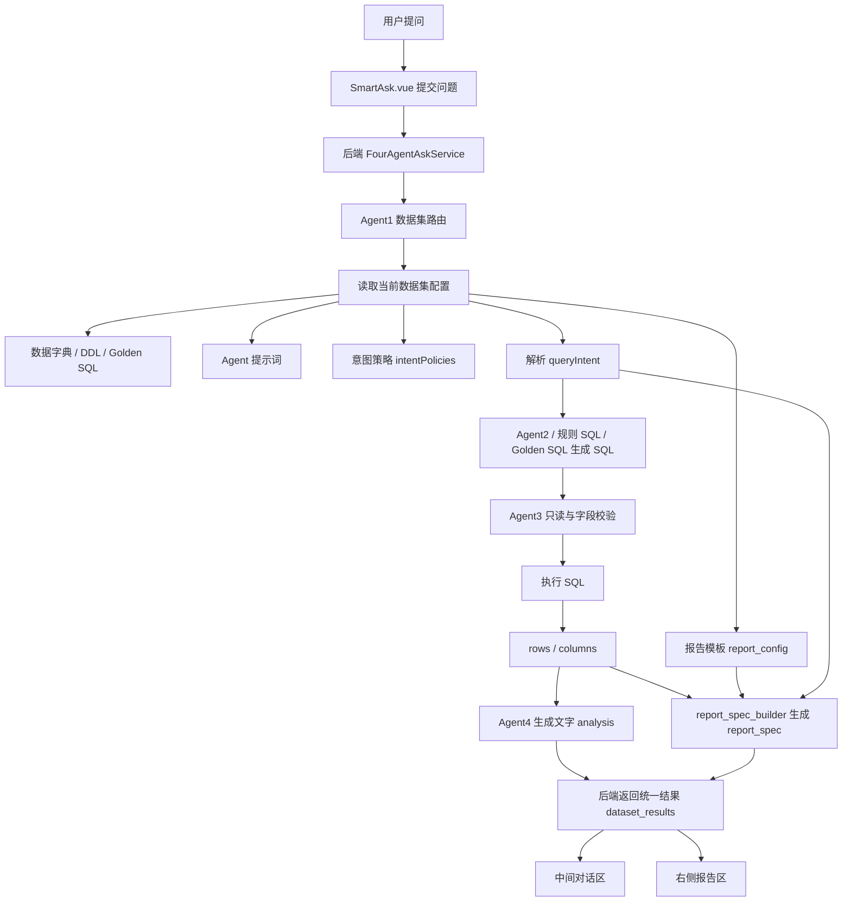
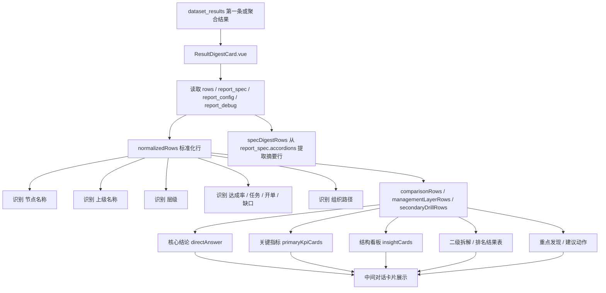
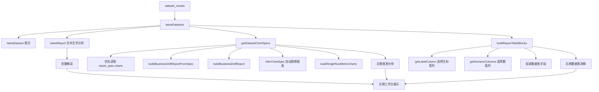
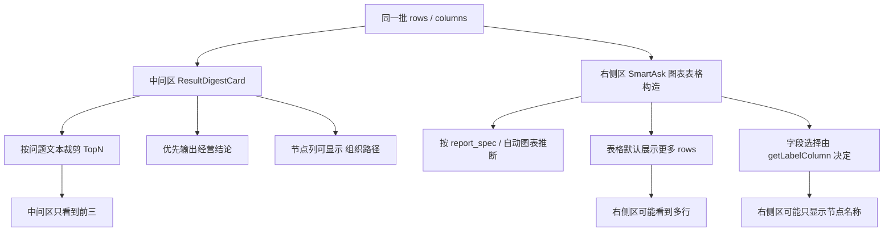
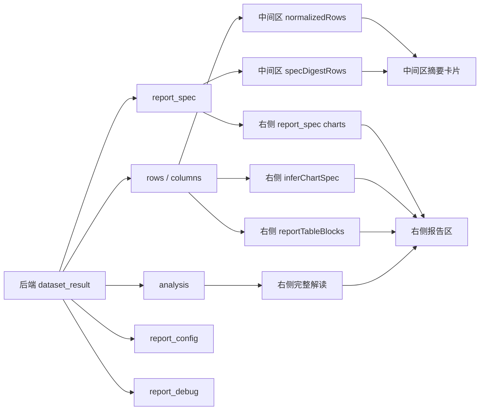
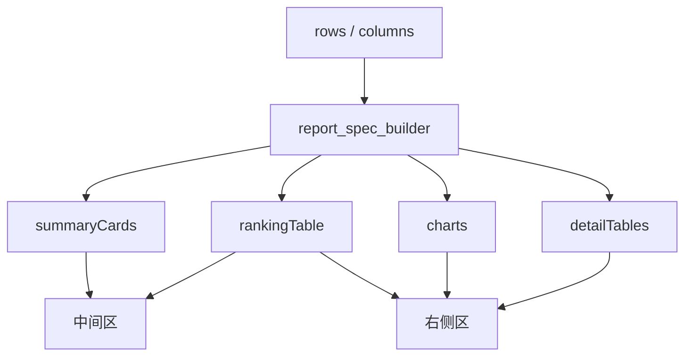

# 智能问数中间区与右侧区流程图

## 结论

当前中间对话区和右侧报告区不是两套后端问数逻辑，它们共用同一轮后端返回结果：

- `dataset_results`
- `rows / columns`
- `analysis`
- `report_spec`
- `report_config`
- `report_debug`

但前端展示阶段确实分成了两套派生逻辑：

- 中间区：偏“老板可读摘要”，主要由 `ResultDigestCard.vue` 二次归纳。
- 右侧区：偏“报告工作台”，主要由 `SmartAsk.vue` 构造图表、表格、弹窗报告。

所以同一批 SQL 结果，可能在中间区和右侧区出现展示口径、排序、字段优先级不一致。

## 总流程



## 中间对话区流程

入口文件：

- `frontend/src/views/SmartAsk.vue`
- `frontend/src/components/smartask/ResultDigestCard.vue`

核心目标：把结果压缩成一屏可读的经营摘要。



中间区的特点：

- 更依赖问题文本判断，如 `Top / 前三 / 最低 / 业务员 / 分公司`。
- 会自己从 `rows` 里找列名，例如 `节点名称`、`上级名称`、`组织路径`。
- 会按当前问题二次裁剪，比如 TopN 只展示前三。
- 展示目的是“快速回答”，不是完整报告。

## 右侧报告区流程

入口文件：

- `frontend/src/views/SmartAsk.vue`

核心目标：展示图表、数据表、弹窗报告和完整解读。



右侧区的特点：

- 更依赖 `report_spec` 和图表推断。
- 图表、表格、弹窗报告分别有自己的构造函数。
- 数据表字段由 `getLabelColumn`、`getNumericColumns` 自动挑选。
- 展示目的是“报告工作台”，保留更多明细和图表。

## 左右不一致的典型原因



常见表现：

- 中间区显示 Top3，右侧表格显示很多行。
- 中间区按达成率排序，右侧图表未使用同一排序字段。
- 中间区显示 `业务代表 · 上级：xxx`，右侧表格只显示 `节点名称`。
- `report_spec` 与前端自动图表推断都参与展示，导致报告区有二次加工。

## 当前关键对象关系



## 建议治理方向

### 1. 后端结果必须先带足语义字段

Top 类明细结果不要只返回：

- `节点名称`
- `达成率`
- `总任务金额`
- `年度开单金额`

应该同时返回：

- `组织路径`
- `上级名称`
- `分公司`
- `代表处`
- `业务部`
- `层级`
- `排名`

例如业务员 TopN：

```text
组织路径 = 东部分公司 / 上海代表处 / 张三
节点名称 = 张三
上级名称 = 上海代表处
分公司 = 东部分公司
代表处 = 上海代表处
全局排名 = 1
```

### 2. 中间区和右侧区共用同一个“展示契约”

建议把 `report_spec` 明确成唯一展示契约：



也就是：

- 中间区不要再大量自己猜表格。
- 右侧区不要再完全独立推断图表。
- 两边都优先读 `report_spec`。
- 只有 `report_spec` 缺失时，才用前端兜底推断。

### 3. 数据集模板里增加展示配置

每个数据集报告模板可配置：

```json
{
  "displayPolicies": {
    "ranking": {
      "labelColumn": "组织路径",
      "showColumns": ["全局排名", "组织路径", "总任务金额", "年度开单金额", "达成率", "剩余任务金额"],
      "sortColumn": "达成率",
      "sortDirection": "desc"
    }
  }
}
```

这样不同数据集可以独立控制：

- Top 排名显示哪些列。
- 表格第一列显示 `节点名称` 还是 `组织路径`。
- 图表按哪个指标排序。
- 明细是否显示上级组织。

## 小结

当前不是两套问数后端，但确实是两套前端展示派生逻辑。

短期修复：

- TopN SQL 返回 `组织路径`。
- 中间区和右侧表格优先显示 `组织路径`。

长期治理：

- 让 `report_spec` 成为统一展示契约。
- 中间区和右侧区都按 `report_spec` 渲染。
- 数据集报告模板新增可视化展示策略，减少代码里继续补特殊规则。
