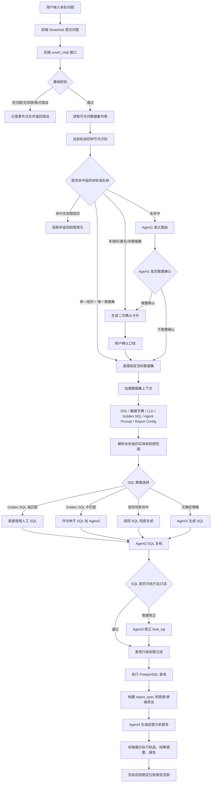

# 智能问数发版说明与流程图

生成日期：2026-05-18

## 1. 文档目的

本文用于后续发版、交付和回归测试说明，重点描述本版本智能问数链路的功能变化、当前执行流程、核心规则和发布注意事项。

本版本目标不是重写智能问数，而是在现有四 Agent 架构上增强确定性、可观测性和发布稳定性：

1. 当前轮问题优先，降低历史上下文对数据集判断的干扰。
2. 基于组织树标准名称识别，提前锁定或确认目标数据集。
3. 强化 Golden SQL、规则 SQL、模型 SQL 的优先级控制。
4. 优化取消、异常、报告定位、更新脚本等用户体验和运维体验。

## 2. 本版本主要功能变化

| 模块 | 变化 | 价值 |
|---|---|---|
| 组织树路由 | 新增基于 `organization_trees.json` 的组织节点名称识别 | 用户提到标准组织名时，优先确定数据集，减少 Agent 猜错 |
| 当前轮优先 | 组织识别只看本轮用户原话，不先吃历史上下文 | 连续对话里避免上一轮口径污染当前问题 |
| 数据集确认 | 多组织、多数据集、重名组织进入二次确认 | 防止同名分公司、城市公司查错数据源 |
| Golden SQL 优先 | 手工配置问题和 SQL 高匹配时优先使用 | 避免被写死规则 SQL 或模型生成覆盖 |
| 规则 SQL 兜底 | 只有在更高优先级策略未命中时使用规则 SQL | 保留稳定兜底，同时不抢占人工样例 |
| 主动取消 | 用户取消时展示中文取消态，不再显示英文异常和持续转圈 | 提升交互一致性 |
| 异常日志 | 问数接口异常、拒绝、权限失败进入事件日志和控制台 | 便于排查偶发报错 |
| 报告定位 | 问数完成后定位到报告顶部，而不是跳到最底部输入框 | 用户第一眼看到核心结论 |
| 更新脚本 | `update.sh` 增加密钥解密校验和 Postgres 密码提示 | 避免容器 unhealthy 后才发现密钥不匹配 |
| 内置模板同步 | 修复消费者数据集模板同步 SQL 参数转义问题 | 减少启动日志中的非致命异常 |

## 3. 智能问数总体流程图



## 4. 当前核心规则

### 4.1 当前轮问题优先规则

1. 用户每一轮提问都会先使用当前用户原话做组织树命名识别。
2. 历史上下文只作为追问、省略表达的补充，不再优先覆盖当前轮明确出现的组织名。
3. 例如上一轮问“商用事业部”，本轮问“消费者事业部哪个分公司完成最好”，应优先锁定消费者事业部数据集。

### 4.2 组织树识别规则

识别来源：

```text
config/organization_trees.json
config/data_permissions.json
```

当前支持：

1. 标准节点名称匹配，例如“消费者事业部”“云贵渝分公司”“东部分公司”。
2. 常见后缀简称匹配，例如“东部”可匹配“东部分公司”，“南部”可匹配“南部分公司”。
3. 根据组织树节点和数据权限绑定反推目标数据集。
4. 命中组织后会把组织标准名称写入 `refined_query`，供 SQL 和报告继续使用。

分流规则：

| 命中情况 | 系统动作 |
|---|---|
| 1 个组织节点，且只归属 1 个可访问数据集 | 直接锁定该数据集 |
| 多个组织节点，且归属同一数据集 | 进入确认，确认是整体、对比还是指定节点 |
| 多个组织节点，或同名组织跨数据集 | 强制二次确认 |
| 命中组织但用户无该数据集权限 | 阻断，不回退到其他数据集 |
| 未命中组织标准名称 | 继续走 Agent1 语义路由 |

示例：

| 用户问题 | 处理结果 |
|---|---|
| 消费者事业部哪个分公司完成最好？ | 锁定消费者事业部数据集 |
| 云贵渝分公司完成怎么样？ | 锁定消费者事业部数据集 |
| 东部分公司业绩怎么样？ | 锁定商用事业部数据集 |
| 东部和南部对比一下 | 进入组织口径确认 |
| 哪个分公司完成最好？ | 未出现标准组织名，交给 Agent1 判断 |

### 4.3 数据集路由规则

路由优先级：

1. 手动选择数据集：用户前端指定数据集时，优先使用指定数据集。
2. 当前轮组织树命中：根据组织节点直接锁定或确认数据集。
3. Agent1 语义路由：基于数据集名称、同义词、公共问题、LLD、Golden SQL 样例打分。
4. 歧义仲裁：候选数据集接近、口径不清、组织维度模糊时进入确认。
5. 模型兜底：确定性规则无法处理时，由 Agent1 模型输出路由 JSON。

路由输出关键字段：

```json
{
  "dataset_ids": [11],
  "refined_query": "重写后的查询",
  "requires_confirmation": false,
  "decision": "generate_sql",
  "candidate_dataset_ids": [11],
  "organization_mentions": []
}
```

### 4.4 二次确认规则

以下情况必须进入确认：

1. 一个组织名称可能对应多个数据集。
2. 同一问题出现多个组织节点，系统无法判断是对比、汇总还是分别查询。
3. 多个候选数据集分数接近。
4. 集合口径存在两种解释，例如“整体汇总”或“成员分别对比”。
5. 用户表达“分公司、组织、区域、事业部”等泛词，但没有明确标准名称。

确认后，系统会把用户确认的口径写回路由结果，并继续执行 SQL 生成和报告链路。

### 4.5 SQL 生成策略规则

SQL 生成优先级：

1. Golden SQL 高匹配直执行  
   人工维护的问题和目标 SQL 精确命中时，直接使用人工 SQL。

2. Golden SQL 中匹配作为种子  
   样例 SQL 与问题高度相关但不适合直接执行时，作为 Agent2 的参考 SQL。

3. 规则 SQL 兜底  
   对明确支持的业务问题，使用后端规则生成稳定 SQL。

4. Agent2 模型生成  
   在没有明确样例和规则时，使用数据字典、DDL、LLD、Prompt 生成 SQL。

5. Agent3 复核修正  
   所有 SQL 都要经过只读、安全、字段、层级、LIMIT 等复核。

只读安全规则：

```text
允许：SELECT / WITH
禁止：INSERT / UPDATE / DELETE / DROP / TRUNCATE / ALTER / CREATE / GRANT / REVOKE 等
```

### 4.6 行级权限规则

1. 数据集可见性先由账号权限过滤。
2. 组织树权限数据集会根据用户组织节点计算授权组织编码。
3. SQL 执行前会套用行级过滤，防止普通用户越权查询其他组织。
4. 如果用户问题提到无权限组织，系统直接返回权限提示，不自动换一个“看起来相似”的数据集。

### 4.7 报告生成规则

报告链路：

```text
SQL 结果
  -> report_spec_builder 生成报告结构
  -> Agent4 生成业务解读
  -> 前端 ResultDigestCard 渲染核心结论、指标、结构看板、建议动作
```

报告展示规则：

1. 标准列优先：`条线`、`层级`、`节点名称`、`上级名称`、任务金额、完成金额、达成率、剩余缺口。
2. 单体组织问题：展示命中节点及下级节点，方便下钻。
3. 对比问题：保留主体维度，不把多个组织合成一行。
4. 排名问题：同层级内比较，避免总体、分公司、城市公司混排。
5. 问数完成后，页面定位到报告顶部，用户先看核心结论。

## 5. 当前关键文件说明

| 文件 | 作用 |
|---|---|
| `backend/four_agent_ask.py` | 智能问数主编排，包含路由、确认、SQL、复核、执行、报告 |
| `backend/organization_route_resolver.py` | 组织树节点识别和数据集确定性路由 |
| `backend/bookshelf_repository.py` | 数据集元数据、Golden SQL、Agent Prompt、公共问题读取 |
| `backend/controllers/smart_chat.py` | 问数 HTTP / Stream 接口、权限校验、事件日志 |
| `backend/data_permission_store.py` | 数据集权限、组织树权限、行级过滤 |
| `backend/organization_tree_store.py` | 组织树配置加载、清洗和管理 |
| `backend/report_spec_builder.py` | 根据 SQL 结果构建报告结构 |
| `frontend/src/views/SmartAsk.vue` | 问数页面主视图、完成态滚动、报告展示 |
| `frontend/src/state/smartAskSession.js` | 前端问数状态、执行轨迹、流式事件解析 |
| `config/organization_trees.json` | 运行态组织树配置 |
| `config/data_permissions.json` | 数据集与组织树权限绑定 |

## 6. 发布和回归测试建议

### 6.1 发布前检查

```bash
python -m py_compile backend/four_agent_ask.py backend/organization_route_resolver.py
npm run build
docker compose config
```

### 6.2 发布后检查

```bash
docker compose ps
docker logs --tail=120 smartask-backend
```

后端应至少满足：

```text
smartask-backend healthy
GET /api/health 200
```

### 6.3 推荐回归问题

| 类型 | 问题 | 预期 |
|---|---|---|
| 消费者事业部锁定 | 消费者事业部哪个分公司完成最好？ | 命中消费者数据集 |
| 消费者分公司锁定 | 云贵渝分公司完成怎么样？ | 命中消费者数据集 |
| 商用分公司锁定 | 东部分公司业绩怎么样？ | 命中商用数据集 |
| 多组织确认 | 东部和南部对比一下 | 出现二次确认 |
| 泛问兜底 | 哪个分公司完成最好？ | 不硬锁组织树，走 Agent1 |
| Golden SQL | 手工配置问题对应 SQL 后提问 | 优先命中 Golden SQL |
| 权限拦截 | 普通用户询问无权限组织 | 返回权限提示，不查错数据集 |
| 取消流程 | 运行中点击取消 | 显示中文取消态，不持续转圈 |
| 报告定位 | 问数完成 | 页面定位到报告顶部 |

## 7. 运行态配置注意事项

以下文件属于运行态配置，不建议直接提交到 Git：

```text
.env
config/.secret_master_key
config/ai_settings.json
config/datasources.json
config/feishu_sync.json
config/auth_tokens.json
config/query_history.json
config/smartask_report_history.json
```

密钥规则：

1. `.env` 里的 `enc:v1:` 密文必须和 `config/.secret_master_key` 配套。
2. 替换 `.env` 后，需要重新创建容器，不能只 restart。
3. `update.sh` 已增加密文解密校验，密钥不匹配会提前报错。
4. Postgres 官方镜像不能解密 `enc:v1`，首次初始化自带数据库时需要注意 `SMARTASK_POSTGRES_PASSWORD`。

## 8. 发版摘要模板

可直接复制到版本说明：

```text
本版本优化智能问数路由准确率，新增基于组织树标准名称的当前轮问题识别机制。
当用户问题明确出现组织节点时，系统优先根据组织树和数据集权限自动锁定目标数据集；
当出现多组织、重名组织或跨数据集歧义时，自动进入二次确认，避免查错数据源。

同时优化 Golden SQL 优先级、主动取消体验、异常日志记录、报告完成后的页面定位和 update 脚本密钥校验，
提升问数准确率、可观测性和生产发布稳定性。
```
