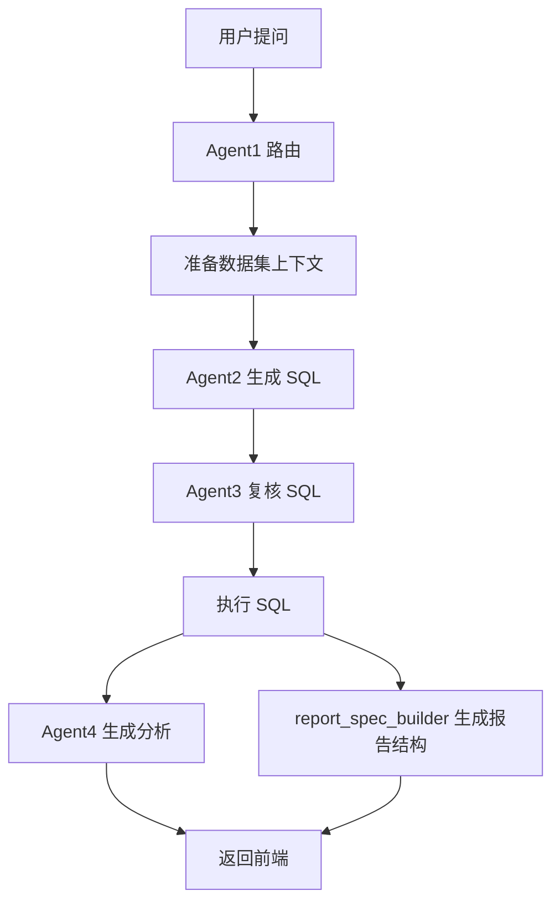
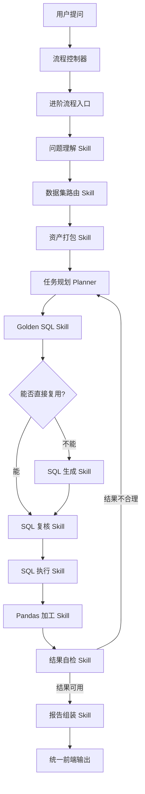

# 智能问数基础流程与进阶流程升级计划（落地版）

## 一、先说结论

这次不是把现在的问数流程继续改复杂，而是新增一套“进阶问数流程”。

现有流程保留，叫 **基础问数流程**。

新流程独立建设，叫 **进阶问数流程**。

用户在前台看到的中间对话区、右侧报告区尽量不动，只是在后端多一个“流程控制器”决定本轮问题走哪套流程。

```text
用户提问
  ↓
流程控制器判断
  ├─ 基础问数流程：继续走现有 FourAgentAskService
  └─ 进阶问数流程：走新的 Skill / 工具 / 数据加工流程
  ↓
统一输出给现在的 SmartAsk 页面
```

你真正想要的是：

- 普通问题继续用稳定的基础流程。
- 高级问题用进阶流程解决，不影响现有问数效果。
- 进阶流程要真正读你后台已经维护的内容，而不是靠硬编码。
- skill、LangChain、MCP、Pandas、SQL Server 这些能力，都要能在后台配置、可开关、可灰度。

## 二、你现在项目里已经有什么

我看了当前项目结构，你现在不是空白项目，已经有一套比较完整的问数后台。

| 现有模块 | 页面 / 后端 | 现在能做什么 | 进阶流程怎么复用 |
|---|---|---|---|
| 智能问数工作台 | `SmartAsk.vue`、`/api/smart-chat/stream` | 用户提问、中间执行轨迹、右侧报告 | 前端不大改，只增加一个流程参数 |
| 基础四 Agent 流程 | `backend/four_agent_ask.py` | 路由、取上下文、生成 SQL、复核 SQL、执行、报告 | 保持不动，作为 Basic Engine |
| 数据连接管理 | `Databases.vue`、`datasource_router.py` | PostgreSQL / MySQL / SQLite / SQL Server 连接和 SQL 执行 | 进阶流程继续复用它执行 SQL |
| 飞书数据同步 | `FeishuSync.vue`、`feishu_sync_service.py` | 飞书表同步到 PG，字段写入 JSONB | 进阶流程使用同步后的数据，不重复造同步逻辑 |
| 数据书架治理 | `DatasetManagement.vue`、`bookshelf.py` | LLD、DDL、数据字典、Golden SQL、常见问题、标准题、Agent 提示片段 | 这是进阶流程最重要的知识来源 |
| 报告模板配置 | `DatasetReportConfig.vue`、`dataset_report_config.py` | 指标、维度、信号规则、意图策略、SQL 输出契约 | 进阶流程输出报告时必须按它来 |
| Agent 管理 | `AgentManagement.vue`、`agents.py` | 维护 Agent 1-4 的全局提示词 | 基础流程继续用；进阶流程可作为默认角色说明 |
| 组织树管理 | `OrganizationTrees.vue`、`organization_trees.py` | 组织名称、层级、别名、权限范围 | 进阶流程做数据集路由和组织校验时复用 |
| 权限 / 功能开关 | `AdminConsole.vue`、`feature_flags.py` | 控制页面、按钮、角色能力 | 新增“问数流程”和“Skill 开关”最适合放这里 |
| 运行态迁移 | `RuntimeMigration.vue` | 导出/导入后台配置 | 进阶流程配置也要进入迁移包，方便发版 |
| 日志面板 | `system_logs.py`、`smart_chat_controller.jsonl` | 问数错误和控制台日志 | 进阶流程要单独写 trace，方便排查 |

所以后面的设计，不应该重新造一套后台，而是把这些现有资产“接成工具”。

## 三、什么是 Skill，用人话说

这里说的 Skill 不是神秘东西，也不是一定要用某个大模型平台的 skill。

在你这个项目里，**Skill 就是一个可以被进阶流程调用的小能力**。

比如：

| Skill 名称 | 它干什么 | 复用现有哪里 | 是否需要新增页面 |
|---|---|---|---|
| 数据集路由 Skill | 判断本轮问题应该查哪个数据集 | 数据书架、组织树、常见问题、路由词 | 后期加开关即可 |
| 资产打包 Skill | 把 LLD、DDL、字段字典、Golden SQL、报告模板整理成上下文包 | `BookshelfRepository.get_dataset_context`、报告模板配置 | 不需要新页面 |
| Golden SQL Skill | 找最像的人工维护 SQL，决定复用还是改写 | 数据书架 Golden SQL | 不需要新页面 |
| SQL 生成 Skill | 根据问题和数据集资产生成 SQL | Agent2 提示片段、字段字典、DDL | 不需要新页面 |
| SQL 复核 Skill | 校验只读、安全、字段、表、组织口径 | 现有 Agent3 规则和字段校验 | 不需要新页面 |
| SQL 执行 Skill | 到对应数据源执行 SQL | `datasource_router.execute_sql_for_source` | 不需要新页面 |
| Pandas 加工 Skill | 对 SQL 结果做排序、分组、TopN、差异、环比等二次加工 | 新增 Python 模块，输入是 SQL 查询结果 | 需要开关，不一定需要页面 |
| 报告组装 Skill | 把结果转成中间区和右侧区都能识别的报告结构 | `report_spec_builder.py`、报告模板配置 | 不需要新页面 |
| MCP 工具 Skill | 未来接外部工具，比如文件、知识库、第三方服务 | 新增 MCP 客户端 | 后期再做 |
| SQL Server Skill | 连接 SQL Server 并执行 SQL | `datasource_router.py` 已有 sqlserver 分支 | 需要补依赖和连接测试 |

一句话：

```text
Skill = 后端能力块 + 是否启用的配置 + 能否被进阶流程调用
```

## 四、基础流程和进阶流程怎么隔离

不要在 `four_agent_ask.py` 里继续堆逻辑。

建议新增这些目录：

```text
backend/
  ask_flow/
    controller.py          # 流程控制器：决定走基础还是进阶
    contracts.py           # 统一输入输出协议
    registry.py            # 注册 basic / advanced 两套流程

  smartask_basic/
    service.py             # 包一层现有 FourAgentAskService，不改它

  smartask_advanced/
    service.py             # 进阶流程入口
    context_pack.py        # 数据集资产打包
    planner.py             # 问题拆解和计划
    skills/
      dataset_route.py
      asset_pack.py
      golden_sql.py
      sql_generate.py
      sql_review.py
      sql_execute.py
      pandas_analyze.py
      report_compose.py
    adapters/
      smartask_response.py # 转成当前前端需要的 dataset_results / report_spec
```

核心原则：

- 基础流程只包装，不重构。
- 进阶流程单独目录，单独日志，单独配置。
- 两个流程最后都输出当前前端能识别的数据结构。
- 前端不需要知道后端内部到底用了几个 Skill。

## 五、后台应该怎么配置

### 1. 系统控制台新增“问数流程配置”

位置建议：`系统控制台` 里加一个分组，叫 **智能问数流程**。

第一版不用做复杂页面，可以先基于 `feature_flags.json` 扩展，后续再做独立配置表。

建议配置长这样：

```json
{
  "smartAskFlow": {
    "defaultFlow": "basic",
    "allowUserSwitch": false,
    "advancedEnabled": true,
    "advancedRoles": ["super_admin", "admin"],
    "datasetPolicies": {
      "12": "advanced",
      "13": "basic"
    },
    "fallbackToBasicOnError": true
  }
}
```

解释：

| 配置 | 含义 |
|---|---|
| `defaultFlow` | 默认走基础还是进阶 |
| `allowUserSwitch` | 前台用户是否能手动切换 |
| `advancedEnabled` | 总开关，关了就全部走基础 |
| `advancedRoles` | 哪些角色允许用进阶 |
| `datasetPolicies` | 指定某个数据集默认走哪套流程 |
| `fallbackToBasicOnError` | 进阶流程失败时是否自动退回基础流程 |

实际建议：

```text
第一阶段：
defaultFlow = basic
advancedEnabled = true
advancedRoles = ["super_admin"]
datasetPolicies 只给一个测试数据集开 advanced
fallbackToBasicOnError = true
```

这样不会影响普通用户。

### 2. 数据书架里继续维护业务资产

你现在已经有数据书架维护页，这个页面就是进阶流程的主要配置入口。

每个数据集建议维护这些内容：

| 数据书架标签 | 该怎么维护 | 进阶流程怎么用 |
|---|---|---|
| 常见问题 | 放用户真实会问的问题 | 路由和意图判断 |
| 标准题集 | 放必须答对的回归测试题 | 发版前自动验证 |
| 路由词 / 别名 | 放“商用、消费者、分公司、代表处、业务部”等别名 | 数据集和组织识别 |
| LLD 文档 | 写业务口径、层级规则、哪些字段代表什么 | Planner 和 SQL 生成 |
| 数据字典 | 每个 JSONB key 的含义、类型、别名 | SQL 生成和 SQL 复核 |
| DDL + 表关联 | 表名、字段、JSONB 字段说明 | SQL 安全校验 |
| Golden SQL | 人工确认过的好 SQL | 优先复用或轻改写 |
| Agent 提示片段 | 按数据集补充 Agent1-4 的特殊规则 | 作为 Skill 的业务规则 |

你问“skill 怎么配置”，第一版不用让用户单独写 Skill 代码。

你在数据书架里维护的这些内容，就是 Skill 的燃料。

例如：

```text
Golden SQL Skill 读取 Golden SQL 标签页
字段字典 Skill 读取 数据字典 标签页
报告组装 Skill 读取 报告模板配置
组织识别 Skill 读取 组织树管理和路由词
```

### 3. 报告模板配置继续承担展示规则

`DatasetReportConfig.vue` 已经有：

- 指标卡。
- 分析维度。
- 信号规则。
- SQL 输出契约。
- 意图策略 `intentPolicies`。
- 高级 JSON。

进阶流程不要自己决定报告长什么样，而是优先读取报告模板。

比如用户问：

```text
商用前三的业务员是谁？
```

报告模板里应该能配置：

```json
{
  "intentPolicies": {
    "ranking": {
      "defaultTopN": 3,
      "targetLevelAliases": {
        "业务代表": ["业务员", "销售", "代表", "人员"],
        "代表处": ["代表处", "城市公司"],
        "分公司": ["分公司"]
      },
      "requiredPathColumns": ["分公司", "代表处", "业务代表"],
      "sortBy": "达成率",
      "sortDirection": "desc"
    }
  }
}
```

这样以后问 TopN 时，左侧和右侧都知道要显示归属路径：

```text
东部分公司 / 上海代表处 / 张三
```

这类规则应该配置在数据集报告模板里，不应该写死到通用代码里。

### 4. AI 模型配置继续复用

现在有 `AIModels.vue`。

进阶流程可以先复用当前默认模型，不急着加一堆模型。

后面如果要细分，可以新增用途：

| 用途 | 建议 |
|---|---|
| route_model | 识别数据集和组织 |
| planner_model | 拆解复杂问题 |
| sql_model | 生成 SQL |
| report_model | 写业务结论 |
| guard_model | 复核和自检 |

第一阶段建议：

```text
全部复用默认模型，先把流程跑通。
```

不要一上来就引入太多模型，排查会很痛苦。

## 六、进阶流程到底怎么跑

### 基础流程现在是这样



### 进阶流程建议这样



和基础流程最大的差别：

- 进阶流程不是一条线走到底。
- 它可以先查样本、再决定 SQL。
- 它可以执行后用 Pandas 二次加工。
- 它可以发现结果不合理后回到 Planner 重试。
- 它可以更充分使用数据书架和报告模板。

## 七、LangChain / LangGraph 放哪里

你不用先纠结 LangChain 怎么配。

更准确地说：

| 名词 | 在你项目里的角色 |
|---|---|
| LangChain | 工具调用框架，可选 |
| LangGraph | 多步骤流程编排器，更适合你的进阶问数 |
| Skill | 被流程调用的小能力 |
| MCP | 未来接外部工具的插座 |
| Pandas | SQL 结果二次加工工具 |

第一版进阶流程建议 **不用急着上 LangGraph**。

先用普通 Python 把 Skill 接口定下来：

```python
class SkillResult:
    success: bool
    data: dict
    message: str

class BaseSkill:
    name: str
    def run(self, state: dict) -> SkillResult:
        ...
```

等 Skill 跑稳定，再把 `planner.py` 换成 LangGraph。

这样不会一开始就被框架绑住。

## 八、Pandas 数据加工怎么用

你现在很多问题不是 SQL 查不到，而是：

- SQL 查出来很多行。
- 前端不知道怎么展示。
- TopN 没有归属路径。
- 排名、对比、差距、汇总口径不稳定。

进阶流程里加 `PandasAnalysisSkill`，专门处理这些。

输入：

```json
{
  "question": "商用前三的业务员",
  "rows": [
    {"分公司": "东部分公司", "代表处": "上海代表处", "业务代表": "张三", "达成率": 72.1}
  ],
  "intent": "ranking",
  "topN": 3
}
```

输出：

```json
{
  "rankedRows": [
    {
      "rank": 1,
      "name": "张三",
      "orgPath": "东部分公司 / 上海代表处 / 张三",
      "rate": 72.1,
      "amount": 8408782.6
    }
  ],
  "summary": "商用事业部前三业务员分别是..."
}
```

这样左侧对话和右侧报告都能展示同一批结构化结果。

## 九、MCP 怎么接

MCP 不建议第一阶段就上。

它适合后面接：

- 文件解析。
- 外部知识库。
- SQL Server 辅助工具。
- Python 沙箱计算服务。
- 飞书消息发送。
- PDF / 图片导出服务。

你可以把 MCP 理解成：

```text
进阶流程可以调用的外部工具插座。
```

第一版先预留配置：

```json
{
  "mcpTools": {
    "enabled": false,
    "servers": []
  }
}
```

等基础 Skill 跑稳定，再接 MCP。

## 十、SQL Server 怎么接

你项目的 `datasource_router.py` 里已经有 `sqlserver` 分支：

- Vanna 连接里有 `connect_to_mssql`。
- 原始 SQL 执行里有 `pyodbc.connect`。

所以不是从零开始。

要真正可用，需要确认：

| 项目 | 要做什么 |
|---|---|
| Docker 镜像 | 安装 ODBC Driver 和 `pyodbc` |
| 数据连接页面 | `Databases.vue` 支持选择 SQL Server、driver、host、port |
| 连通性测试 | `/api/datasources/<id>/test` 能测 SQL Server |
| SQL 方言 | 进阶流程根据数据源类型生成 PostgreSQL / SQL Server 不同 SQL |
| 字段字典 | 数据书架按数据源保存 DDL 和字段解释 |

第一阶段建议：

```text
进阶流程先支持现有 PostgreSQL 数据。
SQL Server 作为第二阶段接入，不要和进阶流程 MVP 混在一起。
```

## 十一、进阶流程第一版怎么做

### 第一阶段：只做控制器和隔离

目标：

- 当前基础问数流程不变。
- 后端新增流程控制器。
- 控制器默认永远走基础流程。
- 返回结果和现在完全一致。

交付：

```text
backend/ask_flow/controller.py
backend/smartask_basic/service.py
```

验收：

```text
所有现有问数效果不变。
控制台可以看到本轮走的是 basic。
```

### 第二阶段：进阶流程 MVP

只开放给超级管理员和一个测试数据集。

MVP Skill：

| Skill | 是否第一版需要 |
|---|---|
| 数据集路由 Skill | 需要 |
| 资产打包 Skill | 需要 |
| Golden SQL Skill | 需要 |
| SQL 生成 Skill | 需要 |
| SQL 复核 Skill | 需要 |
| SQL 执行 Skill | 需要 |
| Pandas 加工 Skill | 需要 |
| 报告组装 Skill | 需要 |
| MCP Skill | 暂不做 |
| SQL Server Skill | 暂不做 |

验收问题建议：

```text
商用前三的业务员是谁？
消费者前三的分公司？
找出消费者事业部达成率最高、最低的两家分公司，对比任务体量、实际开单、缺口差距
线下业务完成最好的分公司是哪个？
```

要求：

- 必须读数据集书架。
- 必须优先参考 Golden SQL。
- 必须输出组织路径。
- 必须按报告模板输出。
- 失败时自动退回基础流程。

### 第三阶段：可视化 Skill 配置

在系统控制台加一个页面或卡片：

```text
智能问数流程

默认流程：基础 / 进阶
进阶流程总开关：开 / 关
允许角色：超级管理员、管理员、业务管理员、普通用户
失败自动退回基础流程：开 / 关

Skill 开关：
[x] 数据集路由
[x] 资产打包
[x] Golden SQL
[x] SQL 生成
[x] SQL 复核
[x] SQL 执行
[x] Pandas 加工
[x] 报告组装
[ ] MCP 工具
[ ] SQL Server 工具
```

每个数据集也可以配置：

```text
消费者测试数据集：基础 / 进阶 / 跟随系统默认
商用事业部数据集：基础 / 进阶 / 跟随系统默认
```

### 第四阶段：LangGraph 编排

当 Skill 稳定后，再把进阶流程的内部编排升级成 LangGraph。

目的不是为了“用了 LangChain 显得高级”，而是为了解决：

- 复杂问题多步骤规划。
- 查一次不够时自动二次探查。
- SQL 执行后发现 0 行时回退改写。
- 多数据集问题拆分执行。
- 需要追问时暂停流程。

### 第五阶段：MCP 和外部工具

再接这些：

- PDF / 图片导出。
- 飞书消息发送。
- 外部知识库。
- Python 沙箱。
- SQL Server 工具。
- 文件解析工具。

## 十二、一个实际例子

用户问：

```text
商用前三的业务员是谁？
```

基础流程可能会：

```text
路由到商用事业部
生成 SQL
执行 SQL
报告里堆出一批业务员
```

进阶流程应该这样：

```text
1. 数据集路由 Skill：
   识别“商用” -> 商用事业部数据集。

2. 资产打包 Skill：
   读取字段字典、Golden SQL、报告模板、意图策略。

3. Planner：
   判断这是 ranking / topN 问题，目标层级是业务代表，TopN=3。

4. Golden SQL Skill：
   找有没有“业务员排名”类似 SQL。

5. SQL 生成 / 改写 Skill：
   SQL 必须输出 分公司、代表处、业务代表、任务、实际、达成率。

6. SQL 复核 Skill：
   检查是否只查当前数据集，是否只读，是否保留组织路径。

7. SQL 执行 Skill：
   执行 SQL。

8. Pandas 加工 Skill：
   按达成率排序，只取前三，并生成 orgPath。

9. 报告组装 Skill：
   左侧和右侧都展示：
   东部分公司 / 上海代表处 / 张三
```

最终用户看到的不是一堆散乱业务员，而是：

```text
1. 东部分公司 / 上海代表处 / 张三：达成率 70.07%
2. 南部分公司 / 粤东代表处 / 李四：达成率 58.88%
3. 商用事业部 / 公共办公业务部 / 王五：达成率 38.22%
```

## 十三、你现在应该怎么配置数据集

以“商用事业部”为例：

### 数据字典

必须维护这些语义：

```text
分公司：组织一级或二级名称
代表处：分公司下级组织
业务部：业务条线
业务代表：人员字段，显示姓名
总任务金额：任务体量
年度开单金额：实际完成
达成率：年度开单金额 / 总任务金额
缺口：总任务金额 - 年度开单金额
```

### Golden SQL

至少维护这些样例：

```text
1. 商用事业部整体业绩
2. 商用四个分公司的业绩
3. 商用前三业务员
4. 某分公司下级代表处业绩
5. 达成率最高/最低节点对比
```

### 报告模板

排名类问题建议配置：

```json
{
  "intentPolicies": {
    "ranking": {
      "defaultTopN": 3,
      "requiredPathColumns": ["分公司", "代表处", "业务代表"],
      "sortBy": "达成率",
      "sortDirection": "desc",
      "showOrgPath": true
    }
  }
}
```

### Agent 提示片段

Agent2 / SQL 生成片段里写：

```text
当用户询问业务员、业务代表、人员 TopN 时，SQL 必须输出其上级组织路径：
分公司、代表处、业务代表。
不得只输出人员姓名。
```

Agent4 / 报告片段里写：

```text
排名类报告必须说明每个对象的组织归属，格式为：
分公司 / 代表处 / 业务代表。
```

## 十四、不要怎么做

不要继续这样做：

- 不要在 `four_agent_ask.py` 里继续堆大量特殊 if。
- 不要把“消费者”“商用”的规则写死成通用逻辑。
- 不要让 Agent3 一刀切改 SQL。
- 不要让右侧报告自己猜展示层级。
- 不要把所有高级能力一次性上完。

正确做法是：

```text
规则放数据集配置。
流程能力放 Skill。
流程选择放控制器。
展示协议保持统一。
```

## 十五、推荐实施顺序

| 阶段 | 做什么 | 风险 |
|---|---|---|
| 1 | 新增流程控制器，默认仍走基础流程 | 低 |
| 2 | 新增进阶流程目录和 Skill 接口 | 低 |
| 3 | 接入数据书架资产打包 | 中 |
| 4 | 接入 Golden SQL / SQL 复核 / SQL 执行 | 中 |
| 5 | 接入 Pandas 加工和组织路径输出 | 中 |
| 6 | 把一个测试数据集切到进阶流程 | 中 |
| 7 | 做控制台可视化开关 | 中 |
| 8 | 引入 LangGraph 编排 | 高 |
| 9 | 接 MCP / SQL Server / 飞书发送 | 高 |

第一版最合适的目标：

```text
基础流程完全不受影响。
超级管理员可以让某一个数据集走进阶流程。
进阶流程能读取数据书架、Golden SQL、报告模板。
TopN / 对比 / 下钻类问题明显比基础流程更稳。
```

## 十六、最终效果

上线后，系统会变成：

```text
基础问数流程：
  稳定、快、适合普通问数。

进阶问数流程：
  慢一点，但会读更多配置、做多步规划、二次加工、结果自检。

控制台：
  决定哪些角色、哪些数据集、哪些问题走进阶。

数据书架：
  仍然是业务配置主入口。

报告模板：
  仍然决定右侧报告怎么展示。
```

这样你以后发版时可以说：

```text
本次升级没有破坏原有基础问数链路，而是在原链路旁边新增进阶问数引擎。
进阶引擎通过 Skill 化方式复用数据书架、Golden SQL、字段字典、组织树和报告模板，
支持更复杂的排名、对比、归因、下钻和多步分析问题。
管理员可在控制台按角色和数据集灰度启用。
```
