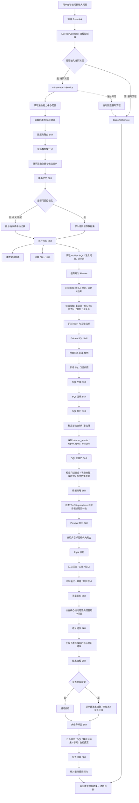
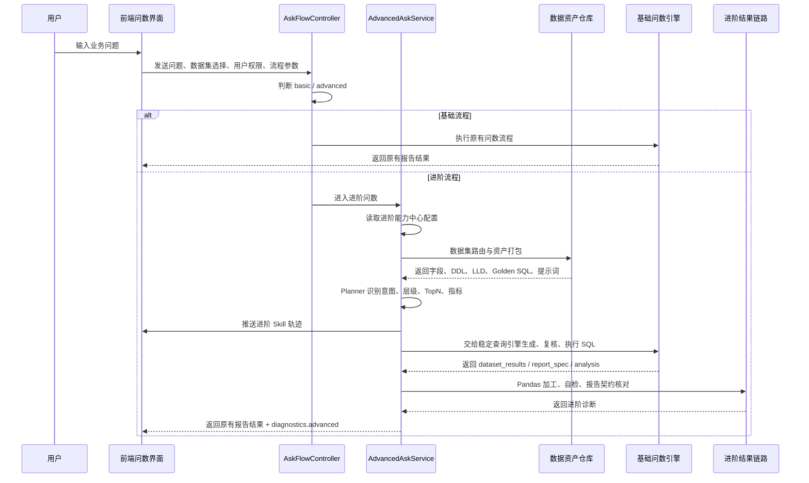
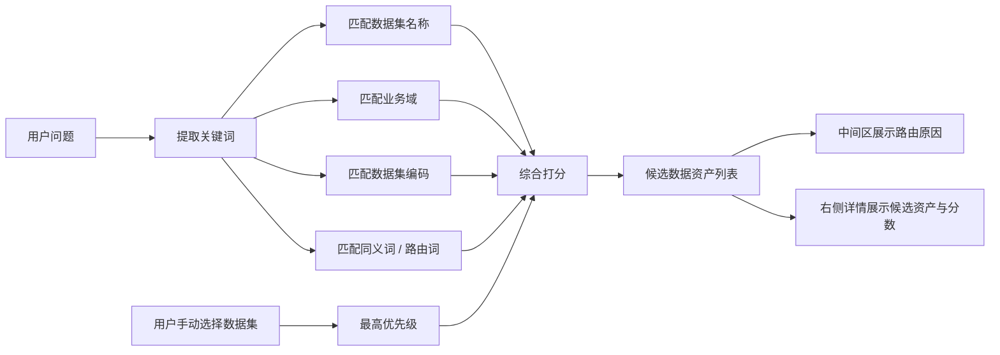
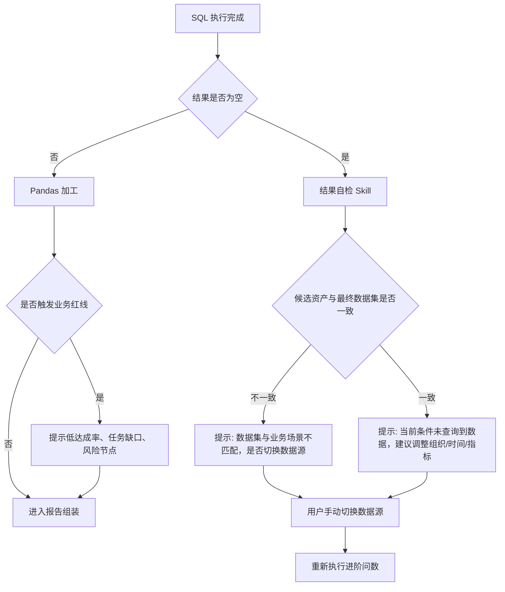
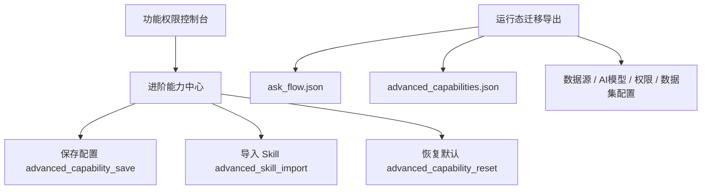
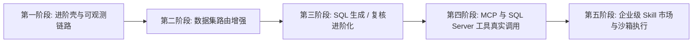

# 进阶版智能问数流程

本文档描述当前项目中的进阶问数执行链路。设计原则是：基础问数流程保持不变，进阶流程只增强过程编排、资产解释、工具链路、自检提示和诊断信息；最终报告仍沿用现有 `dataset_results`、`report_spec`、`analysis` 输出契约。

## 一、流程目标

1. 自动路由透明化：展示系统为什么选择某个数据集，以及候选数据资产的匹配依据。
2. 企业资产复用：把数据集、字段字典、DDL、LLD、Golden SQL、常见问题、Agent 提示词、报告模板作为进阶流程资产。
3. Skill 链路可配置：通过进阶能力中心管理 Skill、MCP、SQL Server 等能力，不把逻辑写死在基础问数里。
4. 结果风险前置：对空结果、数据集错配、低达成率红线、字段缺失等情况主动提示。
5. 报告契约稳定：最终报告展示、图表、下载、右侧报告结构继续沿用原有协议。

## 二、整体架构图



## 三、执行泳道图



## 四、核心节点说明

| 节点 | 作用 | 是否影响基础流程 | 是否改变最终报告 |
| --- | --- | --- | --- |
| AskFlowController | 根据控制台配置、用户角色、数据集策略决定 basic / advanced | 否 | 否 |
| 数据集路由 Skill | 按问题、数据集名称、业务域、别名、手动选择打分 | 否 | 否 |
| 路由守门 Skill | 结合组织树和路由得分判断自动锁定、确认或错配提示 | 否 | 否 |
| 资产打包 Skill | 读取字段字典、DDL、LLD、Golden SQL、常见问题、提示词 | 否 | 否 |
| Planner | 识别排名、对比、诊断、趋势、TopN、组织层级 | 否 | 否 |
| Golden SQL Skill | 检索高质量 SQL 样例，作为口径和 SQL 结构参考 | 否 | 否 |
| SQL 生成 / 复核 / 执行 | 当前阶段复用稳定基础查询引擎 | 否 | 否 |
| SQL 质量门 Skill | 检查 SQL 只读安全、字段映射、表映射、复核结论和首次结果质量 | 否 | 否 |
| 模板策略 Skill | 检查排名/TopN 是否跟随报告模板和本轮 queryIntent，避免固定 Top3 | 否 | 否 |
| Pandas 加工 Skill | 按用户目标层级聚合，再做 TopN、汇总、缺口、风险节点辅助分析 | 否 | 否 |
| 答案契约 Skill | 检查核心结论是否先回答用户真正的问题 | 否 | 否 |
| 结论建议 Skill | 基于证据给出核心结论重写建议，不自动改写报告 | 否 | 否 |
| 结果自检 Skill | 检查空结果、字段缺失、数据集错配、达成率红线 | 否 | 否 |
| 多信号择优 Skill | 汇总路由、SQL、模板、Pandas、答案契约和自检信号，给出采信建议 | 否 | 否 |
| 报告组装 Skill | 核对 `dataset_results`、`report_spec`、`analysis` 契约 | 否 | 否 |

说明：`SQL 生成 / 复核 / 执行` 在能力中心里是进阶链路的能力声明，但前端执行轨迹必须以真实基础查询引擎事件为准，不能在进阶预检阶段提前标记为完成。

## 五、数据集路由透明化规则

进阶流程会把自动路由过程展示给用户，而不是无感知绑定数据集。

当问题明确包含多个事业部/组织并带有“对比、比较、进度、差异、和/与/跟”等跨主体比较意图时，路由守门不会再把跨数据集命中当成二次确认，而是进入 `cross_dataset_compare`：分别锁定命中的多个数据集，让稳定查询引擎逐个数据集执行，再把结果并列交给报告层。



路由展示建议：

1. 当前选择数据集：显示最终执行数据集。
2. 自动路由数据集：显示进阶候选数据集列表。
3. 匹配原因：显示命中的业务域、组织名称、数据集别名、Golden SQL 数量。
4. 手动兜底：用户可以在自动路由异常时切换正确数据集。
5. 多组织同源：如果问题命中多个组织，但组织树显示它们都属于同一数据集，则进阶流程可按同源对比自动锁定该数据集。

## 六、无数据和错配异常处理



典型提示：

1. 数据集错配：数据集与业务场景可能不匹配，是否切换数据源？
2. 空结果：当前数据集返回 0 行，请检查组织名称、统计周期或数据源。
3. 低红线：最优节点达成率仍低于 60%，建议关注整体业务风险。
4. 字段缺失：当前结果未返回关键字段，建议检查数据集字段映射或 SQL 输出契约。

## 七、中间区与右侧区展示建议

### 中间区

中间区用于展示“进阶问数过程”，建议按以下顺序展示：

1. 进阶流程控制器
2. 数据集路由 Skill
3. 路由守门 Skill
4. 资产打包 Skill
5. 任务规划 Planner
6. Golden SQL Skill
7. SQL 生成 Skill
8. SQL 复核 Skill
9. SQL 执行 Skill
10. SQL 质量门 Skill
11. 模板策略 Skill
12. Pandas 加工 Skill
13. 答案契约 Skill
14. 结论建议 Skill
15. 结果自检 Skill
16. 多信号择优 Skill
17. 报告组装 Skill

### 右侧区

右侧区用于展示“执行详情和最终报告”，建议分成两类内容：

1. 执行详情：Skill 轨迹、路由分数、候选资产、Golden SQL、Pandas 诊断、自检提示。
2. 最终报告：继续展示现有核心结论、关键指标、结构看板、图表、完整报告。

## 八、权限与迁移



说明：

1. 进阶能力中心只允许管理员维护。
2. Skill 导入采用 Manifest 级导入，不直接执行第三方代码。
3. `advanced_capabilities.json` 属于运行态配置，应进入迁移导出，不应直接提交到 Git。
4. `ask_flow.json` 控制是否进入进阶流程，默认可保持基础流程。

## 九、Skill 导入 Manifest 示例

```json
{
  "skills": [
    {
      "key": "risk_redline_expert",
      "label": "经营红线专家 Skill",
      "toolType": "fact",
      "description": "根据达成率、任务缺口、组织层级识别经营红线和风险节点。",
      "prompt": "优先识别低于 60% 达成率、缺口扩大、连续排名靠后的组织节点。",
      "tags": ["risk", "business", "redline"],
      "source": "external-skill-library",
      "safety": "只作为提示词和诊断规则参与编排，不执行外部代码。"
    }
  ]
}
```

## 十、分阶段演进路线



当前阶段重点：

1. 进阶流程独立于基础流程。
2. Skill 链路可见、可配置、可迁移。
3. 最终报告稳定不变。
4. 先把数据资产、路由解释、Pandas 加工、自检诊断做实。
