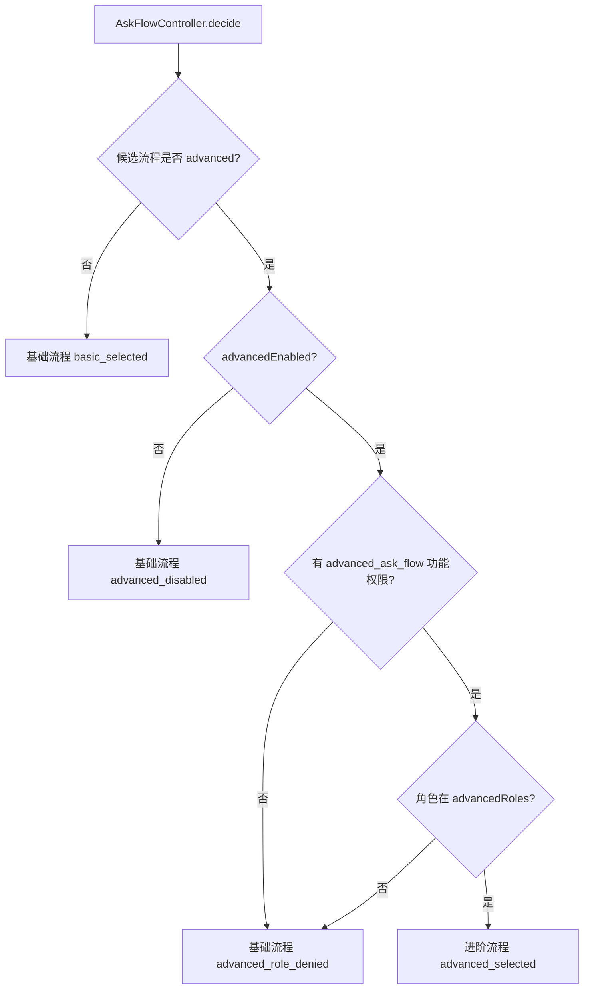
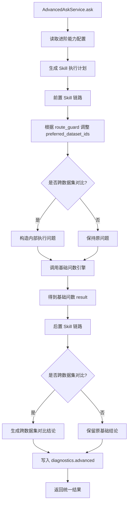
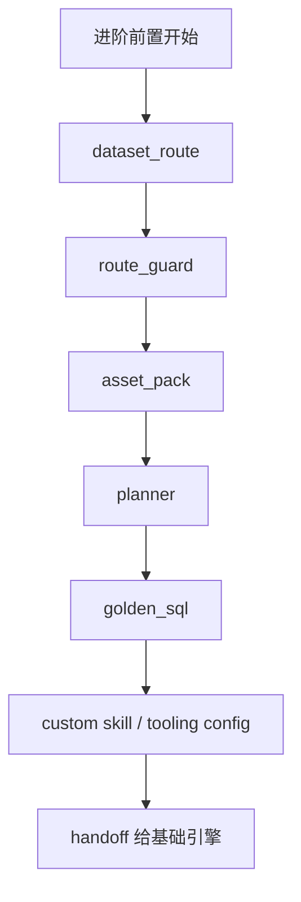
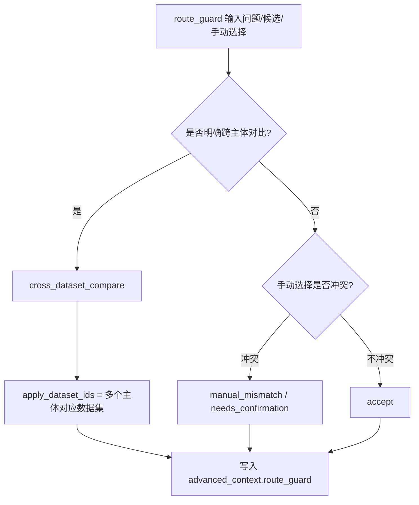
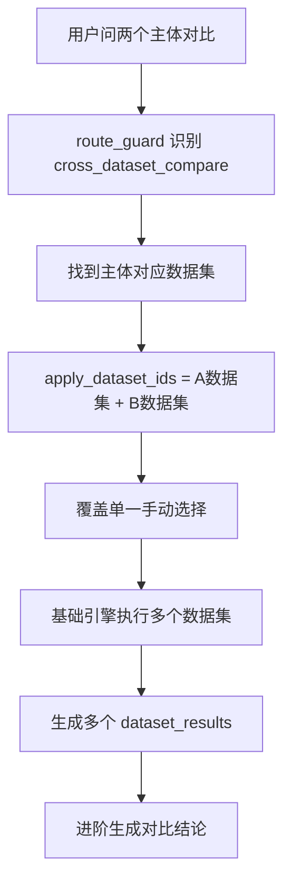
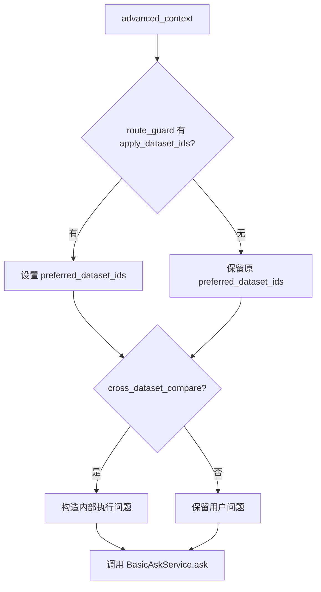
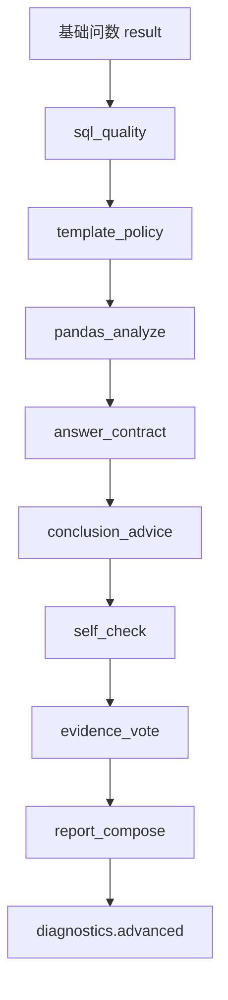
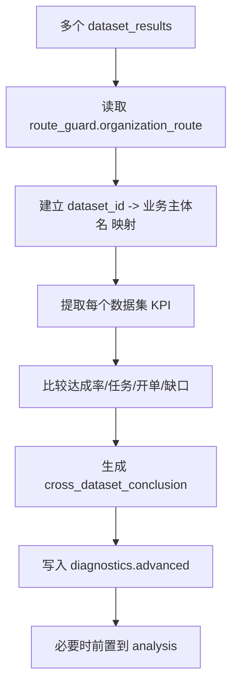
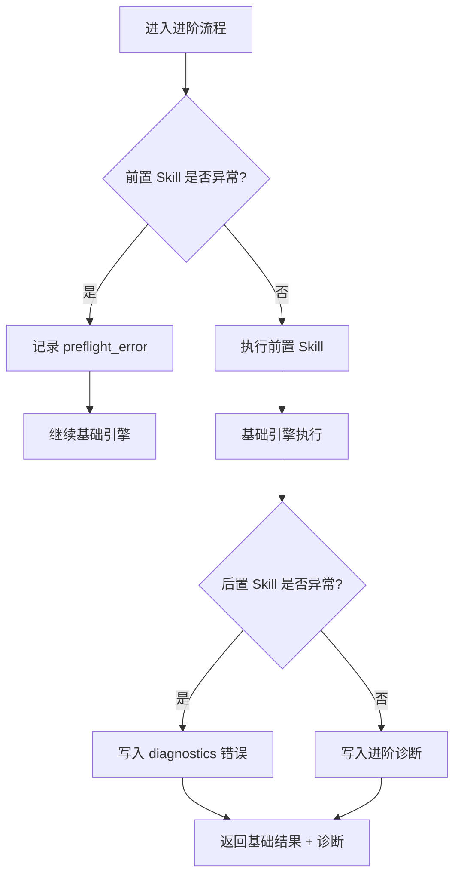

# 进阶问数流程

> 本文只讲“进阶问数”。基础问数请看 `docs/基础问数流程.md`。  
> 关键代码：`backend/ask_flow/controller.py`、`backend/smartask_advanced/service.py`、`backend/smartask_advanced/skills/*`、`backend/smartask_advanced/registry.py`、`backend/smartask_advanced/config_store.py`。

## 1. 进阶问数是什么

进阶问数不是一套完全替代基础问数的新执行引擎。

当前设计是：

- 基础问数负责稳定生成 SQL、复核 SQL、执行 SQL、生成报告。
- 进阶问数在基础问数前后增加 Skill 链路。
- 前置 Skill 增强路由、资产理解、任务规划。
- 后置 Skill 增强质量检查、Pandas 加工、答案契约、自检、多信号择优。
- 最终报告协议仍保持基础问数的结构。

一句话：

> 进阶问数 = 进阶能力链路 + 基础稳定问数引擎 + 进阶诊断与增强结论。

## 2. 进阶流程进入条件

进阶流程不是所有用户都能进。

需要同时满足：

1. 问数流程配置允许进阶。
2. `advancedEnabled = true`。
3. 用户有 `advanced_ask_flow` 功能权限。
4. 用户角色命中 `advancedRoles`。
5. 请求指定、数据集策略指定、或默认流程指定为 `advanced`。

否则会回到基础流程。



## 3. 进阶总流程



## 4. 进阶配置

主要配置来自：

- `config/advanced_capabilities.json`
- 管理页：进阶能力中心。

配置控制：

- 是否启用进阶能力。
- 启用哪些 Skill。
- 是否输出 Skill trace。
- 资产预览数量。
- MCP 配置。
- SQL Server 工具配置。
- 自定义导入 Skill。

进阶配置只影响进阶流程，不应该影响基础流程。

## 5. 前置 Skill 链路

前置 Skill 在基础问数执行前运行。

目标：

- 看清楚问题。
- 看清楚数据资产。
- 看清楚用户手动选择是否合理。
- 给基础引擎提供更好的数据集选择和执行问题。



## 6. dataset_route：数据集候选打分

作用：

- 从进阶视角给数据集打分。
- 输出候选数据集及匹配理由。
- 帮助解释为什么系统认为某个数据集相关。

输入：

- 用户问题。
- 用户手动选择的数据集。
- 数据集目录。
- 数据集别名、业务域、描述等。

输出示例：

```json
[
  {
    "id": 1,
    "dataset_name": "商用事业部",
    "advanced_score": 92,
    "advanced_reason": "命中业务主体和别名"
  }
]
```

注意：

- `dataset_route` 本身不直接决定最终执行。
- 它给 `route_guard` 和资产包提供候选。

## 7. route_guard：路由守门

`route_guard` 是进阶流程里很关键的节点。

职责：

- 判断手动选择是否和问题冲突。
- 判断是否需要覆盖单数据集选择。
- 识别跨数据集对比。
- 识别组织树命中。
- 产出实际要应用的数据集 ID。



常见 action：

| action | 含义 |
| --- | --- |
| `accept` | 路由可接受 |
| `manual_mismatch` | 手动选择与问题明显冲突 |
| `needs_confirmation` | 需要用户确认 |
| `cross_dataset_compare` | 明确跨数据集/跨业务主体对比 |

### 7.1 跨数据集对比

当用户问“商用事业部和消费者事业部对比”这种问题时：

- 不能只用手动选择的数据集。
- `route_guard` 会识别两个业务主体。
- 生成多个 `apply_dataset_ids`。
- 基础引擎会按多个数据集执行。
- 进阶后处理会追加跨数据集结论。



## 8. asset_pack：资产打包

作用：

- 读取候选数据集的书架资产。
- 给后续 Skill 提供上下文。

打包内容：

- 字段字典数量。
- DDL 数量。
- Golden SQL 数量。
- Prompt 数量。
- LLD 概要。
- 常见问题。
- 外部配置。

注意：

- asset_pack 是解释与诊断能力，不直接替代基础引擎加载上下文。
- 基础引擎仍会在执行时重新加载自己的数据集上下文。

## 9. planner：任务规划

作用：

- 识别问题类型。
- 判断目标层级。
- 提取 TopN。
- 为模板策略和答案契约提供依据。

可能识别：

- 单体分析。
- 对比分析。
- 排名。
- 明细查询。
- 趋势查询。
- 风险/缺口分析。

输出示例：

```json
{
  "intent": "ranking",
  "targetLevel": "分公司",
  "topN": 10
}
```

## 10. golden_sql：样例口径检索

作用：

- 从候选资产中检索 Golden SQL。
- 帮助解释有哪些可参考的口径。
- 给基础引擎提供更强的样例信号。

注意：

- Golden SQL 是参考，不是硬限制。
- 用户仍然可以问非样例问题。

## 11. handoff：交给基础稳定引擎

进阶前置完成后，会调用基础引擎：

```python
result = self.fallback_service.ask(**fallback_kwargs)
```

这里的 `fallback_service` 是基础问数服务。

进阶可能会调整：

- `preferred_dataset_ids`
- 内部执行问题 `question`

但最终结果仍按基础问数结构返回。



## 12. 后置 Skill 链路

后置 Skill 在基础结果返回之后运行。

目标：

- 检查 SQL 和数据质量。
- 检查报告是否答到问题。
- 做结构化辅助分析。
- 形成诊断信息。
- 对跨数据集场景补充对比结论。



## 13. sql_quality：SQL 质量门

检查：

- SQL 是否只读。
- 字段是否可靠。
- 表引用是否可靠。
- 是否有空结果风险。
- SQL 和结果是否明显不匹配。

输出：

- 质量评分。
- warning 数量。
- 风险列表。

它不直接阻断结果，主要写入诊断。

## 14. template_policy：模板策略

检查：

- 本轮问题应该展示 Top 几。
- 是否有报告模板配置。
- `queryIntent` 是否识别到 TopN。
- 前端可见结构是否足够表达问题。

典型用途：

- 用户问“排名”，报告不应固定 Top3。
- 应按用户问题、模板配置或默认策略决定 TopN。

## 15. pandas_analyze：结果加工

作用：

- 对 `dataset_results[].rows` 做结构化分析。
- 计算 TopN。
- 识别风险节点。
- 识别缺口。
- 形成辅助摘要。

注意：

- 它不替换 SQL 查询。
- 它不替换基础报告。
- 它给进阶诊断和结论建议提供数据证据。

## 16. answer_contract：答案契约

检查报告是否“答到问题”。

例如：

- 用户问“哪个分公司最好”，结论第一句应回答具体分公司。
- 用户问“两个事业部对比”，结论应明确谁更好、差多少。
- 用户问“明细”，不应只给宏观总结。

输出：

- warning。
- 建议。
- 是否需要重写。

## 17. conclusion_advice：结论建议

作用：

- 基于 Pandas 加工、答案契约、问题意图生成建议结论。
- 当前主要作为诊断增强。
- 对跨数据集场景，可配合专门逻辑把对比结论前置。

## 18. self_check：结果自检

检查：

- 是否有 `dataset_results`。
- 是否空行。
- 是否空列。
- 结果数据集是否与 route_guard 期望一致。
- 是否存在手动选择冲突。
- 是否存在跨数据集缺失。

风险示例：

- 路由守门建议两个数据集，结果只返回一个。
- SQL 执行成功但行数为 0。
- 报告结构缺失。

## 19. evidence_vote：多信号择优

综合多个 Skill 的信号：

- route_guard
- sql_quality
- pandas_analysis
- template_policy
- answer_contract
- self_check

输出：

```json
{
  "decision": "accept",
  "confidence_score": 86,
  "recommended_action": "结果可采信",
  "votes": [],
  "warnings": []
}
```

作用：

- 给本轮结果可信度一个综合判断。
- 让前端或日志能解释为什么接受/警告。

## 20. report_compose：报告契约核对

作用：

- 最后确认结果仍符合现有前端协议。
- 不破坏 `dataset_results`。
- 不破坏 `report_spec`。
- 不破坏 `analysis`。

进阶流程强调：

> 报告展示继续沿用现有协议，进阶只增强过程、诊断和必要结论。

## 21. 跨数据集结论增强

这是进阶区别于基础的一个重点。

场景：

- 用户问两个业务主体对比。
- 基础引擎能分别查出多个数据集结果。
- 但基础报告可能更偏单数据集解读。
- 进阶后处理会构造“跨数据集结论”。



关键要求：

- 结论要比较两个主体。
- 不改变中间区和右侧报告模式。
- 不直接暴露内部数据集名。
- 应显示“商用事业部”“消费者事业部”这类业务主体。

## 22. 进阶结果结构

进阶最终仍返回基础结构，只是多了诊断。

```json
{
  "question": "",
  "route": {},
  "dataset_results": [],
  "sql": "",
  "rows": [],
  "analysis": "",
  "report_spec": {},
  "diagnostics": {
    "ask_flow": {
      "flow": "advanced",
      "reason": "advanced_selected"
    },
    "advanced": {
      "trace_id": "",
      "intent": {},
      "asset_count": 0,
      "skill_count": 0,
      "assets": [],
      "route_guard": {},
      "sql_quality": {},
      "template_policy": {},
      "pandas_analysis": {},
      "answer_contract": {},
      "conclusion_advice": {},
      "self_check": {},
      "evidence_vote": {},
      "report_contract": {}
    }
  }
}
```

## 23. 进阶失败与回退

进阶流程必须可回退。



如果 `AdvancedAskService.ask` 整体抛异常：

- `AskFlowController` 会看 `fallbackToBasicOnError`。
- 如果为 `true`，回落基础流程。
- 返回 `ask_flow.reason = advanced_error_fallback`。

## 24. 进阶权限隔离

进阶流程的权限隔离有两层。

### 24.1 是否能进入进阶

由这些条件决定：

- `advancedEnabled`
- `advancedRoles`
- `advanced_ask_flow`
- `datasetPolicies`
- `defaultFlow`
- 请求体 `flow`

### 24.2 进入后仍受基础数据权限约束

即使进入进阶：

- 数据集访问权限仍要过滤。
- 组织提及权限仍会校验。
- SQL 执行前仍会行级过滤。
- 进阶不能绕过基础权限。

## 25. 进阶流程关键不变式

进阶问数必须满足：

- 不能破坏基础问数。
- 不能绕过数据集权限。
- 不能绕过组织行级权限。
- 异常时可回退基础。
- 最终报告协议保持一致。
- 跨数据集对比应补充对比结论。
- 对外结论用业务主体名，不用内部数据集名。
- Skill 诊断可以增强，但不能让基础结果不可用。

## 26. 进阶问题排查点

如果进阶问数出问题，优先看：

- `diagnostics.ask_flow.flow` 是否为 `advanced`。
- `diagnostics.ask_flow.reason` 是不是 `advanced_selected`。
- 用户是否有 `advanced_ask_flow`。
- `advancedEnabled` 是否开启。
- `advancedRoles` 是否包含当前用户角色。
- `diagnostics.advanced.route_guard.action` 是否正确。
- `effective_preferred_dataset_ids` 是否正确。
- 跨数据集时 `dataset_results` 数量是否符合预期。
- `cross_dataset_conclusion` 是否生成。
- `answer_contract` 是否提示“没有直接回答问题”。
- `evidence_vote.decision` 是否为 warning/risk。
- 进阶异常时是否回退基础。

